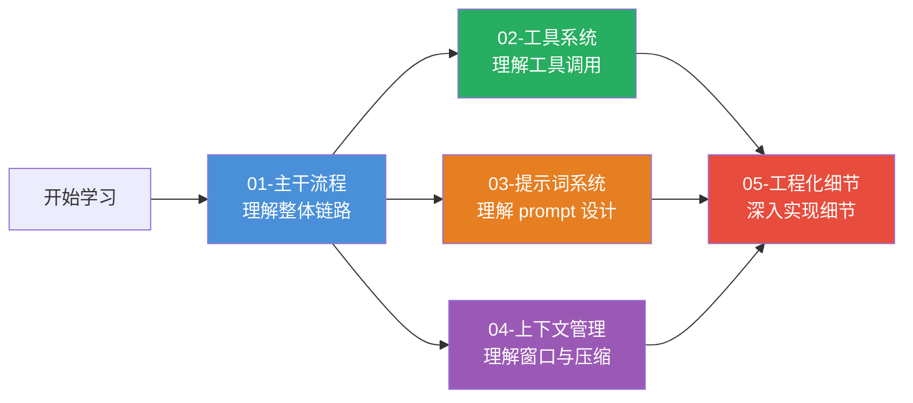
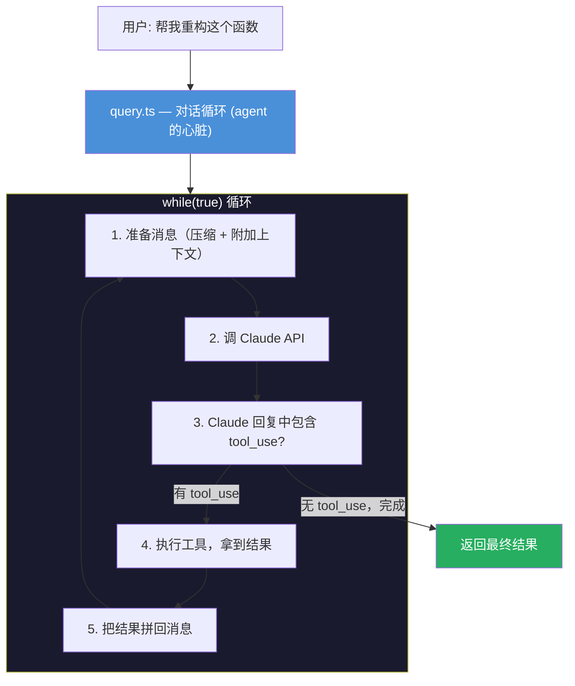

# Claude Code 源码学习总纲

> 目标：通过理解 Claude Code 的工程化设计，掌握 harness（agent 框架）的核心方法论。

---

## 学习路线

---

## 文档索引

### 主文档

| 文档 | 内容 | 重要度 |
|------|------|--------|
| [00-学习总纲](./00-学习总纲.md) | 导航、架构概览、设计决策、FAQ | 本文件 |

### 子文档（核心模块）

| 文档 | 内容 | 重要度 |
|------|------|--------|
| [01-主干流程](./01-主干流程.md) | 启动 → 对话循环 → API 调用 → 工具执行 → 结果返回 | ★★★★★ |
| [02-工具系统](./02-工具系统.md) | 工具调用本质、Tool 接口、执行流程、并行调用、安全层 | ★★★★★ |
| [03-提示词系统](./03-提示词系统.md) | System Prompt 构建、上下文注入、17 条最佳实践 | ★★★★★ |
| [04-上下文管理](./04-上下文管理.md) | 上下文窗口、Token 预算、自动压缩、Micro-Compact | ★★★★☆ |
| [05-工程化细节](./05-工程化细节.md) | 状态管理、中断机制、MCP 协议、Skill 系统、QueryEngine | ★★★★☆ |

---

## 一张图理解整个架构

---

## Java 程序员的思维映射表

| Claude Code 概念 | Java 等价物 | 说明 |
|-----------------|------------|------|
| Tool 接口 | `Command` 模式 | 每个工具是一个 Command 对象 |
| ToolUseContext | `ApplicationContext` + `RequestContext` | 全局状态 + 本次请求上下文 |
| query() 循环 | `while` + RPC 调用 | 核心循环：发请求 → 执行 → 再发请求 |
| system prompt | 配置模板 | 定义 agent 的行为规则 |
| Skill | Batch Job 定义 | 预编排的指令集，不是代码 |
| MCP | SPI (Service Provider Interface) | 外部工具通过标准协议接入 |
| store.ts | EventBus + StateHolder | 35 行的极简状态管理 |
| autocompact | 分页 + 摘要 | 对话太长时用小模型总结历史 |
| toolOrchestration | 线程池调度 | 只读工具并行，有副作用工具串行 |
| feature() flag | `@ConditionalOnProperty` | 根据配置决定是否加载模块 |
| memoize() | `@Cacheable` | 缓存函数结果，同一参数只计算一次 |

---

## 核心文件速查表

### 必读（理解架构）

| 文件 | 行数 | 做什么 | 优先级 |
|------|------|--------|--------|
| `src/Tool.ts` | ~400 | Tool 接口定义 + ToolUseContext | ★★★★★ |
| `src/query.ts` | ~1700 | 对话循环引擎 | ★★★★★ |
| `src/tools.ts` | ~300 | 工具注册与过滤 | ★★★★☆ |
| `src/constants/prompts.ts` | ~500 | System prompt 构建 | ★★★★☆ |
| `src/context.ts` | ~190 | 上下文收集（git、CLAUDE.md） | ★★★★☆ |
| `src/state/store.ts` | ~35 | 极简状态管理 | ★★★★☆ |
| `src/services/api/claude.ts` | ~1500 | API 调用与流式处理 | ★★★☆☆ |
| `src/services/mcp/client.ts` | ~1000 | MCP 客户端 | ★★★☆☆ |
| `src/skills/bundledSkills.ts` | ~100 | Skill 类型定义 | ★★★☆☆ |
| `src/services/tools/toolOrchestration.ts` | ~200 | 工具并行/串行编排 | ★★★☆☆ |

### 推荐读（理解实现细节）

| 文件 | 做什么 |
|------|--------|
| `src/tools/BashTool/BashTool.tsx` | 最典型的 Tool 实现 |
| `src/tools/AgentTool/AgentTool.ts` | 子 Agent 调度 |
| `src/utils/systemPrompt.ts` | Prompt 优先级链 |
| `src/services/compact/autoCompact.ts` | 自动压缩逻辑 |
| `src/QueryEngine.ts` | 非交互式引擎 |
| `src/skills/bundled/simplify.ts` | Skill 实现范本 |

### 可跳过（不影响理解核心架构）

| 目录/文件 | 为什么可跳过 |
|----------|------------|
| `src/voice/`、`src/vim/`、`src/ssh/` | 非核心交互模式 |
| `src/services/analytics/`、`src/services/oauth/` | 基础设施 |
| `src/coordinator/`、`src/assistant/` | 被 feature() 关闭 |
| `packages/@ant/`、`packages/*-napi/` | 全是 stub |
| `src/components/` | UI 层，agent 开发不需要 |
| `src/plugins/`、`src/remote/` | 高级功能 |

---

## 关键设计决策（值得深思）

### 1. 为什么 Tool 是接口而不是抽象类？

因为 Tool 的实现差异很大——BashTool 需要子进程，FileReadTool 需要文件系统，MCPTool 需要网络调用。用接口（而非抽象类）允许每个 Tool 自由选择实现方式。

### 2. 为什么 query() 用 AsyncGenerator？

因为对话循环是**流式**的——每个 token 到达时就要 yield 给 UI 渲染，不能等整个回复完成。AsyncGenerator 天然支持这种"边生成边消费"的模式。

### 3. 为什么 feature() 要返回 false？

这是反作弊/安全设计——外部构建版本不能启用内部功能。通过 build-time 的 dead code elimination，未启用的功能代码完全不会出现在最终 bundle 中。

### 4. 为什么 Skill 不是 Tool？

Skill 本质是**prompt 指令**，不是可执行代码。它告诉 Claude "按这个流程做事"，但实际执行还是 Claude 调用各种 Tool。如果 Skill 是 Tool，就变成了 harness 直接执行，失去了 LLM 的灵活性。

### 5. 为什么需要四层压缩？

因为不同场景需要不同策略：
- 工具结果太大 → 截断（Layer 1）
- 历史消息太旧 → 删除（Layer 2）
- 已缓存内容 → 利用 cache（Layer 3）
- 整体超限 → LLM 总结（Layer 4）

分层设计避免了"一上来就用大炮"的浪费。

---

## 常见问题

### Q: 这个项目有多少行代码？

src/ 目录约 15 万行 TypeScript。但核心逻辑（query.ts + Tool.ts + tools.ts + claude.ts）不到 5000 行。其余是 50+ 个工具实现、UI 组件、服务层等。

### Q: 为什么用 Bun 而不是 Node.js？

Bun 的启动速度比 Node.js 快很多（~50ms vs ~200ms），对于 CLI 工具来说启动速度很重要。Bun 还支持 bundle（单文件打包），方便分发。

### Q: React/Ink 在这里做什么？

Ink 让你在终端里用 React 组件写 UI。REPL.tsx 就是一个 React 组件——它处理用户输入、显示消息、渲染工具结果。但如果你只关心 agent 逻辑（不做终端 UI），可以完全不用 React/Ink。

### Q: MCP 和 Tool 的关系是什么？

MCP 是 Tool 的**来源之一**。内置 Tool 用 TypeScript 实现，MCP Tool 通过网络调用外部 MCP Server 执行。对 Claude 来说，两者没有区别——都是可以调用的工具。

### Q: 如果我要做一个类似的 agent，最小可行版本需要什么？

1. 一个 Tool 接口
2. 2-3 个 Tool 实现（Bash + Read + Edit）
3. 一个 query 循环（while + API 调用 + tool 执行）
4. 一个 system prompt 构建器
5. 一个 API 客户端（调 Anthropic SDK）

这就是 Claude Code 的最小骨架，约 500-800 行代码。
