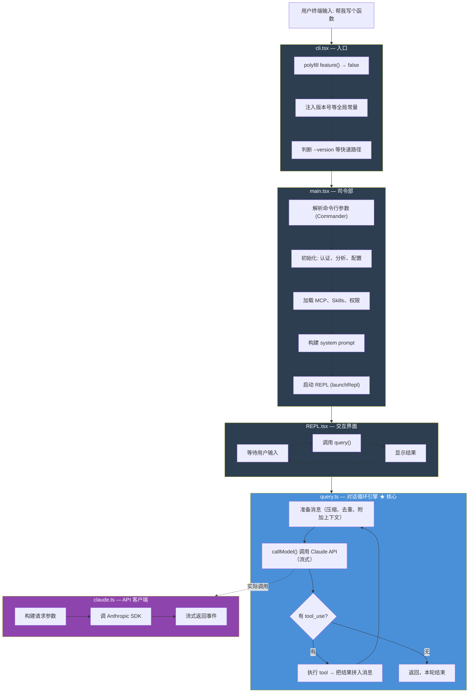
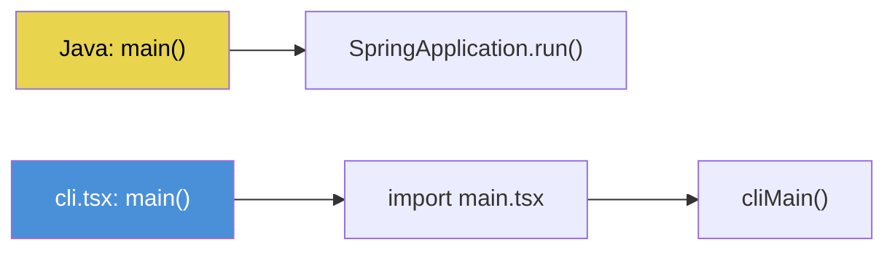
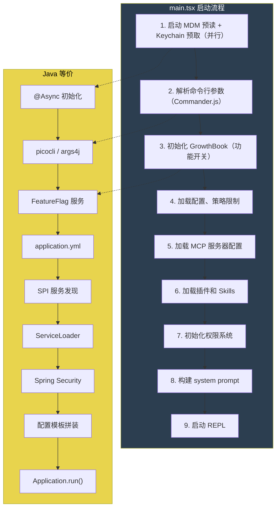
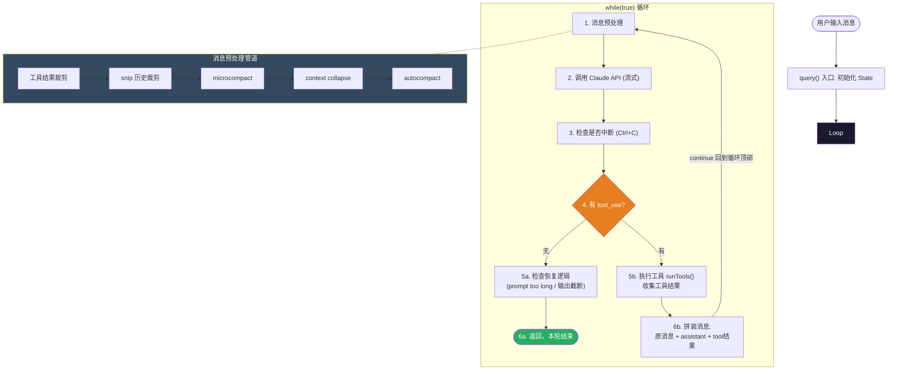
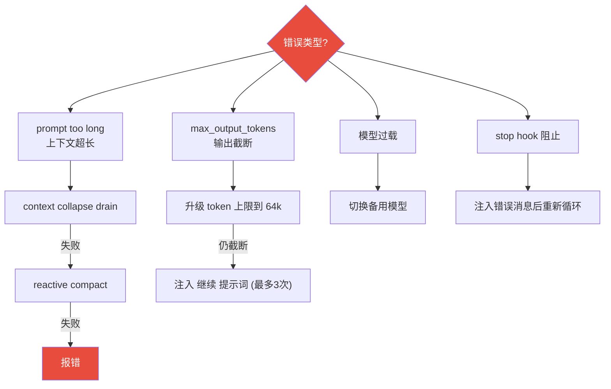
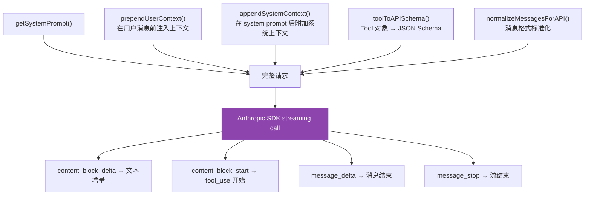
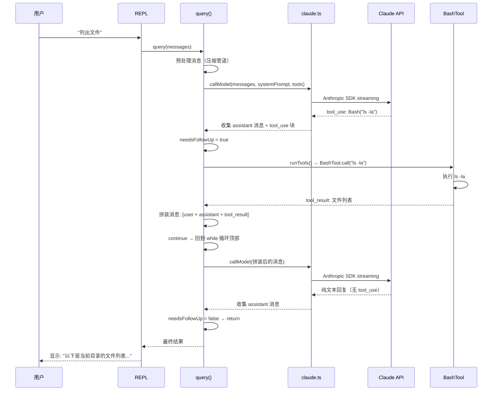
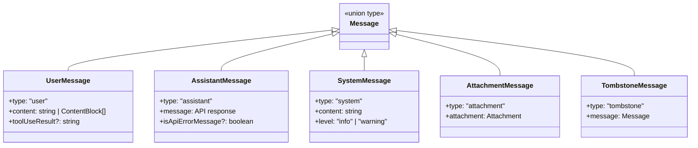
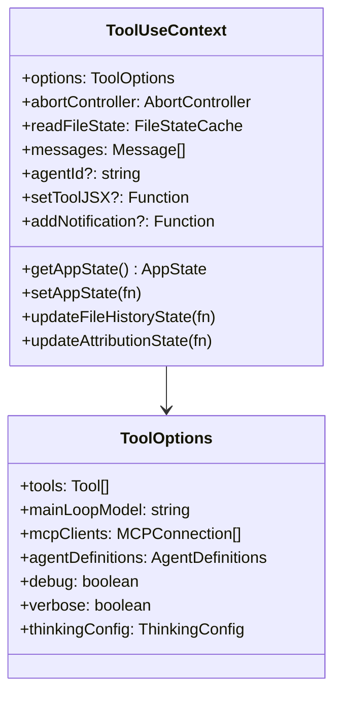

# Claude Code 主干流程：从启动到对话循环

> 阅读本文档后，你将理解：用户输入一句话 → Claude 收到并回复 → 如果回复中包含工具调用则执行工具 → 把结果再发给 Claude → 直到没有工具调用为止，这条完整链路。

---

## 一、全局架构图



---

## 二、启动阶段详解（cli.tsx → main.tsx）

### 2.1 cli.tsx — 门卫

**类比 Java**：相当于 `public static void main(String[] args)`，但做了更多快速路径判断。

**核心逻辑**：
1. 注入全局常量（`MACRO.VERSION`、`BUILD_TARGET` 等）—— 相当于 Java 的 `static final` 常量
2. `feature()` 函数永远返回 `false` —— 所有被 `feature('XXX')` 包裹的代码都是**死代码**，构建时会被消除
3. 判断命令行参数：
   - `--version` → 直接打印版本号，**零模块加载**（最快路径）
   - `--dump-system-prompt` → 输出 system prompt（内部调试用）
   - 其他 → 动态 `import("../main.tsx")` 加载完整 CLI

**Java 对比**：



### 2.2 main.tsx — 司令部

**类比 Java**：相当于 Spring Boot 的启动类 + 配置中心。



---

## 三、对话循环详解（query.ts）★ 最重要

这是整个 harness 的**心脏**。理解了它，你就理解了 agent 的本质。

### 3.1 核心循环流程图



### 3.2 关键概念解释（Java 程序员视角）

#### State — 循环状态

```typescript
type State = {
  messages: Message[]              // 对话历史（相当于 List<ChatMessage>）
  toolUseContext: ToolUseContext    // 工具执行上下文（相当于 ExecutionContext）
  autoCompactTracking: ...         // 压缩追踪状态
  maxOutputTokensRecoveryCount: number  // 输出截断恢复次数
  turnCount: number                // 当前轮次
  transition: Continue | undefined // 为什么继续循环（调试用）
}
```

**类比 Java**：这就是一个 `while` 循环里的局部变量，只不过被提取成了一个对象方便在 `continue` 时传递。

#### 消息预处理管道

在每次调 API 之前，消息会经过一系列处理：


**类比 Java**：就像 HTTP 请求经过 Filter Chain 一样，每个处理器做一件事。

#### tool_use 块 — 工具调用请求

当 Claude 回复中包含 `tool_use` 块时，表示 Claude 想调用一个工具：

```json
{
  "type": "tool_use",
  "id": "toolu_abc123",
  "name": "Bash",
  "input": { "command": "ls -la" }
}
```

**类比 Java**：这就像 RPC 请求——Claude 是客户端，harness 是服务端，`tool_use` 就是一个 RPC 调用。

#### tool_result — 工具执行结果

harness 执行完工具后，把结果封装成 `tool_result`：

```json
{
  "type": "tool_result",
  "tool_use_id": "toolu_abc123",
  "content": "total 48\ndrwxr-xr-x  6 user staff  192 ..."
}
```

然后把 `[原消息 + assistant回复 + tool_result]` 一起再发给 Claude，进入下一轮循环。

### 3.3 恢复机制（容错设计）



---

## 四、API 调用层（claude.ts）

### 4.1 请求构建流程

query.ts 中的 `deps.callModel()` 调用 claude.ts 的流式 API 方法，以下是 claude.ts 内部做的事：



---

## 五、完整时序图（一次用户提问的生命周期）



---

## 六、核心数据结构速查

### Message 类型层次



### ToolUseContext — 工具执行上下文



---

## 七、一句话总结

**Claude Code 的核心就是一个 while 循环**：发消息给 Claude → 如果 Claude 想用工具就执行工具 → 把结果拼回去再发 → 直到 Claude 说"我做完了"。所有其他功能（压缩、权限、MCP、Skills）都是这个循环的增强。

---

## 八、下一步

理解了主干流程后，Day 2 我们将深入四大模块：
- **Tool 系统**：工具是怎么定义、注册、过滤、执行的
- **Prompt 工程**：system prompt 是怎么拼装的
- **Skill 系统**：skill 和 tool 的区别是什么
- **MCP 协议**：外部工具是怎么接入的
