# Claude Code 四大模块深入解析：Tool / Prompt / Skill / MCP

> 阅读本文档后，你将理解：工具系统怎么设计的、Prompt 怎么拼装的、Skill 和 Tool 的本质区别、MCP 外部工具怎么接入的。

---

## 一、Tool 系统 — agent 的手和脚

### 1.1 Tool 是什么

Tool 就是 agent 能做的"动作"。Claude 说"我想执行 `ls`"，harness 就调用 BashTool；Claude 说"我想读文件"，harness 就调用 FileReadTool。

**类比 Java**：Tool ≈ `Command` 模式。每个 Tool 就是一个 Command 对象。

### 1.2 Tool 接口定义（Tool.ts）

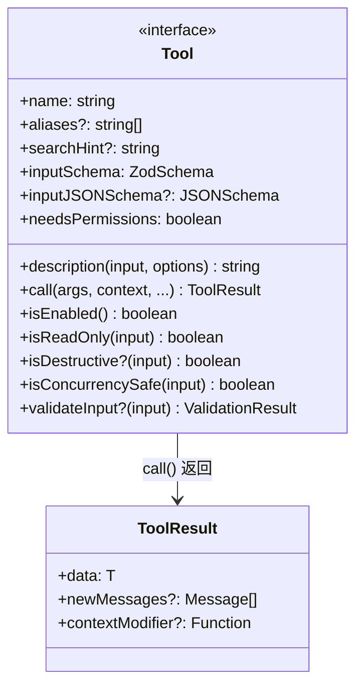

**类比 Java**：

```java
// 如果用 Java 写，大概是这样：
public interface Tool<I, O> {
    String name();
    ZodSchema<I> inputSchema();
    String description(I input, Options options);
    ToolResult<O> call(I input, ExecutionContext context);  // 核心
    boolean isEnabled();
    boolean isReadOnly(I input);
    boolean needsPermissions();
}
```

### 1.3 ToolUseContext — 执行上下文

每次调用 `tool.call()` 时，会传入一个 `ToolUseContext`，它包含：

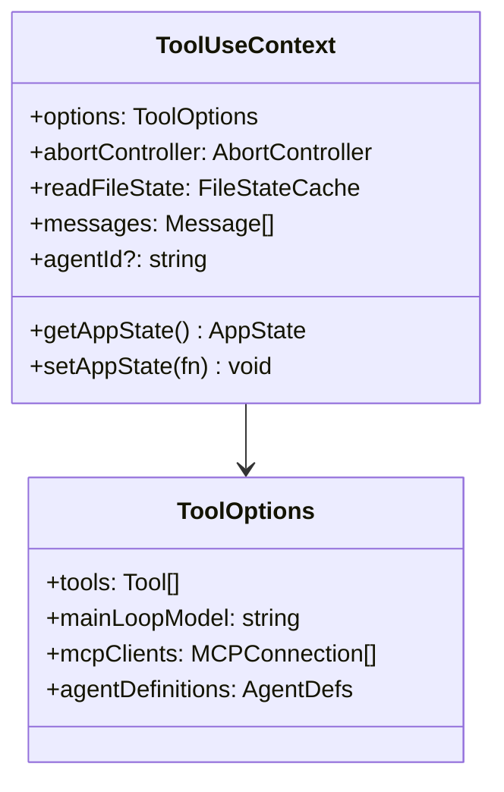

**类比 Java**：这就是 `ApplicationContext` + `RequestContext` 的合体——既有全局状态，也有本次请求的上下文。

### 1.4 Tool 注册与过滤（tools.ts）

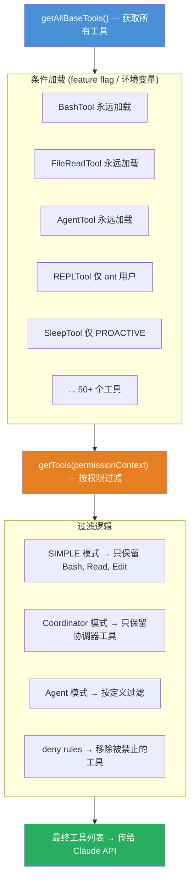

**类比 Java**：类似 Spring 的 `@ConditionalOnProperty`——根据配置决定是否加载某个 Bean。

### 1.5 BashTool 实现分析（最典型的 Tool）

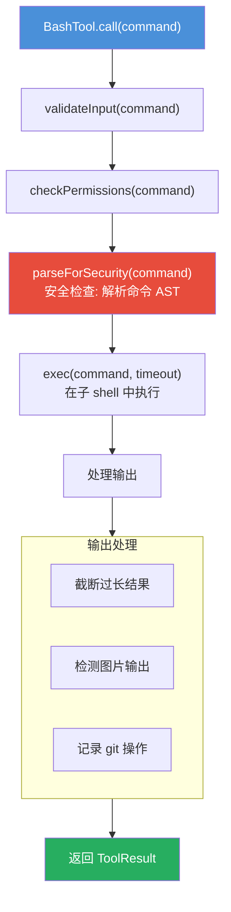

### 1.6 AgentTool — 子 Agent 调度

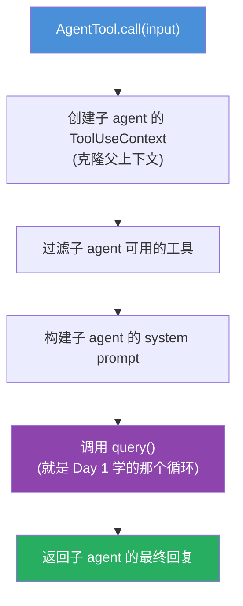

**类比 Java**：就像在一个线程里启动另一个线程——子 agent 有自己的上下文、工具、对话历史。

---

## 二、Prompt 工程 — agent 的大脑指令

### 2.1 Prompt 构建流程

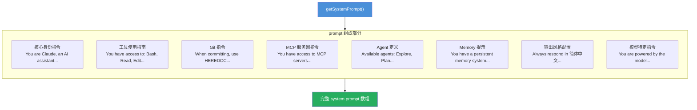

### 2.2 上下文注入（context.ts）

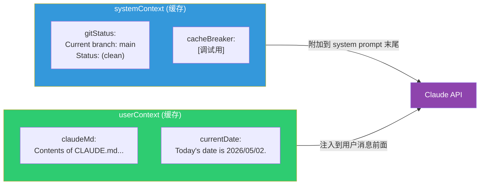

### 2.3 System Prompt 优先级链（systemPrompt.ts）

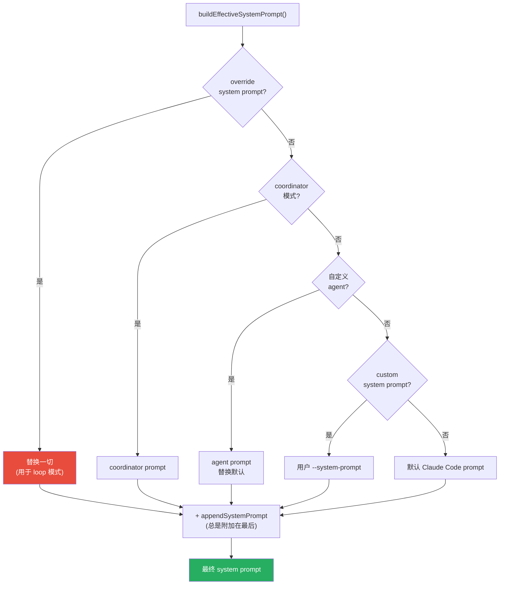

**类比 Java**：就像 Spring 的 `@Order` 注解——优先级高的配置覆盖优先级低的。

---

## 三、Skill 系统 — 预编排的指令集

### 3.1 Skill 是什么

**关键区分**：Skill ≠ Tool。

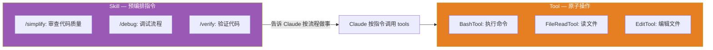

**类比 Java**：
- Tool ≈ Service 方法
- Skill ≈ 一段 Spring Batch Job 定义——它不是代码，而是一组指令

### 3.2 BundledSkillDefinition 结构

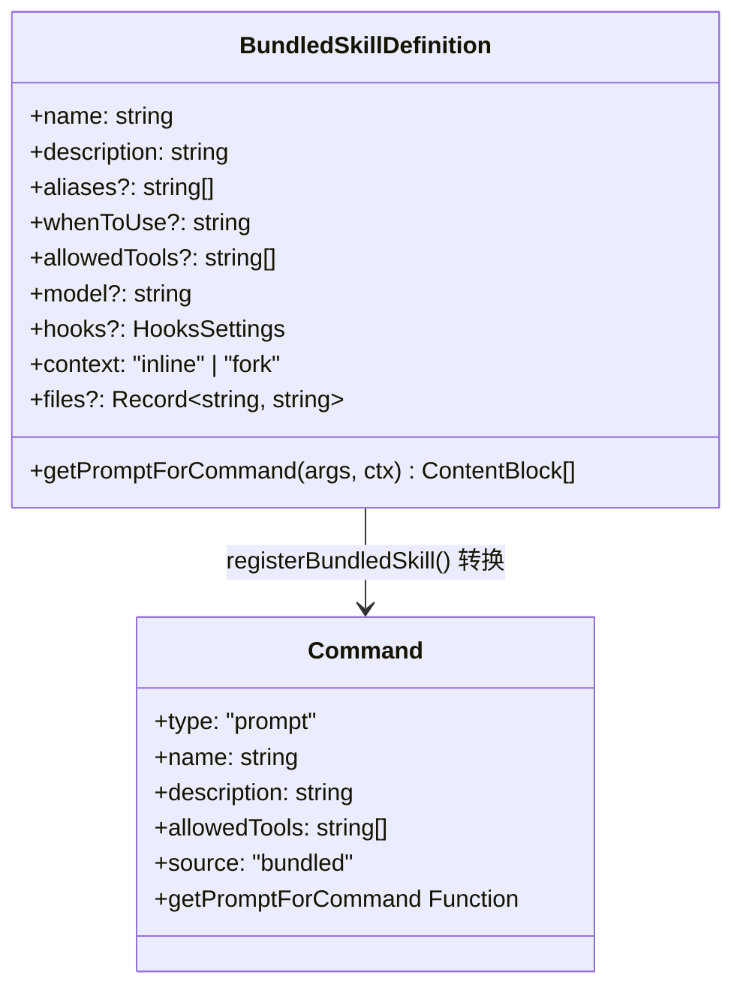

### 3.3 Skill 的加载流程

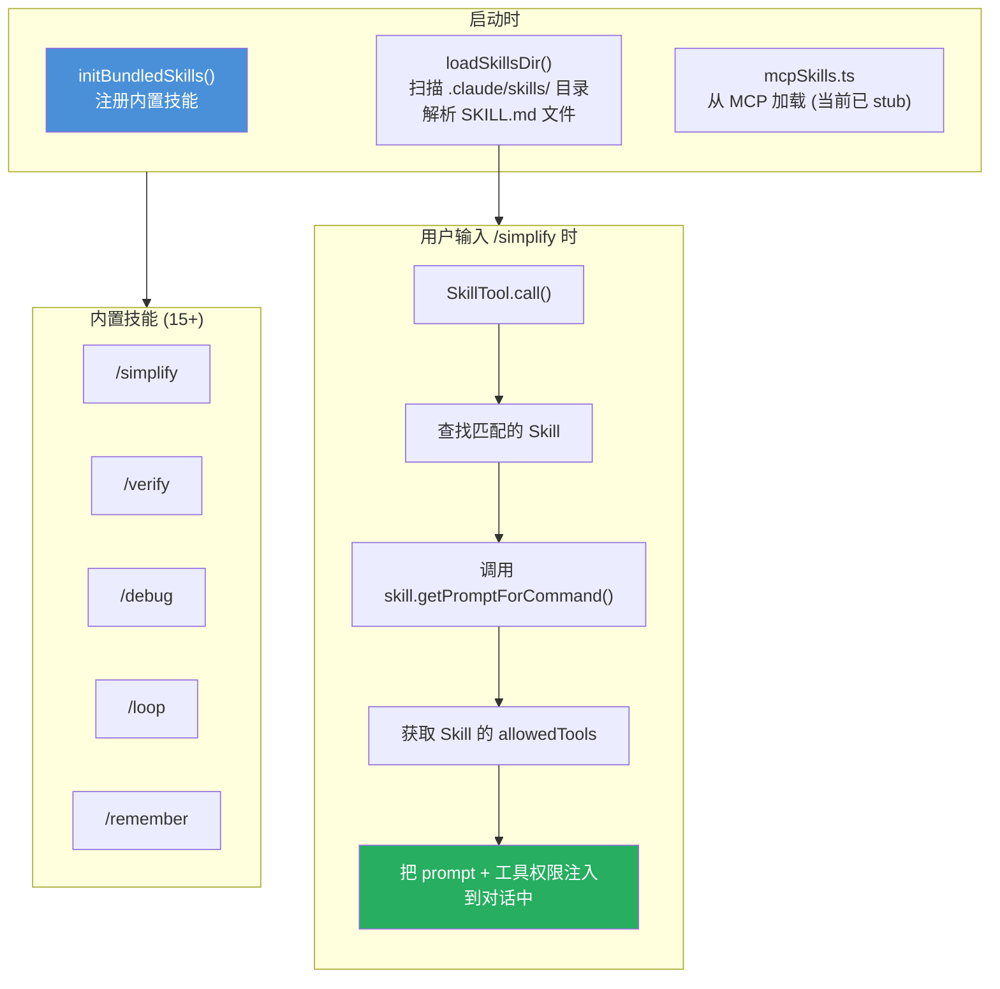

### 3.4 SKILL.md 文件格式（磁盘技能）

```markdown
---
name: my-skill
description: 做某件事的技能
allowedTools:
  - Bash
  - Read
  - Edit
hooks:
  pre: echo "starting"
  post: echo "done"
---

你是一个专业的代码审查员。请按以下步骤工作：

1. 使用 GrepTool 搜索所有 TODO 注释
2. 使用 FileReadTool 读取相关文件
3. 使用 EditTool 修复发现的问题

完成后给出总结报告。
```

---

## 四、MCP 协议 — 外部工具接入

### 4.1 MCP 是什么

MCP（Model Context Protocol）是一个标准协议，让外部程序能向 Claude 暴露工具、资源和提示词。

**类比 Java**：MCP ≈ SPI（Service Provider Interface）。

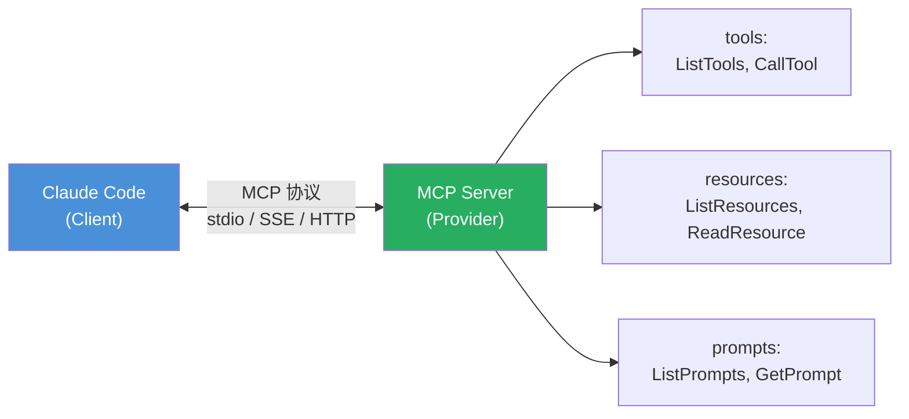

### 4.2 MCP 客户端连接流程（client.ts）

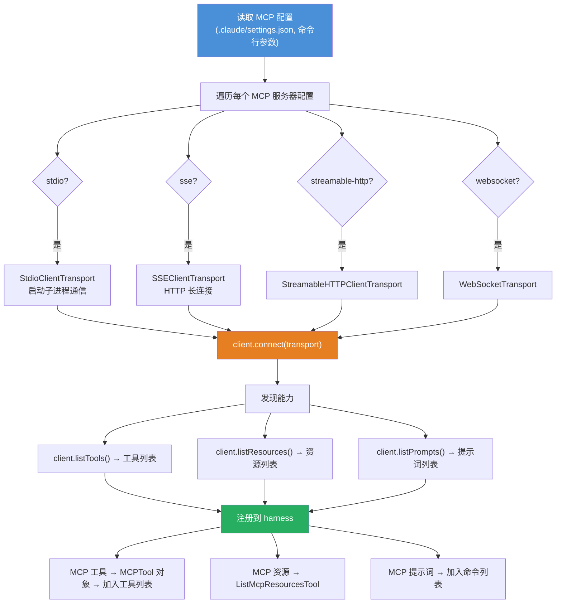

### 4.3 MCPTool — MCP 工具的包装

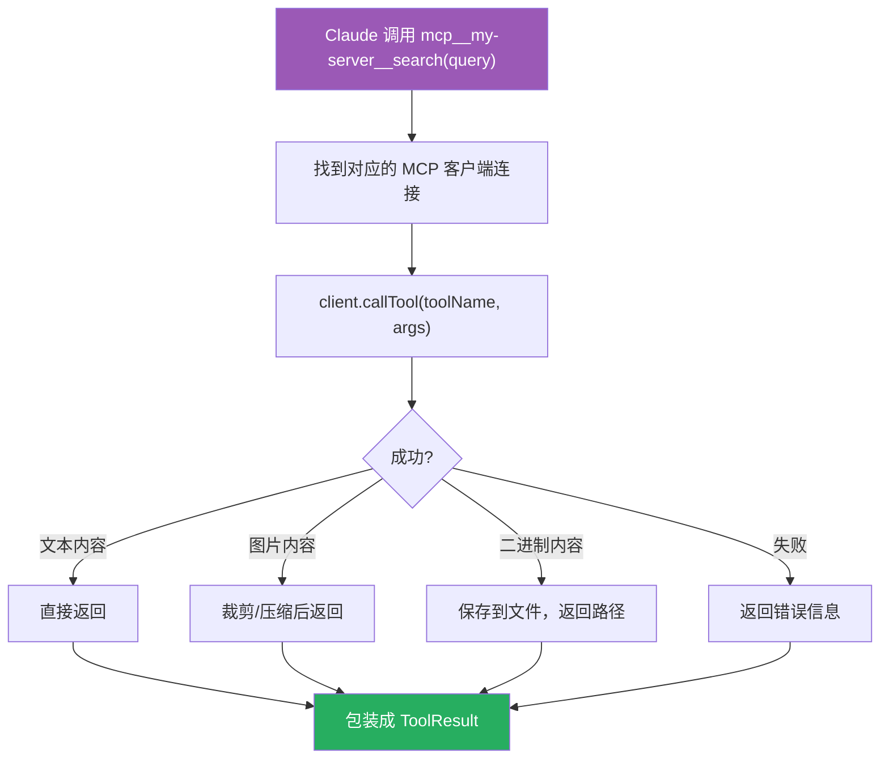

---

## 五、四大模块协作关系图

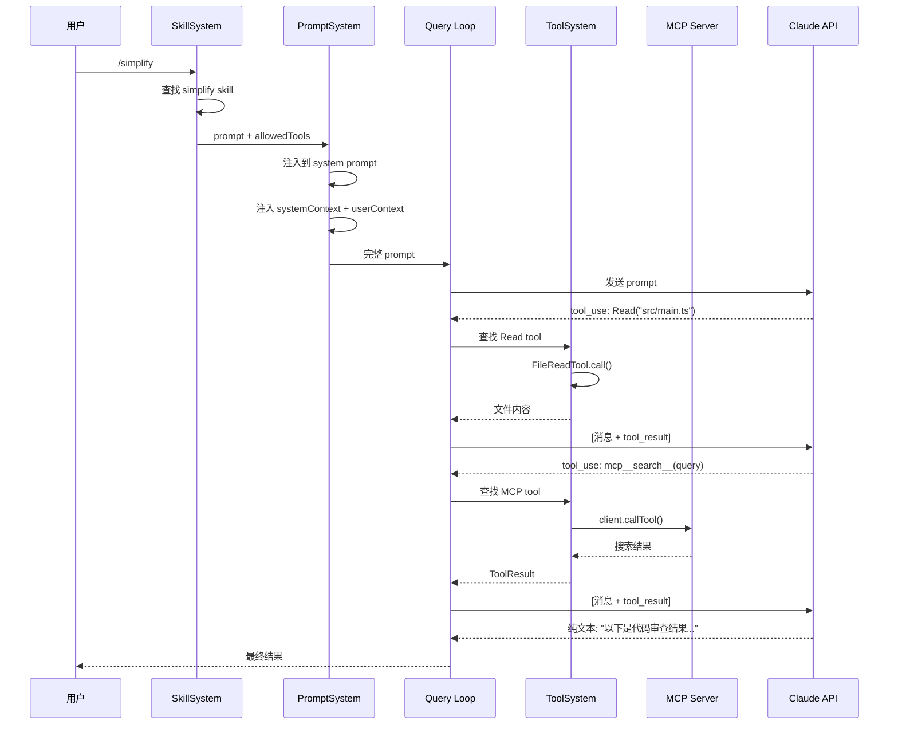

---

## 六、设计模式总结

| 模式 | 在哪里用 | Java 等价 |
|------|---------|-----------|
| Command | Tool 接口 | `Command.execute()` |
| Strategy | Tool 过滤策略 | `Strategy` 接口 |
| Observer | store.ts 状态订阅 | `EventListener` |
| Template Method | Skill.getPromptForCommand | `AbstractMethod` |
| Adapter | MCPTool 包装 MCP 工具 | `Adapter` 模式 |
| Chain of Responsibility | 消息预处理管道 | `Filter Chain` |
| Composite | system prompt 拼装 | `Builder` 模式 |
| Singleton | context.ts 的 memoize | `@Scope("singleton")` |

---

## 七、一句话总结每个模块

- **Tool**：agent 能做的原子操作，定义了"能做什么"
- **Prompt**：agent 的行为指令，定义了"怎么做"
- **Skill**：预编排的指令集，定义了"按什么流程做"
- **MCP**：外部工具接入协议，扩展了"能做什么"的边界

---

## 八、下一步

Day 3 我们将学习：
- **状态管理**：store.ts 的极简设计
- **QueryEngine**：非交互式模式（SDK 调用）
- **上下文压缩**：对话太长怎么办
- **任务系统**：多步骤任务怎么管理
