# Claude Code 工具系统深度解析

> 阅读本文档后，你将理解：工具调用的本质是什么、Tool 接口怎么设计的、工具怎么定义给大模型、程序怎么执行并返回结果、多轮循环和并行调用的完整机制、以及典型 Tool 的实现分析。

---

## 一、工具调用的本质

### 1.1 一句话定义

**工具调用 = 大模型决策 + 程序执行**。大模型只负责"想调什么、传什么参数"，真正的代码执行全在程序侧完成。

### 1.2 为什么需要工具调用

大模型本质上是一个文本生成器——它能生成代码、分析逻辑、撰写文档，但它**不能**：

- 读写文件系统
- 执行 shell 命令
- 调用外部 API
- 访问数据库

工具调用就是给大模型装上"手脚"，让它能与外部世界交互。

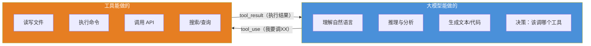

### 1.3 与 Java 的类比

| 概念 | Java 等价 | 说明 |
|------|----------|------|
| 工具定义 | `interface Tool` | 声明有哪些能力 |
| 工具调用 | `Command` 模式 | 大模型发出指令，程序执行 |
| tool_use | RPC 请求 | 包含方法名 + 参数 |
| tool_result | RPC 响应 | 包含执行结果或错误 |
| 多轮循环 | 消息驱动的事件循环 | 持续交互直到任务完成 |

**本质就是 RPC over Messages**——Claude 是服务端，harness 是客户端，`tool_use` 是请求，`tool_result` 是响应。只不过整个协议是通过消息数组传递的，而不是 HTTP 请求/响应。

---

## 二、Tool 接口设计

### 2.1 Tool 接口定义（Tool.ts）

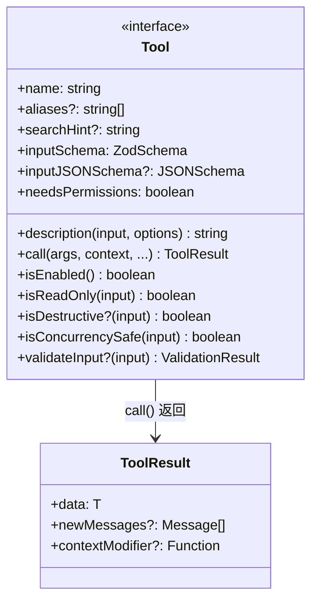

**类比 Java**：

```java
// 如果用 Java 写，大概是这样：
public interface Tool<I, O> {
    String name();
    ZodSchema<I> inputSchema();
    String description(I input, Options options);
    ToolResult<O> call(I input, ExecutionContext context);  // 核心
    boolean isEnabled();
    boolean isReadOnly(I input);
    boolean needsPermissions();
}
```

**核心方法说明**：
- `name` — 工具的唯一标识，大模型通过这个名字调用
- `inputSchema` — 参数的 JSON Schema 定义
- `description` — 给大模型看的使用说明（不是给人看的）
- `call()` — 实际执行逻辑，返回 `ToolResult`
- `isReadOnly()` — 是否只读操作（用于权限判断）
- `isConcurrencySafe()` — 是否可并发执行

### 2.2 ToolUseContext — 执行上下文

每次调用 `tool.call()` 时，会传入一个 `ToolUseContext`，它包含：

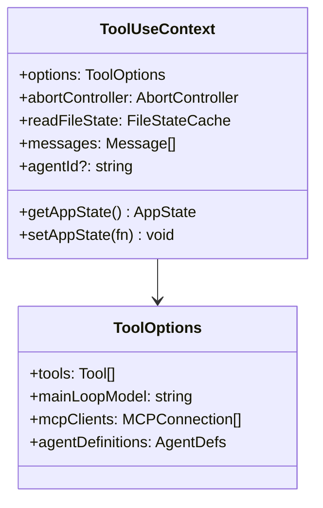

**类比 Java**：这就是 `ApplicationContext` + `RequestContext` 的合体——既有全局状态，也有本次请求的上下文。

### 2.3 Tool 注册与过滤（tools.ts）

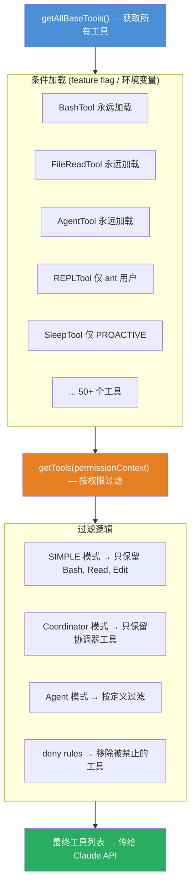

**类比 Java**：类似 Spring 的 `@ConditionalOnProperty`——根据配置决定是否加载某个 Bean。

---

## 三、工具定义与发现

### 3.1 工具的 JSON Schema 定义

每个工具需要告诉大模型三件事：**叫什么名字**、**干什么用**、**需要什么参数**。

```json
{
  "name": "Read",
  "description": "Reads a file from the local filesystem. You can access any file directly by using this tool.",
  "input_schema": {
    "type": "object",
    "properties": {
      "file_path": {
        "type": "string",
        "description": "The absolute path to the file to read"
      },
      "offset": {
        "type": "integer",
        "description": "The line number to start reading from"
      },
      "limit": {
        "type": "integer",
        "description": "The number of lines to read"
      }
    },
    "required": ["file_path"]
  }
}
```

### 3.2 大模型看到的工具列表

发给 API 的请求中，`tools` 参数是一个数组，包含所有可用工具的定义：

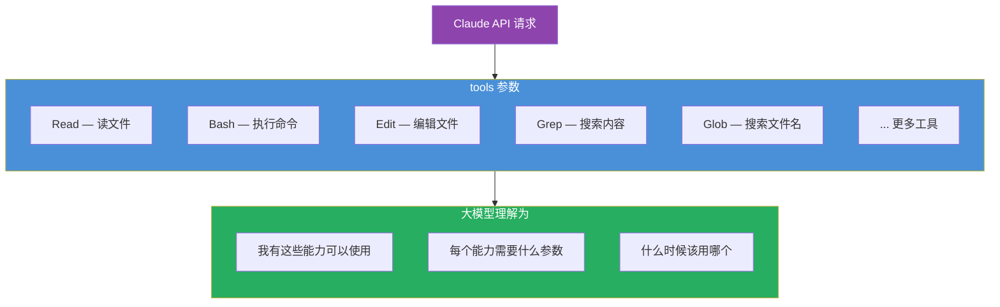

### 3.3 description 的重要性

`description` 不是给人看的，是给大模型看的。它是大模型判断"什么时候该用这个工具"的关键依据。

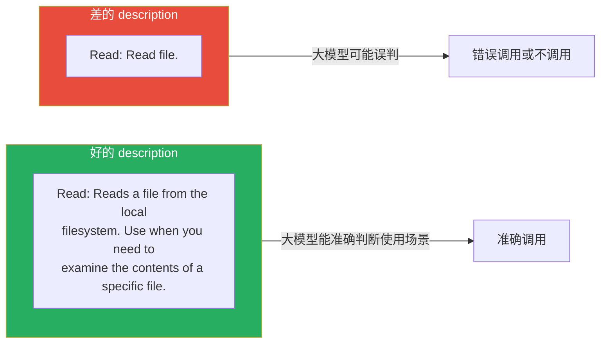

---

## 四、工具执行流程

### 4.1 完整执行流程

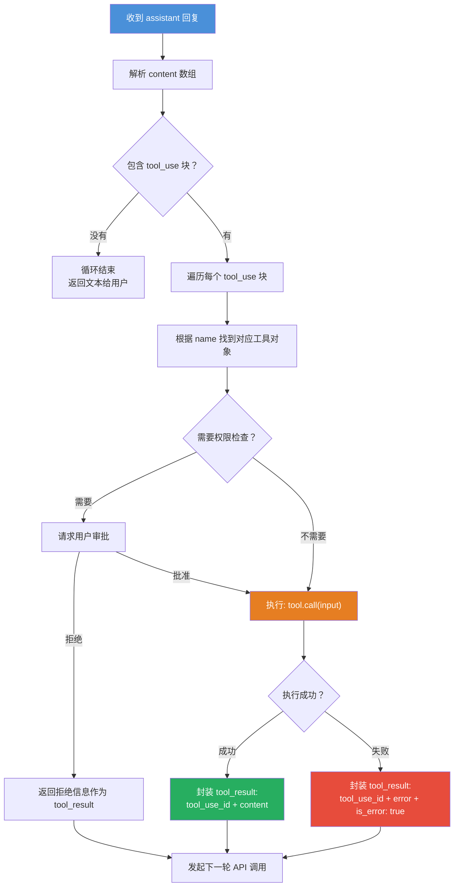

### 4.2 代码追踪：三步走

**第一步：从 API 响应中提取 tool_use 块**

```typescript
// src/query.ts:828-838
if (message.type === 'assistant') {
    assistantMessages.push(assistantMessage)

    // 从 assistant 消息的 content 数组中过滤出 tool_use 块
    const msgToolUseBlocks = assistantMessage.message.content
        .filter(content => content.type === 'tool_use') as ToolUseBlock[]

    if (msgToolUseBlocks.length > 0) {
        toolUseBlocks.push(...msgToolUseBlocks)
        needsFollowUp = true  // ← 标记需要继续循环
    }
}
```

**第二步：执行工具，生成 tool_result 消息**

```typescript
// src/query.ts:1383-1411
const toolUpdates = streamingToolExecutor
    ? streamingToolExecutor.getRemainingResults()
    : runTools(toolUseBlocks, assistantMessages, canUseTool, toolUseContext)

for await (const update of toolUpdates) {
    if (update.message) {
        yield update.message
        // 把工具结果转成 UserMessage，加入 toolResults 数组
        toolResults.push(
            ...normalizeMessagesForAPI([update.message], tools)
                .filter(_ => _.type === 'user'),
        )
    }
}
```

工具结果消息的结构（`src/services/tools/toolExecution.ts:1456`）：

```typescript
createUserMessage({
    content: [
        {
            type: 'tool_result',
            tool_use_id: 'toolu_abc123',   // 对应 tool_use 的 id
            content: '文件内容...',          // 工具执行结果
        }
    ],
    sourceToolAssistantUUID: assistantMessage.uuid,  // 关联到哪个 assistant 消息
})
```

**第三步：拼装消息，发起下一轮 API 调用**

```typescript
// src/query.ts:1718-1730
const next: State = {
    // 关键：拼装三部分消息
    messages: [...messagesForQuery, ...assistantMessages, ...toolResults],
    toolUseContext: updatedToolUseContext,
    turnCount: nextTurnCount,
    // ...
}
state = next
// → 回到 while(true) 循环顶部，用新 messages 再次调用 API
```

### 4.3 tool_use 和 tool_result 的结构

**tool_use 块**（大模型返回）：

```json
{
  "type": "tool_use",
  "id": "toolu_01ABC123",
  "name": "Read",
  "input": {
    "file_path": "src/main.ts",
    "limit": 20
  }
}
```

**tool_result 消息**（程序发回）：

```json
{
  "role": "user",
  "content": [
    {
      "type": "tool_result",
      "tool_use_id": "toolu_01ABC123",
      "content": "import { readFileSync } from 'fs'\n\nexport function main() {\n  // ...\n}"
    }
  ]
}
```

**配对规则**：
- 每个 `tool_use` 有唯一 `id`
- 每个 `tool_result` 通过 `tool_use_id` 关联到对应的 `tool_use`
- API 要求每个 `tool_use` 都必须有对应的 `tool_result`（否则报错）
- `tool_result` 必须紧跟在包含对应 `tool_use` 的 `assistant` 消息之后

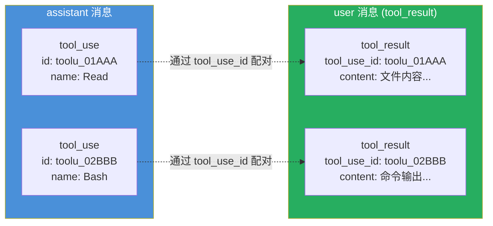

### 4.4 错误处理

工具执行失败时，通过 `is_error` 标记：

```json
{
  "type": "tool_result",
  "tool_use_id": "toolu_01ABC123",
  "content": "<tool_use_error>Error: ENOENT: no such file or directory 'src/missing.ts'</tool_use_error>",
  "is_error": true
}
```

大模型看到 `is_error: true` 后会知道工具执行失败，可以尝试其他方案（换个路径、换个工具等）。

---

## 五、多轮循环机制

### 5.1 循环流程

工具调用不是一次性的，而是一个**持续循环**，直到大模型认为任务完成：

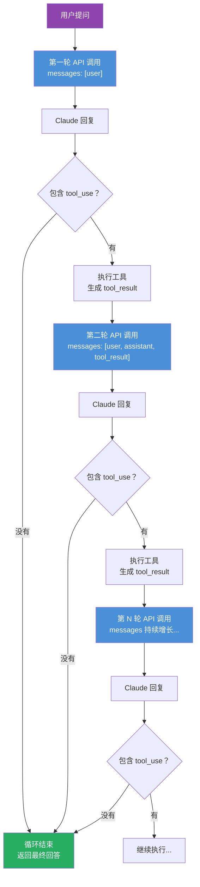

### 5.2 消息不断累积

每一轮循环，消息数组都会增长：

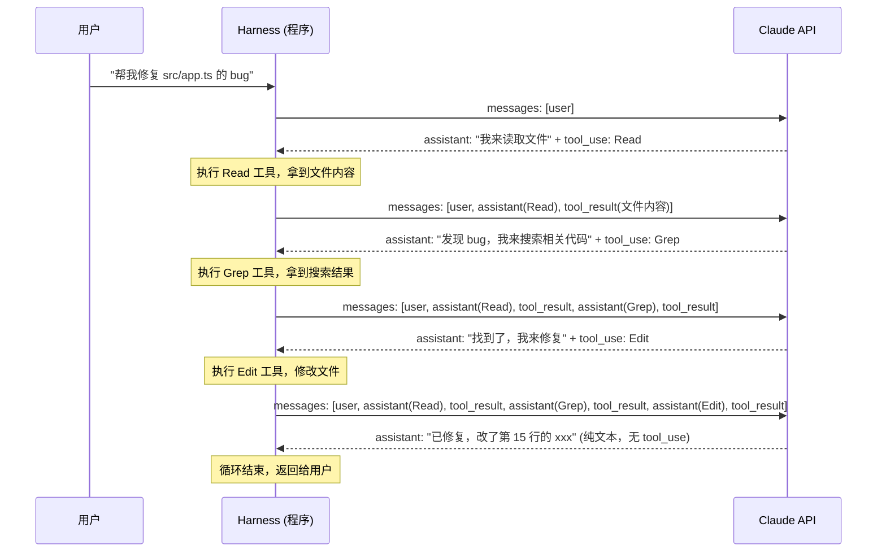

### 5.3 代码实现（query.ts 核心循环）

```typescript
// 简化自 src/query.ts
while (true) {
    // 1. 调用 Claude API
    const response = await callClaudeAPI(messages, tools, systemPrompt)

    // 2. 提取 assistant 回复
    assistantMessages.push(response)

    // 3. 检查是否有 tool_use
    const toolUseBlocks = response.content
        .filter(block => block.type === 'tool_use')

    if (toolUseBlocks.length === 0) {
        break  // 没有工具调用，循环结束
    }

    // 4. 执行所有工具
    for (const toolUse of toolUseBlocks) {
        const tool = findToolByName(tools, toolUse.name)
        const result = await tool.call(toolUse.input, context)

        // 5. 生成 tool_result 消息
        toolResults.push({
            role: 'user',
            content: [{
                type: 'tool_result',
                tool_use_id: toolUse.id,
                content: result.data,
                is_error: result.isError
            }]
        })
    }

    // 6. 拼装消息，进入下一轮
    messages = [...messages, ...assistantMessages, ...toolResults]
}
```

### 5.4 实际例子：完整消息结构

用户说"帮我看看 src/utils/config.ts 的前 20 行"。

**第一轮发给 API 的 messages**：

```json
[
  {
    "role": "user",
    "content": "帮我看看 src/utils/config.ts 的前 20 行"
  }
]
```

**第一轮 API 返回（assistant 消息）**：

```json
{
  "role": "assistant",
  "content": [
    {
      "type": "text",
      "text": "好的，我来读取这个文件的前 20 行。"
    },
    {
      "type": "tool_use",
      "id": "toolu_01ABC123",
      "name": "Read",
      "input": {
        "file_path": "D:/develop/OpenSource/claude-code/src/utils/config.ts",
        "limit": 20
      }
    }
  ]
}
```

**生成 tool_result 消息**：

```json
{
  "role": "user",
  "content": [
    {
      "type": "tool_result",
      "tool_use_id": "toolu_01ABC123",
      "content": "import { readFileSync, writeFileSync } from 'fs'\nimport { join } from 'path'\nimport { getGlobalConfigDir } from './paths.js'\n\nexport function getGlobalConfig(): GlobalConfig {\n  const configPath = join(getGlobalConfigDir(), 'config.json')\n  try {\n    const raw = readFileSync(configPath, 'utf-8')\n    return JSON.parse(raw)\n  } catch {\n    return getDefaultConfig()\n  }\n}\n\nexport function saveGlobalConfig(config: GlobalConfig): void {\n  const configPath = join(getGlobalConfigDir(), 'config.json')\n  writeFileSync(configPath, JSON.stringify(config, null, 2))\n}"
    }
  ]
}
```

**第二轮发给 API 的完整 messages**：

```json
[
  {
    "role": "user",
    "content": "帮我看看 src/utils/config.ts 的前 20 行"
  },
  {
    "role": "assistant",
    "content": [
      {
        "type": "text",
        "text": "好的，我来读取这个文件的前 20 行。"
      },
      {
        "type": "tool_use",
        "id": "toolu_01ABC123",
        "name": "Read",
        "input": {
          "file_path": "D:/develop/OpenSource/claude-code/src/utils/config.ts",
          "limit": 20
        }
      }
    ]
  },
  {
    "role": "user",
    "content": [
      {
        "type": "tool_result",
        "tool_use_id": "toolu_01ABC123",
        "content": "import { readFileSync, writeFileSync } from 'fs'\n..."
      }
    ]
  }
]
```

**第二轮 API 返回（无 tool_use，循环结束）**：

```json
{
  "role": "assistant",
  "content": [
    {
      "type": "text",
      "text": "以下是 src/utils/config.ts 前 20 行的内容：\n\n```typescript\nimport { readFileSync, writeFileSync } from 'fs'\nimport { join } from 'path'\nimport { getGlobalConfigDir } from './paths.js'\n\nexport function getGlobalConfig(): GlobalConfig {\n  const configPath = join(getGlobalConfigDir(), 'config.json')\n  try {\n    const raw = readFileSync(configPath, 'utf-8')\n    return JSON.parse(raw)\n  } catch {\n    return getDefaultConfig()\n  }\n}\n```\n\n这个函数读取全局配置文件，如果文件不存在则返回默认配置。"
    }
  ]
}
```

**没有 tool_use 块 → `needsFollowUp = false` → 循环结束。**

---

## 六、并行工具调用

### 6.1 什么是并行调用

当大模型一次返回多个 `tool_use` 块时，如果这些工具之间没有依赖关系，程序可以**并行执行**：

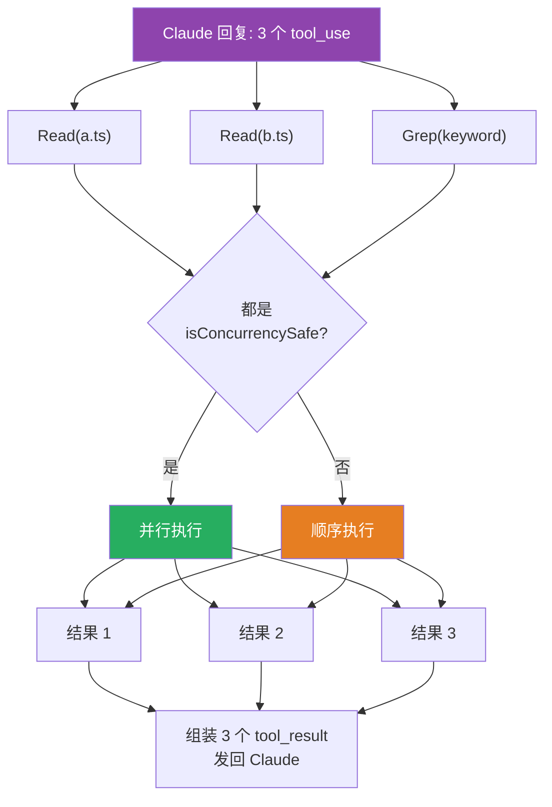

### 6.2 并发安全判定

不是所有工具都能并行执行。每个工具需要声明自己是否并发安全：

| 工具 | isConcurrencySafe | 原因 |
|------|------------------|------|
| Read | true | 只读操作，不影响其他调用 |
| Grep | true | 只读搜索 |
| Glob | true | 只读搜索 |
| Bash | false | 可能有副作用（写文件、启动服务等） |
| Edit | false | 修改文件，并发会冲突 |

```typescript
// Claude Code 中的判定逻辑
function isConcurrencySafe(tool, input): boolean {
    return tool.isConcurrencySafe(input)
    // Read: return true
    // Bash: return false
}
```

**类比 Java**：只读方法可以加 `synchronized`，写方法需要独占锁。Read 就像 `get()` 方法，可以并发；Edit 就像 `set()` 方法，需要互斥。

### 6.3 并行执行的例子

当 Claude 一次回复中包含多个 tool_use 时：

```json
{
  "role": "assistant",
  "content": [
    { "type": "text", "text": "我来同时读取这两个文件。" },
    { "type": "tool_use", "id": "toolu_01AAA", "name": "Read",
      "input": { "file_path": "src/a.ts" } },
    { "type": "tool_use", "id": "toolu_02BBB", "name": "Read",
      "input": { "file_path": "src/b.ts" } }
  ]
}
```

两个 Read 都是 `isConcurrencySafe = true`，所以 `runToolsConcurrently()` 并行执行，生成两个 tool_result：

```json
[
  {
    "role": "user",
    "content": [
      {
        "type": "tool_result",
        "tool_use_id": "toolu_01AAA",
        "content": "文件 a.ts 的内容..."
      }
    ]
  },
  {
    "role": "user",
    "content": [
      {
        "type": "tool_result",
        "tool_use_id": "toolu_02BBB",
        "content": "文件 b.ts 的内容..."
      }
    ]
  }
]
```

---

## 七、安全层

### 7.1 为什么需要安全层

大模型可能被提示注入攻击（恶意文件内容中嵌入指令），也可能做出危险操作（删除文件、执行危险命令）。所以程序必须在工具执行前进行拦截。

### 7.2 拦截流程

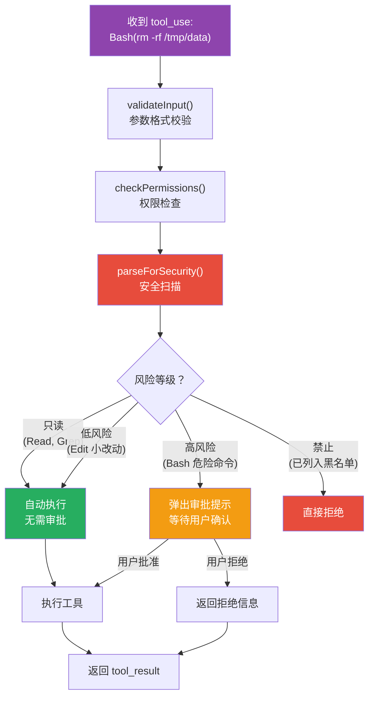

### 7.3 权限模型

```typescript
// 简化自 Claude Code 的权限检查
async function canUseTool(tool, input): Promise<PermissionResult> {
    // 1. 只读工具自动放行
    if (tool.isReadOnly(input)) return { allowed: true }

    // 2. 检查用户配置的权限规则
    const rule = findMatchingPermissionRule(tool.name, input)
    if (rule === 'allow') return { allowed: true }
    if (rule === 'deny') return { allowed: false, reason: '被用户规则禁止' }

    // 3. 高风险操作需要用户审批
    if (tool.isDestructive?.(input)) {
        const userApproval = await promptUser(tool, input)
        return userApproval
    }

    // 4. 默认放行
    return { allowed: true }
}
```

**类比 Java**：就像 Spring Security 的权限拦截器链——只读操作放行，写操作需要认证，危险操作需要管理员审批。

---

## 八、典型 Tool 实现

### 8.1 BashTool — 最典型的 Tool

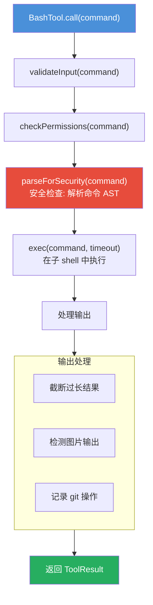

**关键特性**：
- `isReadOnly()` — 根据命令内容判断（如 `ls` 只读，`rm` 非只读）
- `isConcurrencySafe()` — 返回 `false`（可能有副作用）
- `needsPermissions` — 返回 `true`（高风险操作）
- `parseForSecurity()` — 解析命令 AST，拦截危险模式

### 8.2 AgentTool — 子 Agent 调度

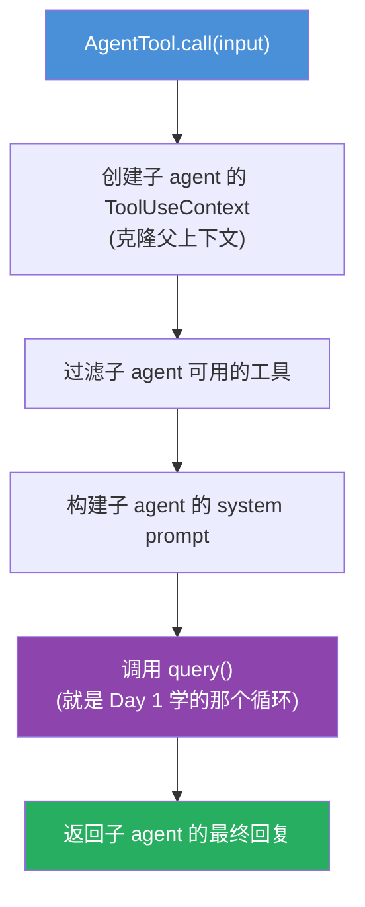

**类比 Java**：就像在一个线程里启动另一个线程——子 agent 有自己的上下文、工具、对话历史。

**关键特性**：
- 克隆父上下文，但过滤工具列表
- 构建独立的 system prompt
- 递归调用 `query()` 函数（复用多轮循环机制）
- 返回子 agent 的最终回复作为 ToolResult

### 8.3 FileReadTool — 只读工具

**关键特性**：
- `isReadOnly()` — 返回 `true`（只读操作）
- `isConcurrencySafe()` — 返回 `true`（可并发）
- `needsPermissions` — 返回 `false`（低风险）
- 直接读取文件内容，无需用户审批

---

## 九、完整生命周期图

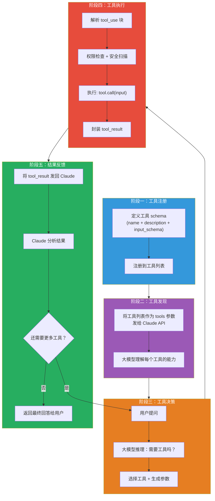

---

## 核心要点总结

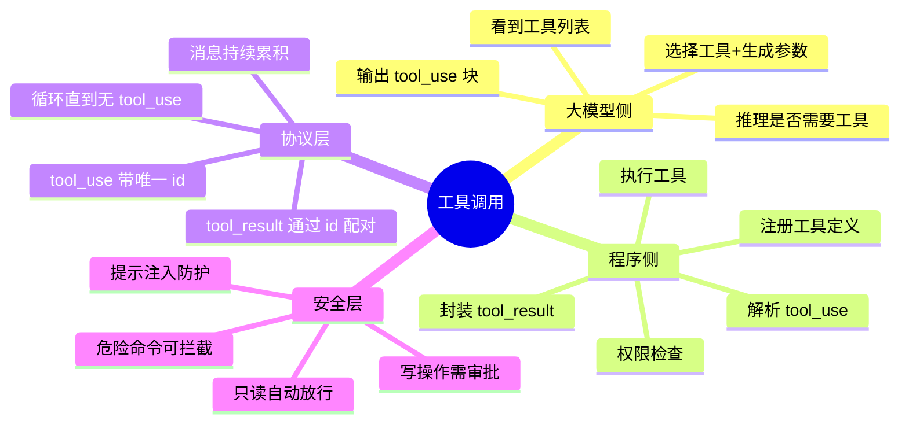

| 要点 | 说明 |
|------|------|
| 大模型不执行代码 | 只输出 tool_use 文本，程序负责执行 |
| 工具通过 JSON Schema 定义 | name + description + input_schema |
| tool_use 和 tool_result 通过 id 配对 | 确保结果对应正确的调用 |
| 多轮循环直到无 tool_use | 消息数组持续增长 |
| 并行调用需判断并发安全 | 只读工具可并行，写工具需顺序 |
| 安全层是程序侧的拦截 | 大模型无法绕过权限检查 |

---

## 与 Claude Code 源码的对应关系

| 概念 | Claude Code 代码位置 |
|------|---------------------|
| 工具定义 | `src/Tool.ts` — Tool 接口 |
| 工具注册 | `src/tools.ts` — getAllBaseTools() |
| 工具执行循环 | `src/query.ts` — while(true) 主循环 |
| 工具结果注入 | `src/query.ts` — toolResults 拼装 |
| 权限检查 | `src/utils/permissions/` |
| 并发执行判定 | `tool.isConcurrencySafe()` |
| 工具结果消息结构 | `src/services/tools/toolExecution.ts` |
