# Claude Code 工程化实践：状态管理 / 上下文压缩 / 工具编排 / QueryEngine

> 阅读本文档后，你将理解：极简状态管理设计、对话太长怎么压缩、多个工具怎么并行/串行执行、非交互模式怎么工作。

---

## 一、状态管理（store.ts）— 35 行的极简设计

### 1.1 完整实现

整个状态管理只有 35 行代码，核心就是三个方法：

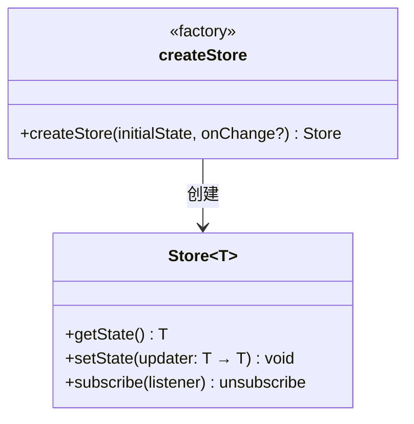

**类比 Java**：这就是一个极简版的 `EventBus` + `StateHolder`。

### 1.2 设计精髓

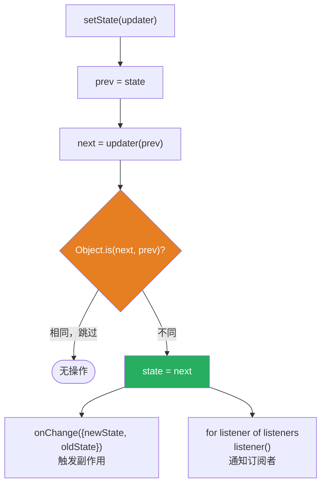

三个设计要点：

| 要点 | 做法 | 为什么 |
|------|------|--------|
| 不可变更新 | `updater(prev) => next` | 避免意外修改旧状态 |
| 引用相等检查 | `Object.is(next, prev)` | 避免无意义的重渲染 |
| 副作用分离 | `onChange` 回调 | 状态变更后的副作用（日志、持久化）独立处理 |

### 1.3 AppState — 全局状态结构

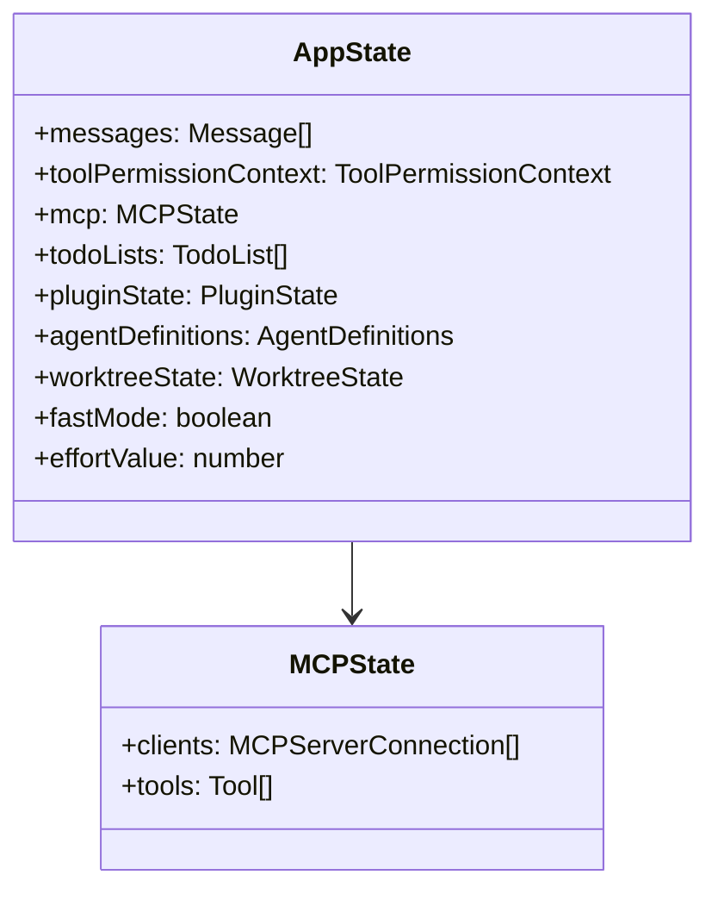

**类比 Java**：这就是 Spring 的 `ApplicationContext`——一个全局可访问的状态容器。

### 1.4 React 集成（AppState.tsx）

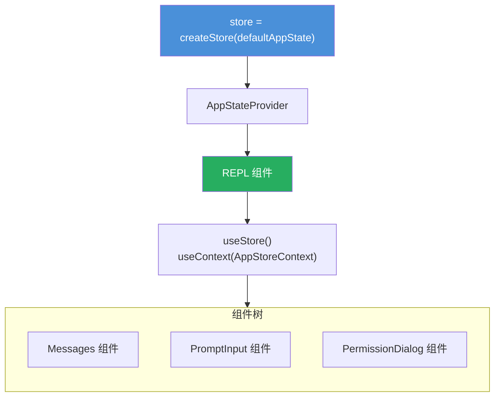

---

## 二、上下文压缩 — 对话太长怎么办

### 2.1 问题背景

Claude API 有上下文窗口限制（如 200k tokens）。当对话历史超过限制时，必须压缩。

**类比 Java**：类似数据库分页——你不能把所有历史记录都放在一个查询里。

### 2.2 压缩策略层次

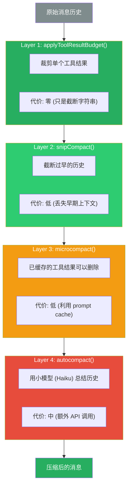

### 2.3 autocompact 详细流程

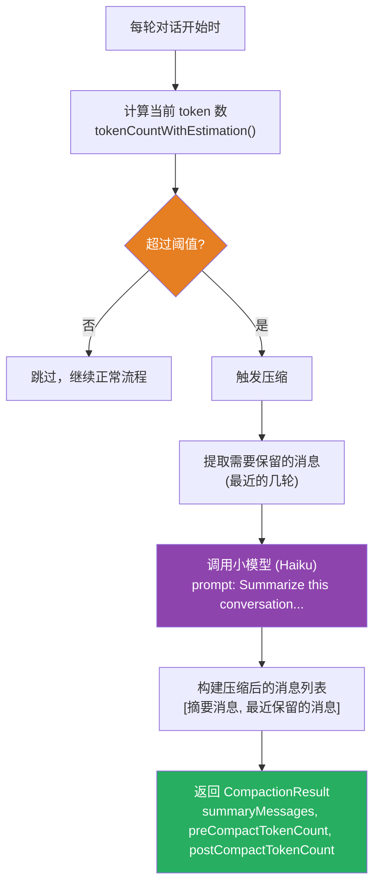

### 2.4 reactiveCompact — 被动压缩

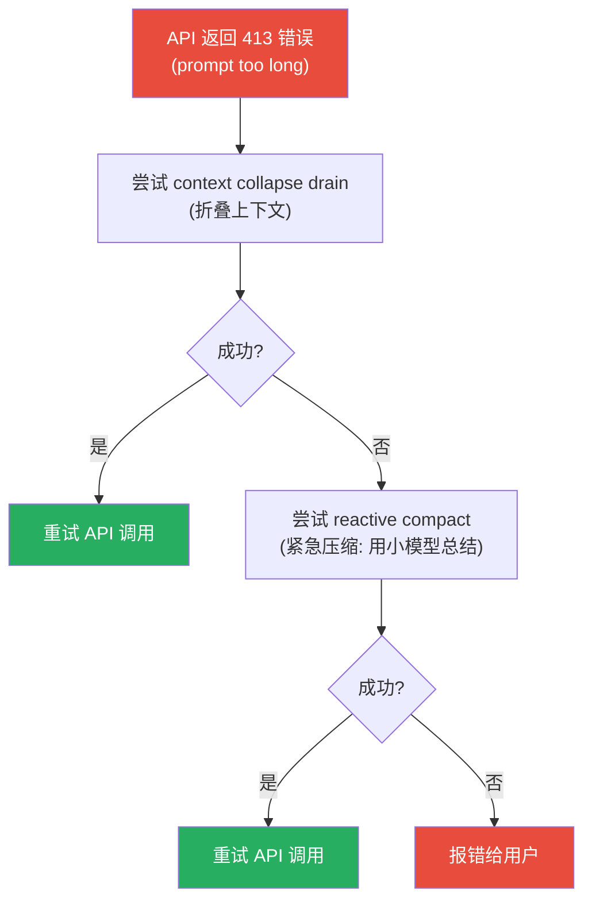

**类比 Java**：就像 HTTP 请求的重试机制——413 时先压缩再重试。

### 2.5 max_output_tokens 恢复

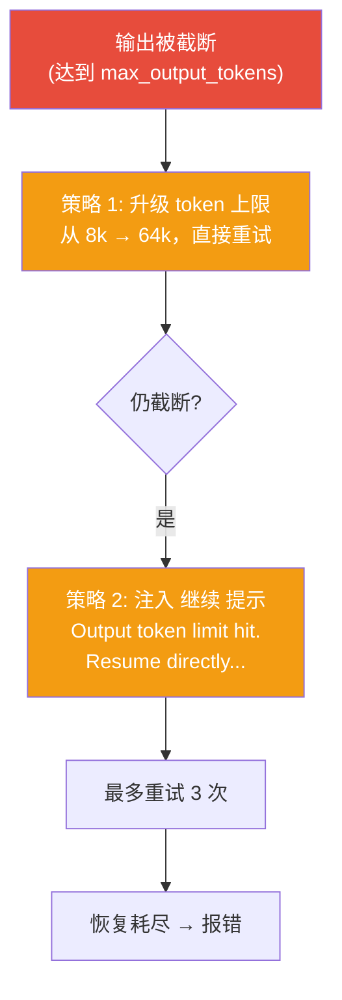

---

## 三、工具编排（toolOrchestration.ts）— 并行与串行

### 3.1 核心问题

Claude 一次回复可能包含多个 tool_use 块。怎么执行它们？

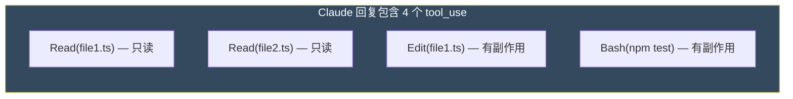

### 3.2 执行策略

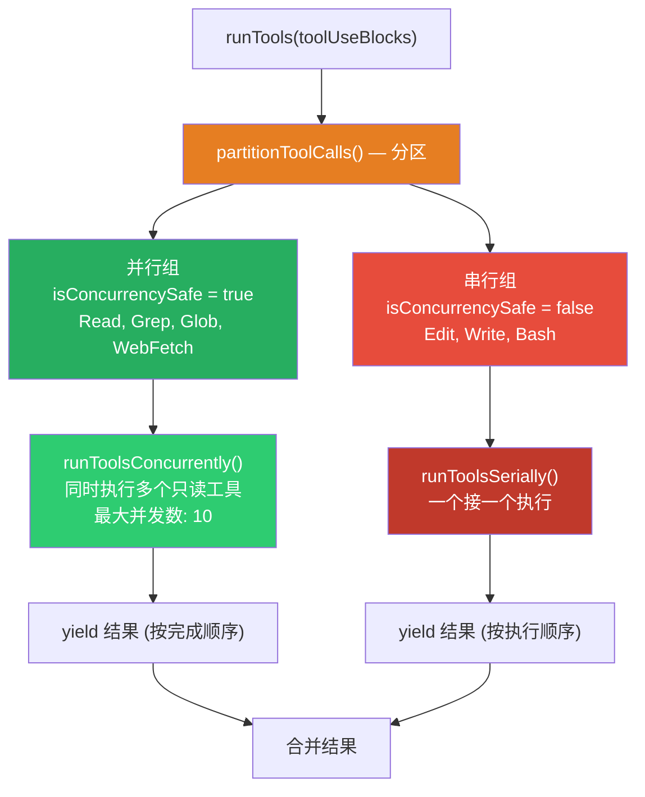

### 3.3 分区算法

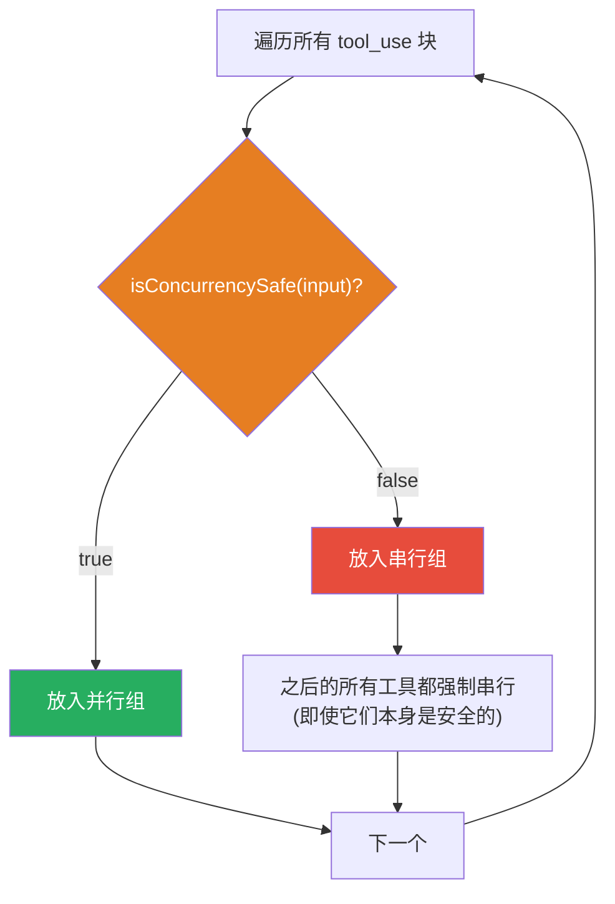

**为什么遇到不安全工具后要全部串行？**

因为不安全工具（如 Edit）会改变文件状态，后续的"安全"工具（如 Read）可能需要读取修改后的内容。如果并行执行，Read 可能读到旧内容。

---

## 四、QueryEngine — 非交互模式

### 4.1 什么是 QueryEngine

QueryEngine 是 `query()` 的高级封装，用于**非交互式**场景（SDK 调用、自动化脚本）。

**类比 Java**：
- REPL 模式 ≈ Spring MVC 的 `@Controller`（交互式，有 UI）
- QueryEngine 模式 ≈ Spring 的 `CommandLineRunner`（非交互式，无 UI）

### 4.2 QueryEngine vs REPL

| 维度 | REPL | QueryEngine |
|------|------|-------------|
| 交互方式 | 终端 UI（Ink/React） | SDK 调用 |
| 用户输入 | 键盘输入 | 编程传入 |
| 输出方式 | 终端渲染 | 回调/流 |
| 状态管理 | React state | 简单变量 |
| 权限确认 | 弹窗询问 | 预设/自动 |

### 4.3 QueryEngine 核心流程

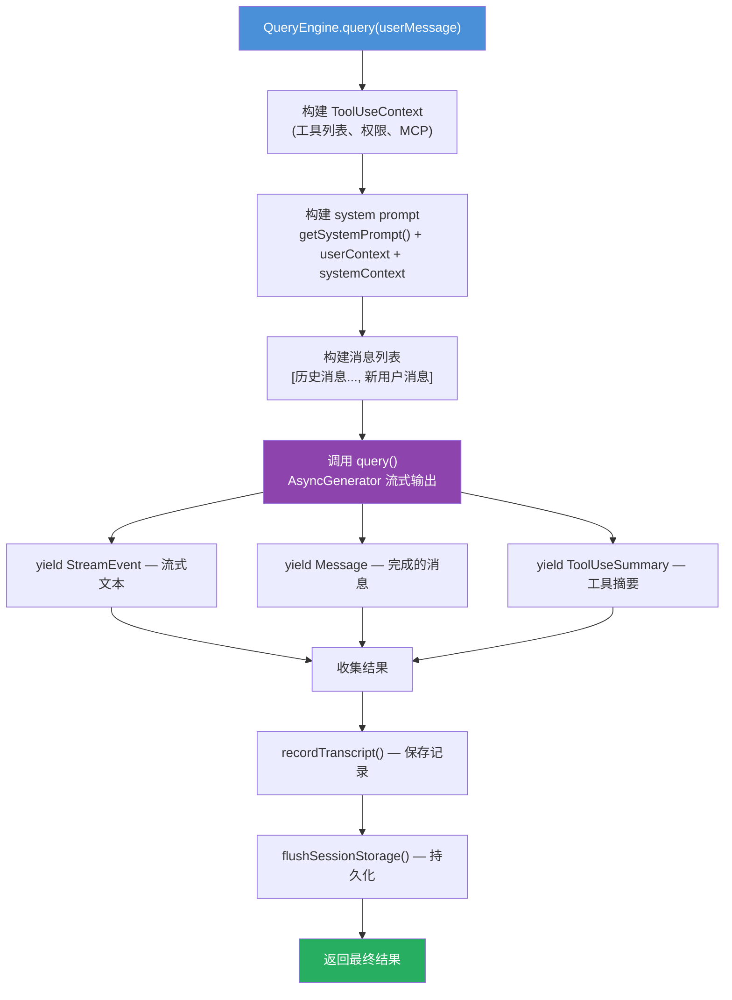

---

## 五、工具执行权限系统

### 5.1 权限模式

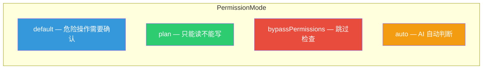

### 5.2 权限判断流程

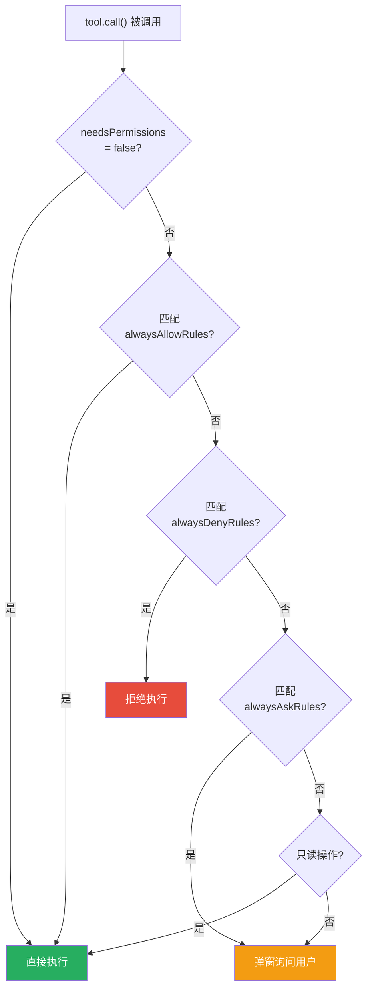

---

## 六、完整 Agent 架构总结

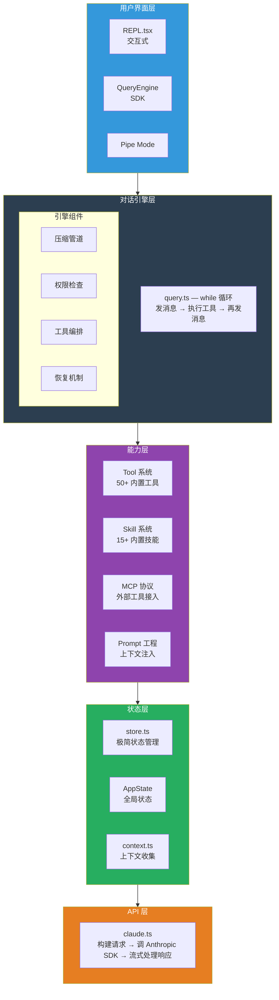

---

## 七、如果我要做一个简化版 Agent

基于这三天的学习，一个最小可运行的 agent 需要：

### 必须有（核心骨架）

| 模块 | 你需要做什么 | 参考文件 |
|------|------------|---------|
| Tool 接口 | 定义 `name`, `inputSchema`, `call()` | `Tool.ts` |
| 2-3 个 Tool 实现 | Bash, FileRead, FileEdit | `BashTool.tsx`, `FileReadTool.ts` |
| query 循环 | while(true) { 调API → 执行tool → 拼消息 } | `query.ts` |
| API 客户端 | 调 Anthropic SDK 流式接口 | `claude.ts` |
| system prompt | 拼装身份 + 工具描述 + 上下文 | `prompts.ts` |

### 最好有（工程化增强）

| 模块 | 你需要做什么 | 参考文件 |
|------|------------|---------|
| 权限系统 | 哪些工具需要用户确认 | `types/permissions.ts` |
| 上下文压缩 | 对话太长时自动压缩 | `services/compact/` |
| 工具并行 | 只读工具并行执行 | `toolOrchestration.ts` |
| 状态管理 | 全局状态 + 订阅机制 | `store.ts` |

### 可以后做（高级功能）

| 模块 | 你需要做什么 | 参考文件 |
|------|------------|---------|
| MCP 支持 | 接入外部工具 | `services/mcp/client.ts` |
| Skill 系统 | 预编排指令集 | `skills/` |
| 子 Agent | 在 tool 内启动另一个 agent | `AgentTool/` |
| 记忆系统 | 跨会话持久化 | `memdir/` |

---

## 八、学习路径总结

```mermaid
flowchart LR
    subgraph Day1["Day 1: 主干流程"]
        direction TB
        D1a["cli.tsx → main.tsx"]
        D1b["REPL → query.ts"]
        D1c["claude.ts"]
        D1d["理解: 启动 → 对话循环 → API 调用"]
    end

    subgraph Day2["Day 2: 四大模块"]
        direction TB
        D2a["Tool 系统"]
        D2b["Prompt 工程"]
        D2c["Skill 系统"]
        D2d["MCP 协议"]
    end

    subgraph Day3["Day 3: 工程化实践"]
        direction TB
        D3a["状态管理"]
        D3b["上下文压缩"]
        D3c["工具编排"]
        D3d["QueryEngine"]
    end

    Day1 --> Day2 --> Day3

    style Day1 fill:#4A90D9,color:#fff
    style Day2 fill:#8E44AD,color:#fff
    style Day3 fill:#27AE60,color:#fff
```

你现在对 Claude Code 的架构应该有了完整的认知。可以基于这些文档回忆、复习，也可以针对任何模块深入提问。
