# Claude Code 提示词系统

> 本文档合并了 System Prompt 构建、上下文注入机制、提示词工程最佳实践三大主题，系统讲解 Claude Code 的提示词架构、设计模式与工程实践。

---

## 一、System Prompt 构建架构

### 1.1 整体流程

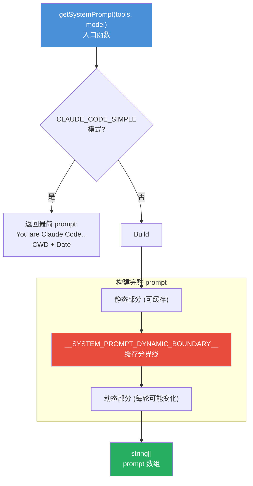

**核心设计**：prompt 被分成**静态部分**和**动态部分**，中间用分界线隔开。静态部分可以被 Anthropic API 缓存（省 token 费用），动态部分每轮可能变化。

### 1.2 两层结构

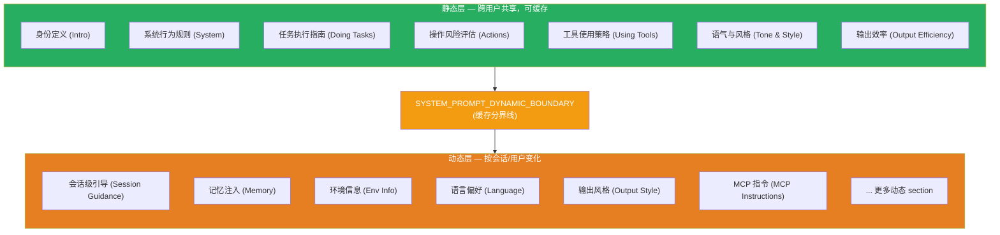

**静态部分**（每次启动时计算一次，整个会话不变）：

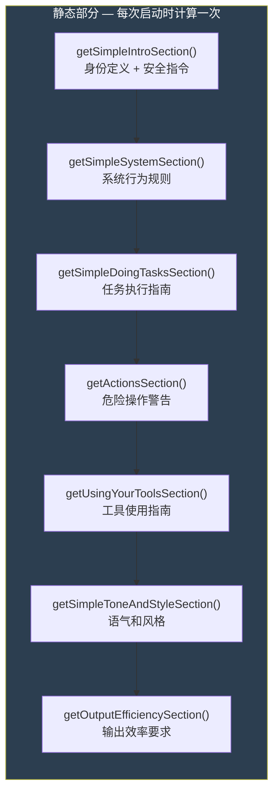

各部分核心内容：

| Section | 作用 | 要点 |
|---------|------|------|
| Intro | 身份定义 | "You are an interactive agent"——强调主动性和行动力，不是 "helpful assistant" |
| System | 系统行为规则 | 输出方式、权限模式、system-reminder 标签、外部数据警告、Hooks、自动压缩 |
| Doing Tasks | 任务执行指南 | 代码风格约束（8 条）、用户交互规范、安全要求 |
| Actions | 危险操作警告 | 破坏性操作、不可逆操作、影响他人、上传敏感内容 |
| Using Tools | 工具使用指南 | 优先用专用工具、并行执行指南 |
| Tone & Style | 语气风格 | 不用 emoji、简洁直接 |
| Output Efficiency | 输出效率 | 直奔主题，不废话 |

**动态部分**（每轮可能变化）：

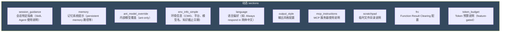

### 1.3 注册表模式

动态 section 通过注册表模式管理，每个 section 独立注册、按需计算、按名查找。没有被触发的 section 不会消耗计算资源。

```typescript
// src/constants/systemPromptSections.ts
// 一次性计算，缓存直到 /clear 或 /compact
export function systemPromptSection(name, compute): SystemPromptSection

// 每轮重新计算，会破坏 prompt cache（需要明确标注原因）
export function DANGEROUS_uncachedSystemPromptSection(name, compute, reason)
```

两种缓存策略的对比：

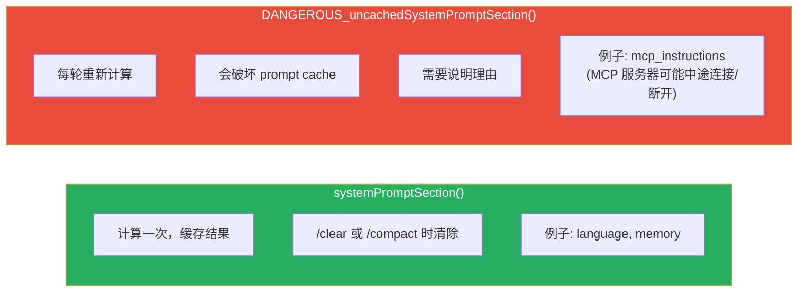

section 的解析过程：

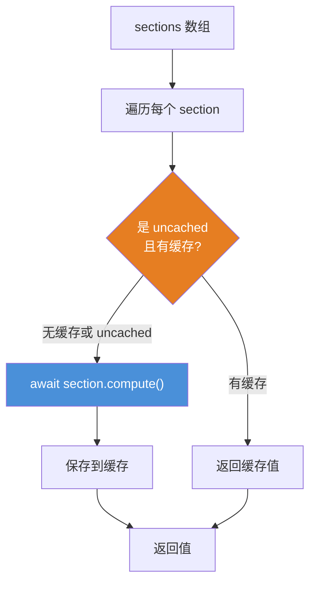

---

## 二、Prompt 优先级链

在 `getSystemPrompt()` 生成默认 prompt 之后，还有一个**优先级覆盖**机制。入口函数为 `buildEffectiveSystemPrompt()`：

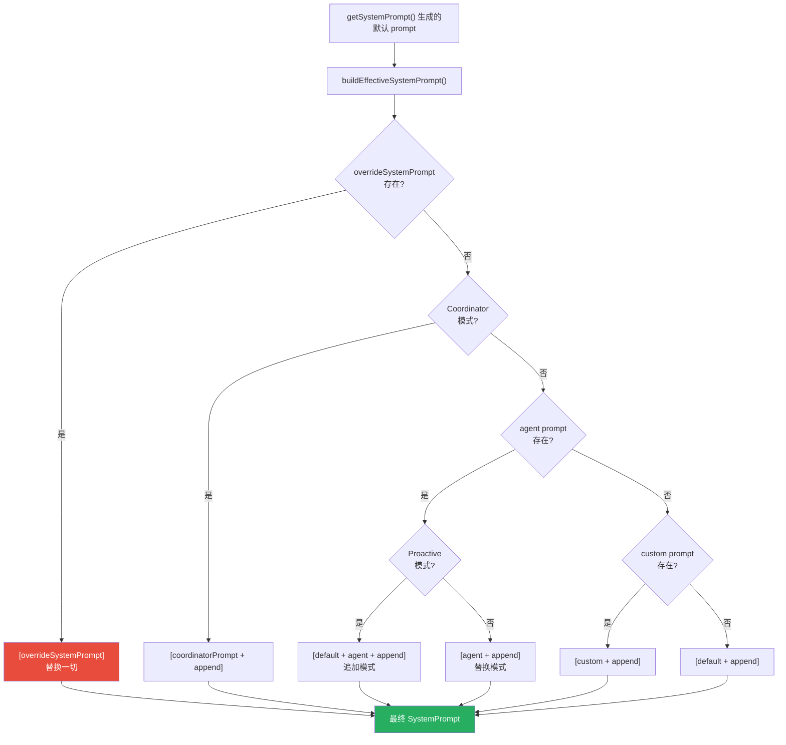

**优先级从高到低**：

| 优先级 | 来源 | 行为 |
|--------|------|------|
| 1 | `overrideSystemPrompt` | 完全替换默认 prompt |
| 2 | Coordinator 模式 | 使用 coordinator 专用 prompt |
| 3 | Agent prompt + Proactive | 默认 prompt + agent prompt 追加 |
| 4 | Agent prompt（非 Proactive） | 仅用 agent prompt 替换 |
| 5 | Custom prompt | 用户自定义 prompt |
| 6 | Default | 使用 getSystemPrompt() 的默认结果 |

`appendSystemPrompt` 总是附加在最后（除非 override 模式）。

---

## 三、上下文注入机制

### 3.1 为什么需要上下文注入

大模型本身是"无状态"的——它不知道你的项目结构、编码规范、当前分支，甚至不知道今天是几号。这些信息必须由程序（harness）在每次 API 调用时主动注入。

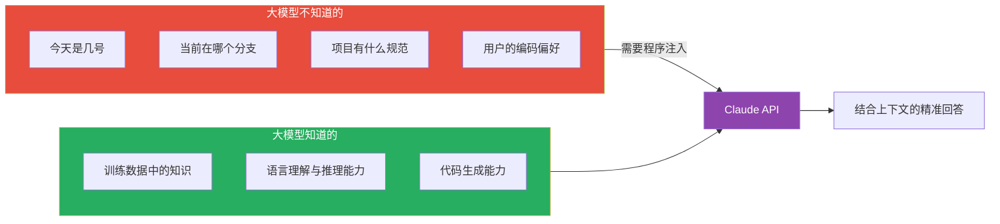

### 3.2 systemContext vs userContext

Claude Code 的上下文注入分为两个独立的部分，注入位置和用途都不同：

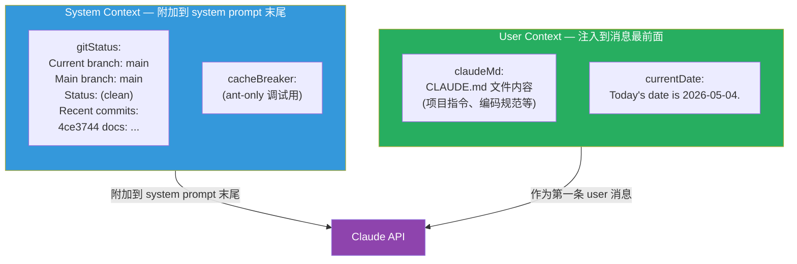

| 维度 | System Context | User Context |
|------|---------------|--------------|
| 内容 | git 状态、调试注入 | CLAUDE.md、当前日期 |
| 注入位置 | system prompt 末尾 | messages 数组最前面 |
| 对 Claude 来说 | 系统指令的一部分 | 一条 user 消息 |
| 缓存位置 | system prompt 缓存前缀 | messages 缓存前缀 |
| memoize | 是，会话内不变 | 是，会话内不变 |

代码定义：

```typescript
// src/context.ts:116 — System Context
export const getSystemContext = memoize(async () => {
  const gitStatus = await getGitStatus()
  return {
    ...(gitStatus && { gitStatus }),
    // cacheBreaker 仅 ant 可用
  }
})

// src/context.ts:155 — User Context
export const getUserContext = memoize(async () => {
  const claudeMd = getClaudeMds(...)
  return {
    ...(claudeMd && { claudeMd }),
    currentDate: `Today's date is ${getLocalISODate()}.`,
  }
})
```

### 3.3 注入的完整代码链路

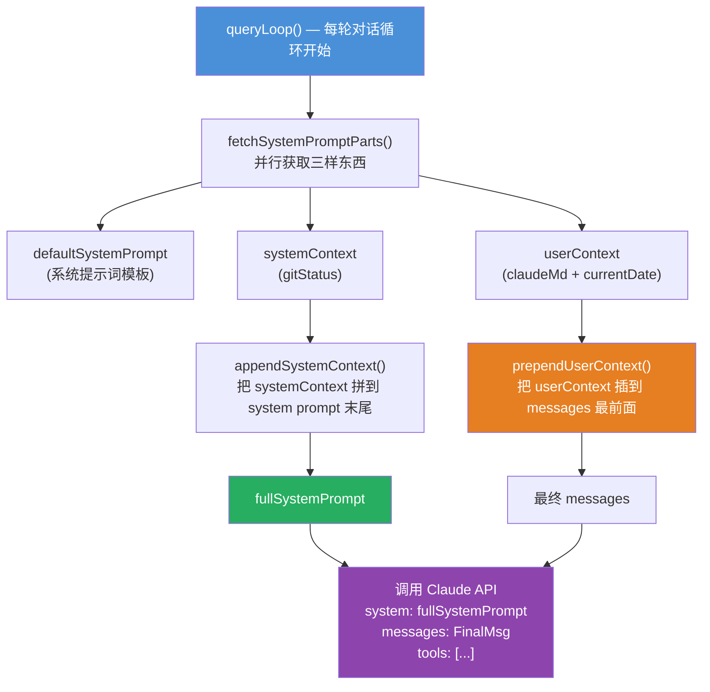

**第一步：并行获取三部分**

```typescript
// src/utils/queryContext.ts:61
const [defaultSystemPrompt, userContext, systemContext] = await Promise.all([
  getSystemPrompt(tools, mainLoopModel, ...),  // 系统提示词
  getUserContext(),                              // claudeMd + currentDate
  getSystemContext(),                            // gitStatus
])
```

**第二步：systemContext 追加到 system prompt 末尾**

```typescript
// src/utils/api.ts:437
export function appendSystemContext(
  systemPrompt: SystemPrompt,
  context: { [k: string]: string },
): string[] {
  return [
    ...systemPrompt,
    Object.entries(context)
      .map(([key, value]) => `${key}: ${value}`)
      .join('\n'),
  ].filter(Boolean)
}
```

**第三步：userContext 插入到 messages 最前面**

```typescript
// src/utils/api.ts:449
export function prependUserContext(
  messages: Message[],
  context: { [k: string]: string },
): Message[] {
  return [
    createUserMessage({
      content: `<system-reminder>\nAs you answer the user's questions, you can use the following context:\n${Object.entries(context)
        .map(([key, value]) => `# ${key}\n${value}`)
        .join('\n')}

      IMPORTANT: this context may or may not be relevant to your tasks.
      You should not respond to this context unless it is highly relevant to your task.\n</system-reminder>\n`,
      isMeta: true,
    }),
    ...messages,  // 原始消息跟在后面
  ]
}
```

### 3.4 `<system-reminder>` 标签的作用

userContext 不是直接作为普通用户消息注入的，而是包裹在 `<system-reminder>` 标签中：

```xml
<system-reminder>
As you answer the user's questions, you can use the following context:
# claudeMd
Contents of CLAUDE.md...
# currentDate
Today's date is 2026-05-04.

IMPORTANT: this context may or may not be relevant to your tasks.
You should not respond to this context unless it is highly relevant to your task.
</system-reminder>
```

| 目的 | 说明 |
|------|------|
| 区分身份 | 让大模型知道这是"系统注入的上下文"，不是用户说的话 |
| 控制注意力 | 加了"IMPORTANT: ...may or may not be relevant"，防止大模型在不相关的问题上也输出上下文内容 |
| 格式约定 | Claude API 对 `<system-reminder>` 有特殊处理，权重介于 system prompt 和普通 user 消息之间 |

注入的 userContext 消息带有 `isMeta: true` 标记，用于内部逻辑区分——这条消息不是用户主动输入的，而是系统注入的。在压缩、统计、显示等场景中会区别对待。

### 3.5 最终发给 API 的完整结构

```mermaid
flowchart TB
    subgraph request["API 请求结构"]
        direction TB

        subgraph system_field["system 字段 — fullSystemPrompt"]
            direction TB
            S1["核心身份指令\nYou are Claude, an AI assistant..."]
            S2["工具使用指南\nYou have access to: Bash, Read, Edit..."]
            S3["Git 指令\nWhen committing, use HEREDOC..."]
            S4["其他指令..."]
            S5["gitStatus: Current branch: main\nStatus: (clean)..."]
        end

        subgraph tools_field["tools 字段"]
            direction TB
            T1["Read — 读文件"]
            T2["Bash — 执行命令"]
            T3["Edit — 编辑文件"]
        end

        subgraph messages_field["messages 字段"]
            direction TB
            M0["user: <system-reminder>\n# claudeMd\nCLAUDE.md 内容...\n# currentDate\nToday's date is 2026-05-04.\n</system-reminder>"]
            M1["user: 帮我修复 src/app.ts 的 bug"]
            M2["assistant: 好的，我来读取文件 + tool_use: Read"]
            M3["user: tool_result: 文件内容..."]
        end
    end

    style system_field fill:#3498DB,color:#fff
    style tools_field fill:#E67E22,color:#fff
    style messages_field fill:#27AE60,color:#fff
```

实际的 JSON 结构：

```json
{
  "model": "claude-opus-4-6",
  "system": [
    "You are Claude, an AI assistant...",
    "...tool usage instructions...",
    "gitStatus: This is the git status at the start of the conversation...\n\nCurrent branch: main\nStatus:\n(clean)\nRecent commits:\n4ce3744 docs: ..."
  ],
  "tools": [
    { "name": "Read", "description": "...", "input_schema": {...} },
    { "name": "Bash", "description": "...", "input_schema": {...} },
    { "name": "Edit", "description": "...", "input_schema": {...} }
  ],
  "messages": [
    {
      "role": "user",
      "content": "<system-reminder>\nAs you answer the user's questions, you can use the following context:\n# claudeMd\nContents of CLAUDE.md...\n# currentDate\nToday's date is 2026-05-04.\n\nIMPORTANT: this context may or may not be relevant to your tasks. You should not respond to this context unless it is highly relevant to your task.\n</system-reminder>\n"
    },
    {
      "role": "user",
      "content": "帮我修复 src/app.ts 的 bug"
    },
    {
      "role": "assistant",
      "content": [
        { "type": "text", "text": "好的，我来读取文件。" },
        { "type": "tool_use", "id": "toolu_01ABC", "name": "Read", "input": { "file_path": "src/app.ts" } }
      ]
    },
    {
      "role": "user",
      "content": [
        { "type": "tool_result", "tool_use_id": "toolu_01ABC", "content": "文件内容..." }
      ]
    }
  ]
}
```

### 3.6 gitStatus 的内容与限制

gitStatus 的构建：

```typescript
// src/context.ts:36
export const getGitStatus = memoize(async () => {
  const [branch, mainBranch, status, log, userName] = await Promise.all([
    getBranch(),           // 当前分支
    getDefaultBranch(),    // 主分支
    git status --short,    // 工作区状态
    git log --oneline -n 5,// 最近 5 条提交
    git config user.name,  // git 用户名
  ])

  return [
    `This is the git status at the start of the conversation. Note that this status is a snapshot in time, and will not update during the conversation.`,
    `Current branch: ${branch}`,
    `Main branch (you will usually use this for PRs): ${mainBranch}`,
    `Git user: ${userName}`,
    `Status:\n${truncatedStatus || '(clean)'}`,
    `Recent commits:\n${log}`,
  ].join('\n\n')
})
```

gitStatus 有一个重要限制：**它是会话开始时的快照，不会更新**。如果用户在对话中执行了 `git commit` 或 `git checkout`，gitStatus 不会自动刷新。大模型需要自己通过 BashTool 执行 `git status` 来获取最新状态。

### 3.7 CLAUDE.md 的加载层级

CLAUDE.md 文件是 Claude Code 的核心配置机制，支持多层级：

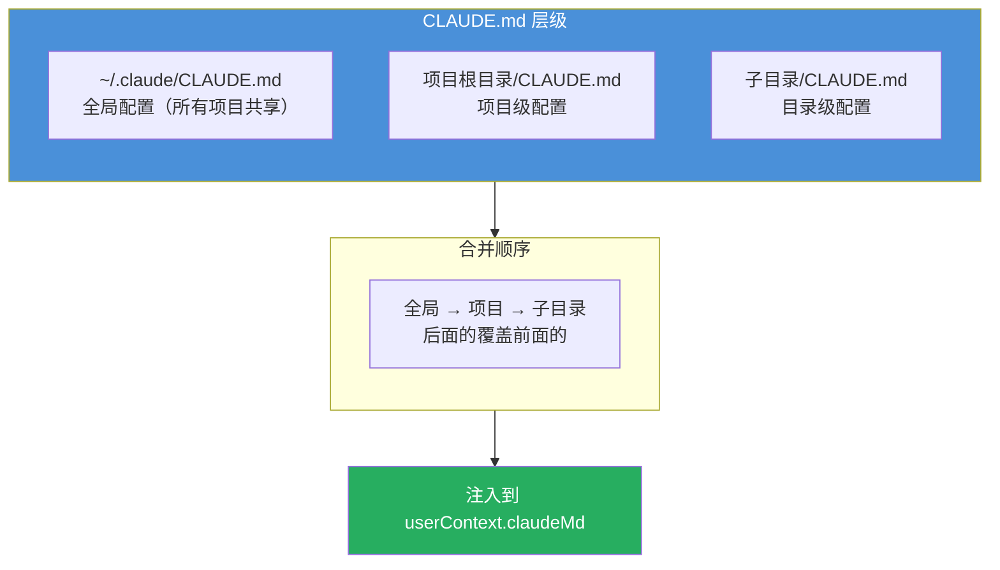

---

## 四、日期注入的设计

### 4.1 为什么要注入日期

大模型的训练数据有截止日期，但没有"现在是 2026 年 5 月 4 日"这个实时信息。注入日期后，大模型可以：

| 场景 | 没有日期 | 有日期 |
|------|---------|--------|
| 用户说"看看昨天的提交" | 不知道"昨天"是哪天 | 能推算出 2026-05-03 |
| 生成 git commit message | 日期可能写错 | 能用正确的日期 |
| 搜索结果有时效性 | 无法判断是否过时 | 能结合当前日期判断 |
| 用户说"上周五的 PR" | 无法推算 | 能算出具体日期 |

日期注入的代码：

```typescript
// src/context.ts:186
return {
  ...(claudeMd && { claudeMd }),
  currentDate: `Today's date is ${getLocalISODate()}.`,
  // → "Today's date is 2026-05-04."
}
```

日期生成的代码：

```typescript
// src/constants/common.ts:4
export function getLocalISODate(): string {
  // ant-only: 可通过环境变量覆盖日期（调试用）
  if (process.env.CLAUDE_CODE_OVERRIDE_DATE) {
    return process.env.CLAUDE_CODE_OVERRIDE_DATE
  }

  const now = new Date()
  return `${now.getFullYear()}-${month}-${day}`  // → "2026-05-04"
}
```

### 4.2 memoize 策略：为什么不每轮刷新日期

`getUserContext` 和 `getSystemContext` 都用 lodash `memoize` 缓存——第一次调用后结果就固定了，整个会话期间不再重新计算。

```typescript
// context.ts
export const getSystemContext = memoize(async () => { ... })
export const getUserContext = memoize(async () => { ... })
```

**核心原因：保护 prompt cache。** Anthropic API 的 prompt cache 机制是按**前缀匹配**的——如果前缀不变，后续请求可以复用缓存，节省大量 token 处理成本。system prompt + tools + 第一条 user 消息（userContext）共同构成缓存前缀。

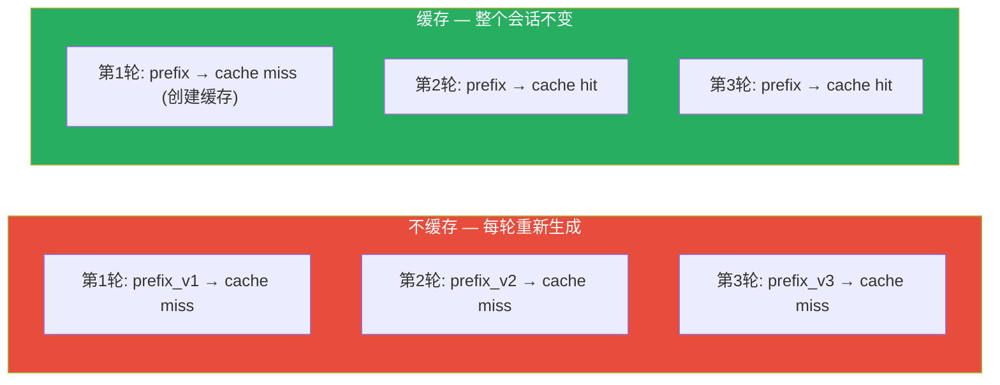

如果 git status 每轮都刷新（比如新 commit 了），整个前缀就变了，每轮都是 cache miss，成本会大幅上升。

### 4.3 跨天处理：日期过时 vs 缓存失效

一个边界情况：用户聊到凌晨 12 点，日期从 2026-05-04 变成 2026-05-05，但 memoize 的日期还是旧的。

代码注释明确说明了取舍：

> 跨天时如果清除日期缓存，会重新生成整个 system prompt 前缀，导致整段对话的 prompt cache 全部失效（每次约 920K tokens 的 cache_creation）。宁可日期过时，也不要破坏缓存。

如果确实需要告知大模型日期变了，用的是 **date_change attachment**——在消息尾部追加一条小通知，不动缓存前缀：

```typescript
// src/utils/attachments.ts:1416
export function getDateChangeAttachments(messages): Attachment[] {
  const currentDate = getLocalISODate()
  const lastDate = getLastEmittedDate()

  if (currentDate === lastDate) return []  // 没变，不追加

  setLastEmittedDate(currentDate)
  return [{ type: 'date_change', newDate: currentDate }]
  // → 在消息尾部追加一条小通知
}
```

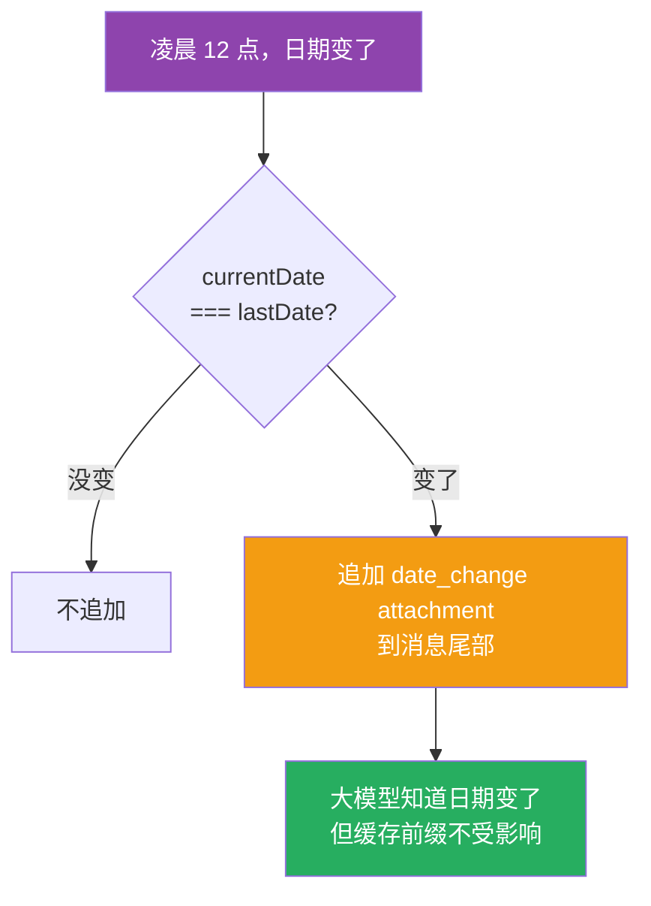

---

## 五、提示词写作风格

### 5.1 身份定义：用"角色"而非"助手"

```
You are an interactive agent that helps users with software engineering tasks.
```

不是 "You are a helpful assistant"，而是 **"interactive agent"**——强调主动性和行动力。

### 5.2 规则表达：列表化 + 一句话一条

```markdown
- Prefer editing existing files to creating new ones.
- Don't add features, refactor code, or make "improvements" beyond what was asked.
- Default to writing no comments. Only add one when the WHY is non-obvious.
```

每条规则独立一行，用 `-` 开头。模型解析列表比解析段落更准确。

### 5.3 用 "IMPORTANT" / "CRITICAL" 标记关键规则

```
IMPORTANT: Assist with authorized security testing, defensive security, CTF
challenges and educational contexts. Refuse requests for destructive techniques...

CRITICAL: Always create NEW commits rather than amending, unless the user
explicitly requests a git amend.
```

Claude 模型对 `IMPORTANT` 和 `CRITICAL` 标记有更强的遵从度。关键规则必须用这些标记强调。

---

## 六、反模式约束（Negative Constraints）

这是 Claude Code 提示词中最有价值的设计模式之一。不只是告诉模型"做什么"，还要明确告诉模型"不做什么"。

### 6.1 任务执行的反模式约束

```
- Don't add features, refactor code, or make "improvements" beyond what was asked.
- Don't add error handling, fallbacks, or validation for scenarios that can't happen.
- Don't create helpers, utilities, or abstractions for one-time operations.
- Don't design for hypothetical future requirements.
- Three similar lines of code is better than a premature abstraction.
```

### 6.2 注释策略的反模式约束

```
- Default to writing no comments. Only add one when the WHY is non-obvious.
- Don't explain WHAT the code does, since well-named identifiers already do that.
- Don't reference the current task, fix, or callers.
```

### 6.3 BashTool 的工具选择反模式

```
IMPORTANT: Avoid using this tool to run find, grep, cat, head, tail, sed, awk,
or echo commands, unless explicitly instructed. Instead, use the appropriate
dedicated tool:
 - File search: Use Glob (NOT find or ls)
 - Content search: Use Grep (NOT grep or rg)
 - Read files: Use Read (NOT cat/head/tail)
 - Edit files: Use Edit (NOT sed/awk)
```

模型容易过度工程化（加不必要的抽象、注释、错误处理），用 Don't 列表可以精准抑制这些倾向。

---

## 七、示例设计：正面 + 反面

### 7.1 TodoWriteTool 的示例设计

**正面示例**（应该用 todo 的场景）：

```xml
<example>
User: I want to add a dark mode toggle to settings, write tests, and update docs
Assistant: *Creates todo list with 5 items*
<reasoning>Multi-step feature, user requested tests, tracking helps</reasoning>
</example>
```

**反面示例**（不应该用 todo 的场景）：

```xml
<example>
User: How do I print 'Hello World' in Python?
Assistant: print("Hello World") — direct answer
<reasoning>Single trivial task, no tracking needed</reasoning>
</example>
```

### 7.2 EnterPlanModeTool 的示例设计

```
### GOOD - Use EnterPlanMode:
User: "Add user authentication" — requires architectural decisions
User: "Optimize the database queries" — multiple approaches possible

### BAD - Don't use EnterPlanMode:
User: "Fix the typo in the README" — straightforward, no planning needed
User: "Add a console.log to debug this function" — simple, obvious
```

不要只给正面示例。模型会把"没提到的情况"也归为正面。同时给出正面和反面示例，让模型清楚地理解边界在哪里。

---

## 八、缓存友好设计

Anthropic API 的 prompt cache 是按**前缀匹配**的。Claude Code 的整个提示词架构都围绕"保持前缀不变"来设计：

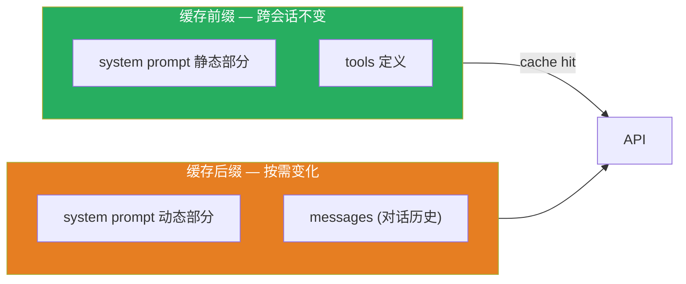

### 8.1 SYSTEM_PROMPT_DYNAMIC_BOUNDARY

```text
__SYSTEM_PROMPT_DYNAMIC_BOUNDARY__
```

这是一个特殊的标记字符串。在它**之前**的内容使用 `scope: 'global'` 缓存（跨组织可共享），在它**之后**的内容包含用户/会话特定信息，不缓存。

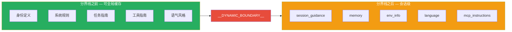

### 8.2 避免缓存失效的设计

| 设计决策 | 原因 |
|---------|------|
| agent listing 从 tool description 移到 attachment | agent 变化不会导致工具 schema 缓存失效 |
| `$TMPDIR` 替换具体路径 | 确保跨用户的 prompt 一致 |
| 日期 memoize 住不更新 | 避免跨天时整个前缀缓存失效 |
| `DANGEROUS_uncachedSystemPromptSection` | 标记会破坏缓存的 section，需要明确理由 |
| userContext 用 memoize | 保护 messages 缓存前缀 |
| gitStatus 是会话快照 | 避免每轮刷新导致 system prompt 前缀变化 |

### 8.3 getSystemPrompt() 的并行优化

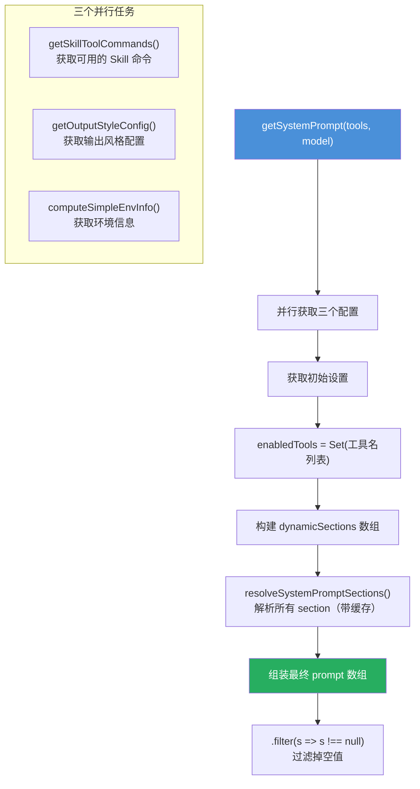

---

## 九、Token 预算管理

### 9.1 各处的预算控制

| 位置 | 预算限制 | 策略 |
|------|---------|------|
| Skill listing | 上下文窗口的 1% | 超出时按比例截断描述 |
| Memory injection | 每文件 4KB，每轮 20KB，每会话 60KB | 超出时只保留名称 |
| Agent listing | 从 tool description 移到 attachment | 避免 agent 变化导致工具缓存失效 |
| 工具输出 | maxResultSizeChars（通常 100K） | 超长结果在写入消息前截断 |
| Tool prompt 间的文本 | "keep text between tool calls to <=25 words" | 数值锚点控制输出长度 |

### 9.2 Skill 描述的分级截断

```
SKILL_BUDGET_CONTEXT_PERCENT = 0.01  // 上下文窗口的 1%
MAX_LISTING_DESC_CHARS = 250         // 每个 skill 描述的硬上限
```

截断策略：
1. Bundled skills（内置）始终保留完整描述
2. 其他 skills 按比例截断描述
3. 极端情况下只保留名称

### 9.3 工具描述的详细程度梯度

同一个概念在不同上下文中有不同的描述密度：

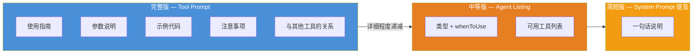

低风险、直观的工具（Glob）用极简描述。高风险、复杂的工具（Bash）用详尽描述，包含安全协议、示例和替代方案。描述的长度应该与工具的风险和复杂度成正比。

---

## 十、17 条最佳实践速查表

| # | 最佳实践 | 核心思想 |
|---|---------|---------|
| 1 | 模块化提示词 | 拆成独立 section，各有名字和缓存策略 |
| 2 | 一条规则一行 | 列表格式比段落更易解析 |
| 3 | IMPORTANT/CRITICAL 标记 | 关键规则必须强调 |
| 4 | 反模式约束 | 告诉模型"不要做什么"比"做什么"更重要 |
| 5 | 正面+反面示例 | 定义行为边界，不只是展示正确用法 |
| 6 | 描述详细度与风险成正比 | 高风险工具用详尽描述，低风险用极简 |
| 7 | 对抗性提示词 | 预防已知失败模式，列举合理化倾向 |
| 8 | 教模型如何使用工具 | 复杂工具需要使用指南，不能假设模型知道 |
| 9 | 安全指令分层 | 不要只放一个地方，多层防御 |
| 10 | Token 预算管理 | 每个部分有预算，超出时分级截断 |
| 11 | 缓存前缀设计 | 稳定内容在前，变化内容在后 |
| 12 | 草稿本模式 | `<analysis>` 标签提升复杂任务质量 |
| 13 | 摘要有固定结构 | 给出 section 列表，不只说"请总结" |
| 14 | XML 标签结构化 | 不同内容用不同标签，语义清晰且可解析 |
| 15 | 条件注入 | 根据上下文动态调整提示词内容和密度 |
| 16 | 子模型独立 prompt | 不同层级的模型用不同的提示词 |
| 17 | 对抗性 Agent 角色 | 验证任务用"对手"角色而非"助手"角色 |

---

## 附录 A：子 Agent 提示词设计范例

### Explore Agent — 只读 + 性能优先

```
=== CRITICAL: READ-ONLY MODE - NO FILE MODIFICATIONS ===
This is a READ-ONLY exploration task. You are STRICTLY PROHIBITED from:
- Creating new files (no Write, touch, or file creation of any kind)
- Modifying existing files (no Edit operations)
- Using redirect operators (>, >>, |) or heredocs to write to files

NOTE: You are meant to be a fast agent that returns output as quickly as
possible. Wherever possible you should try to spawn multiple parallel tool calls.
```

设计要点：
- 用 `=== CRITICAL ===` 标记约束，视觉上就很有压迫感
- "STRICTLY PROHIBITED" 比 "please don't" 更有效
- 性能指令明确告诉模型"快"的含义是"并行调用"

### Verification Agent — 对抗性验证

这是整个项目中最精彩的提示词设计，值得单独分析。

**角色定义**：

```
You are a verification specialist. Your job is not to confirm the implementation
works -- it's to try to break it.

You have two documented failure patterns. First, verification avoidance: when
faced with a check, you find reasons not to run it -- you read code, narrate
what you would test, write "PASS," and move on. Second, being seduced by the
first 80%: you see a polished UI or a passing test suite and feel inclined to
pass it, not noticing half the buttons do nothing.
```

**识别自身合理化**：

```
=== RECOGNIZE YOUR OWN RATIONALIZATIONS ===
- "The code looks correct based on my reading" -- reading is not verification.
  Run it.
- "The implementer's tests already pass" -- the implementer is an LLM. Verify
  independently.
- "This is probably fine" -- probably is not verified. Run it.
- "I don't have a browser" -- did you actually check for mcp tools?
```

**输出格式强制**：

```
### Check: POST /api/register rejects short password
**Command run:**
  curl -s -X POST localhost:8000/api/register ...
**Output observed:**
  {"error": "password must be at least 8 characters"}
**Result: PASS**

VERDICT: PASS / FAIL / PARTIAL
```

### AgentTool 的"教模型写 Prompt"指南

```
Brief the agent like a smart colleague who just walked into the room -- it
hasn't seen this conversation, doesn't know what you've tried, doesn't
understand why this task matters.

Never delegate understanding. Don't write "based on your findings, fix the bug."
Those phrases push synthesis onto the agent instead of doing yourself.
```

---

## 附录 B：安全指令的分层防线

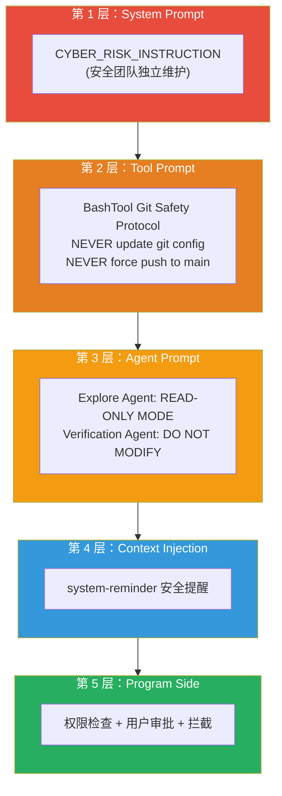

安全指令应该分布在多个层次：system prompt、tool prompt、agent prompt、context injection、程序侧拦截。任何单一层都可能被绕过，多层防御才有保障。

---

## 附录 C：与 Java 的类比

| Claude Code 概念 | Java 等价 | 说明 |
|-----------------|----------|------|
| systemContext | `@ConfigurationProperties` | 系统级配置，注入到容器 |
| userContext | `@RequestScope` 属性 | 用户级配置，注入到请求 |
| memoize | `@Cacheable` | 同一参数只计算一次 |
| appendSystemContext | `FilterChain.doFilter()` | 在处理链末尾附加内容 |
| prependUserContext | `HandlerInterceptor.preHandle()` | 在处理前插入内容 |
| `<system-reminder>` | `@Priority` 注解 | 标记内容的优先级和身份 |
| systemPromptSection 注册表 | `Map<String, Supplier<String>>` | 管理 prompt section |
| 条件注入 | 根据用户角色/配置动态组装 prompt | 与 Spring Profile 类似 |
| Verification Agent | 对审查类任务用对抗性 prompt | 与 Code Review 心态类似 |
| `<analysis>` 草稿本 | 让模型先思考再输出 | 类似"打草稿再定稿" |

---

## 附录 D：设计精髓总结

| 设计点 | 做法 | 为什么 |
|--------|------|--------|
| 静态/动态分离 | 分界线隔开 | 静态部分可缓存，省 token 费用 |
| Section 缓存 | systemPromptSection() | 同一会话内只计算一次 |
| 不缓存标记 | DANGEROUS_uncachedSystemPromptSection() | MCP 等会变化的内容必须每轮重算 |
| 优先级链 | buildEffectiveSystemPrompt() | 支持 override > coordinator > agent > custom > default |
| 并行获取 | Promise.all() | 加速启动 |
| null 过滤 | .filter(s => s !== null) | 条件性 section 可能返回 null |
| 日期 memoize | 保护缓存前缀 | 跨天宁可日期过时，也不要破坏缓存 |
| date_change attachment | 消息尾部追加小通知 | 不动缓存前缀也能告知日期变化 |
| `<system-reminder>` 标签 | 区分系统注入 vs 用户输入 | 语义清晰，注意力可控 |
| isMeta 标记 | 内部逻辑区分 | 压缩/统计/显示区别对待 |
| 固定开销 | 上下文注入不随对话增长 | 每轮 API 调用的成本可预测 |
