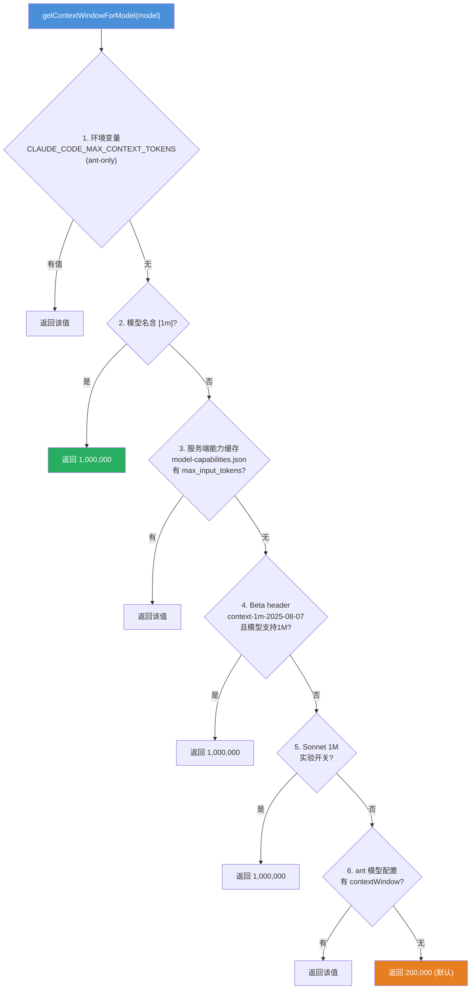
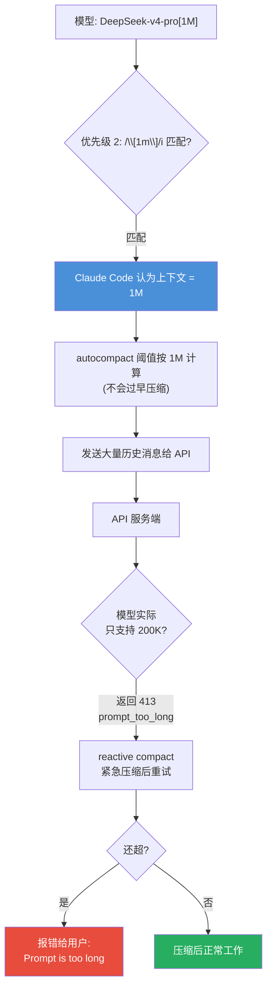
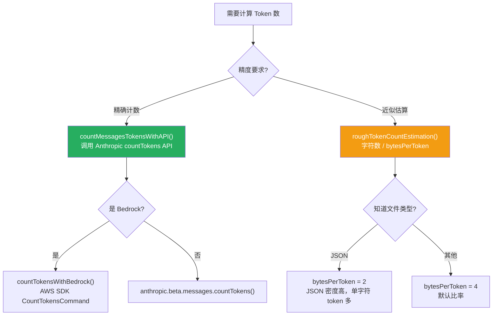
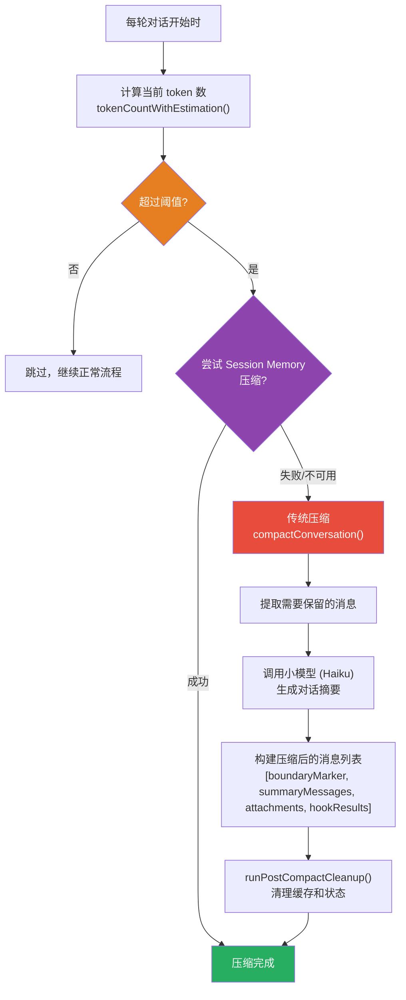
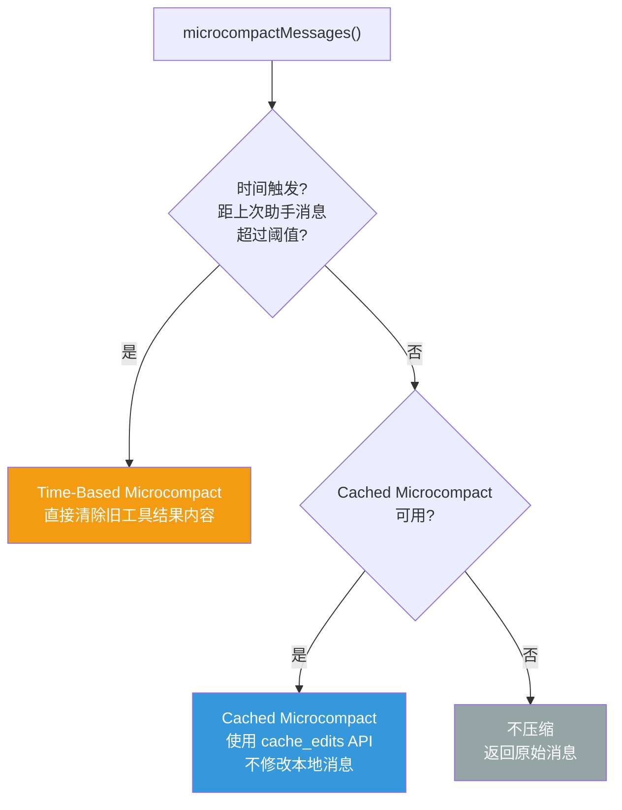
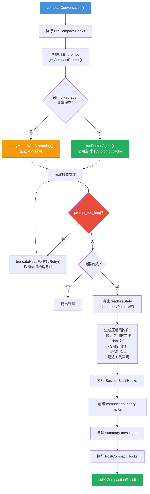
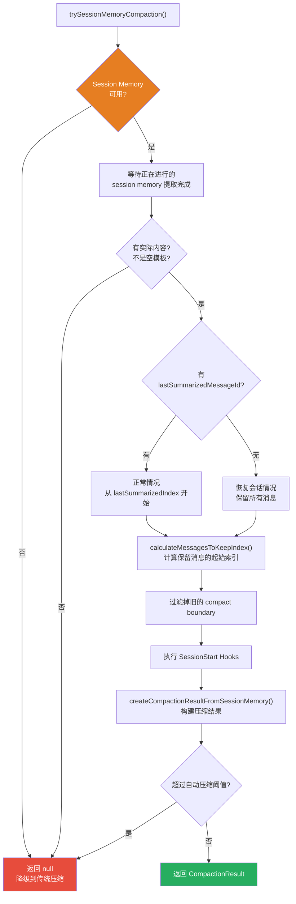
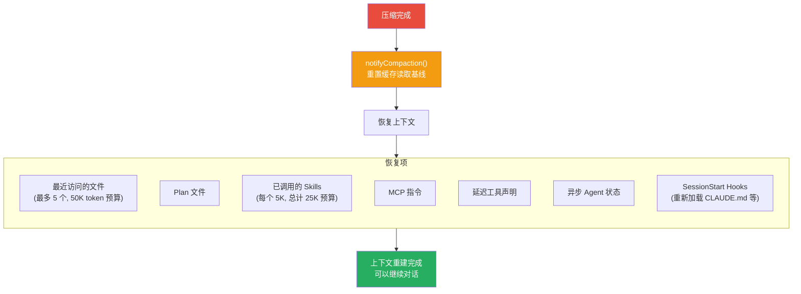
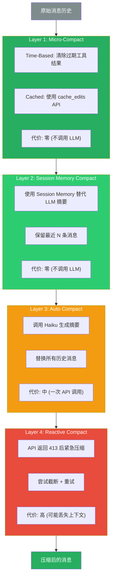

# Claude Code 上下文管理：窗口解析、Token 预算与压缩机制

> 阅读本文档后，你将理解：上下文窗口大小如何确定、Token 如何分配和计数、对话过长时如何通过多层压缩机制保持上下文有效性。

---

## 一、上下文窗口的确定

### 1.1 核心函数

所有上下文窗口大小的确定都经过 `getContextWindowForModel()`（`src/utils/context.ts:51`）。

```typescript
export function getContextWindowForModel(model: string, betas?: string[]): number {
    // 6 级优先级，逐级探测
    // ...
    return MODEL_CONTEXT_WINDOW_DEFAULT  // 200_000（兜底）
}
```

### 1.2 6 级优先级解析链



| 优先级 | 来源 | 条件 | 返回值 |
|--------|------|------|--------|
| 1 | 环境变量 | `CLAUDE_CODE_MAX_CONTEXT_TOKENS`（ant-only） | 自定义值 |
| 2 | 模型名后缀 | `/\[1m\]/i` 正则匹配 | 1,000,000 |
| 3 | 服务端缓存 | `~/.claude/cache/model-capabilities.json` 中有 `max_input_tokens` | 该值 |
| 4 | Beta header | `context-1m-2025-08-07` + 模型支持 1M | 1,000,000 |
| 5 | 实验开关 | Sonnet 1M experiment（`coral_reef_sonnet` flag） | 1,000,000 |
| 6 | ant 模型配置 | `AntModel.contextWindow` | 该值 |
| 7 | 默认值 | 以上都没命中 | **200,000** |

### 1.3 [1M] 后缀的实现原理

检测逻辑通过正则 `/\[1m\]/i` 匹配模型名中的 `[1m]`、`[1M]` 等形式：

```typescript
// src/utils/context.ts:35
export function has1mContext(model: string): boolean {
    if (is1mContextDisabled()) return false
    return /\[1m\]/i.test(model)  // 不区分大小写
}
```

哪些模型原生支持 1M：

```typescript
// src/utils/context.ts:43
export function modelSupports1M(model: string): boolean {
    if (is1mContextDisabled()) return false
    const canonical = getCanonicalName(model)
    return canonical.includes('claude-sonnet-4') || canonical.includes('opus-4-6')
}
```

| 模型 | 支持 1M |
|------|---------|
| Claude Sonnet 4.x | 是 |
| Claude Opus 4.6 | 是 |
| Claude Opus 4.5 及以下 | 否 |
| Claude Haiku | 否 |
| 第三方模型 (DeepSeek 等) | 不检查，`[1M]` 后缀直接生效 |

**禁用 1M**：设置环境变量 `CLAUDE_CODE_DISABLE_1M_CONTEXT=1` 后，所有 1M 相关逻辑都被禁用。

### 1.4 配置错误的后果



**结论**：`[1M]` 只影响客户端的上下文管理策略，不会让 API 服务端变出 1M 能力。

---

## 二、Token 预算分配

### 2.1 有效上下文窗口计算

```typescript
// src/services/compact/autoCompact.ts:33
export function getEffectiveContextWindowSize(model: string): number {
    const reservedTokensForSummary = Math.min(
        getMaxOutputTokensForModel(model),
        MAX_OUTPUT_TOKENS_FOR_SUMMARY,  // 20,000
    )
    let contextWindow = getContextWindowForModel(model, getSdkBetas())

    const autoCompactWindow = process.env.CLAUDE_CODE_AUTO_COMPACT_WINDOW
    if (autoCompactWindow) {
        const parsed = parseInt(autoCompactWindow, 10)
        if (!isNaN(parsed) && parsed > 0) {
            contextWindow = Math.min(contextWindow, parsed)
        }
    }

    return contextWindow - reservedTokensForSummary
    // 200K 模型: 200,000 - 20,000 = 180,000 有效窗口
    // 1M 模型: 1,000,000 - 20,000 = 980,000 有效窗口
}
```

### 2.2 200K 窗口的典型分配

| 区域 | 大约 Token 数 | 说明 |
|------|-------------|------|
| System Prompt | ~20-30K | 身份、工具描述、上下文注入 |
| Tools Schema | ~10-20K | 工具定义的 JSON Schema |
| Messages | ~130-150K | 对话历史（用户消息 + 助手回复 + 工具结果） |
| Output Reserve | ~20K | 预留给模型输出和压缩摘要 |
| **总计** | **~200K** | 上下文窗口总容量 |

### 2.3 关键常量

```typescript
// src/services/compact/autoCompact.ts
const MAX_OUTPUT_TOKENS_FOR_SUMMARY = 20_000   // 压缩摘要的最大输出
export const AUTOCOMPACT_BUFFER_TOKENS = 13_000 // 自动压缩缓冲区
export const WARNING_THRESHOLD_BUFFER_TOKENS = 20_000  // 警告阈值缓冲
export const ERROR_THRESHOLD_BUFFER_TOKENS = 20_000    // 错误阈值缓冲
export const MANUAL_COMPACT_BUFFER_TOKENS = 3_000      // 手动压缩缓冲

// src/services/compact/compact.ts
export const POST_COMPACT_MAX_FILES_TO_RESTORE = 5     // 压缩后恢复的最大文件数
export const POST_COMPACT_TOKEN_BUDGET = 50_000        // 压缩后文件恢复的 token 预算
export const POST_COMPACT_MAX_TOKENS_PER_FILE = 5_000  // 单文件最大 token 数
export const POST_COMPACT_MAX_TOKENS_PER_SKILL = 5_000 // 单 Skill 最大 token 数
export const POST_COMPACT_SKILLS_TOKEN_BUDGET = 25_000 // Skills 总 token 预算
```

---

## 三、Token 计数策略

### 3.1 两种计数方式



### 3.2 近似估算实现

```typescript
// src/services/tokenEstimation.ts
export function roughTokenCountEstimation(
  content: string,
  bytesPerToken: number = 4,
): number {
  return Math.round(content.length / bytesPerToken)
}

// 根据文件类型调整比率
export function bytesPerTokenForFileType(fileExtension: string): number {
  switch (fileExtension) {
    case 'json':
    case 'jsonl':
    case 'jsonc':
      return 2  // JSON 密度高，token 比率更低
    default:
      return 4  // 默认 4 字符 = 1 token
  }
}
```

### 3.3 混合计数策略（tokenCountWithEstimation）

```typescript
// src/utils/tokens.ts
export function tokenCountWithEstimation(messages: readonly Message[]): number {
  let i = messages.length - 1
  while (i >= 0) {
    const message = messages[i]
    const usage = message ? getTokenUsage(message) : undefined
    if (message && usage) {
      // 找到最近的 API 响应，使用其精确计数
      // 对之后的消息使用近似估算
      return (
        getTokenCountFromUsage(usage) +
        roughTokenCountEstimationForMessages(messages.slice(i + 1))
      )
    }
    i--
  }
  // 没有 API 响应时，全部使用近似估算
  return roughTokenCountEstimationForMessages(messages)
}
```

**核心思想**：最后一次 API 响应的 `usage` 包含精确的 token 计数，之后新增的消息用近似估算补充。

### 3.4 Token 计数来源

```typescript
// API 响应中的 usage 结构
interface Usage {
  input_tokens: number                    // 输入 token 数
  output_tokens: number                   // 输出 token 数
  cache_creation_input_tokens?: number    // 缓存创建的 token 数
  cache_read_input_tokens?: number        // 缓存读取的 token 数
}

// 计算总 token 数
export function getTokenCountFromUsage(usage: Usage): number {
  return (
    usage.input_tokens +
    (usage.cache_creation_input_tokens ?? 0) +
    (usage.cache_read_input_tokens ?? 0) +
    usage.output_tokens
  )
}
```

---

## 四、自动压缩机制

### 4.1 触发阈值计算

```typescript
// src/services/compact/autoCompact.ts
export function getAutoCompactThreshold(model: string): number {
  const effectiveContextWindow = getEffectiveContextWindowSize(model)
  const autocompactThreshold = effectiveContextWindow - AUTOCOMPACT_BUFFER_TOKENS
  // 200K 模型: 180,000 - 13,000 = 167,000 触发压缩
  // 1M 模型: 980,000 - 13,000 = 967,000 触发压缩

  // 环境变量覆盖（用于测试）
  const envPercent = process.env.CLAUDE_AUTOCOMPACT_PCT_OVERRIDE
  if (envPercent) {
    const parsed = parseFloat(envPercent)
    if (!isNaN(parsed) && parsed > 0 && parsed <= 100) {
      const percentageThreshold = Math.floor(effectiveContextWindow * (parsed / 100))
      return Math.min(percentageThreshold, autocompactThreshold)
    }
  }

  return autocompactThreshold
}
```

### 4.2 shouldAutoCompact 逃逸条件

```typescript
export async function shouldAutoCompact(
  messages: Message[],
  model: string,
  querySource?: QuerySource,
  snipTokensFreed = 0,
): Promise<boolean> {
  // 逃逸条件 1: 递归保护 — session_memory 和 compact 是 forked agent
  if (querySource === 'session_memory' || querySource === 'compact') {
    return false
  }

  // 逃逸条件 2: 用户禁用
  if (!isAutoCompactEnabled()) {
    return false
  }

  // 逃逸条件 3: Reactive-only 模式（ant-only）
  if (feature('REACTIVE_COMPACT')) {
    if (getFeatureValue_CACHED_MAY_BE_STALE('tengu_cobalt_raccoon', false)) {
      return false
    }
  }

  // 逃逸条件 4: Context-collapse 模式（ant-only）
  if (feature('CONTEXT_COLLAPSE')) {
    if (isContextCollapseEnabled()) {
      return false
    }
  }

  // 核心判断：token 数是否超过阈值
  const tokenCount = tokenCountWithEstimation(messages) - snipTokensFreed
  const threshold = getAutoCompactThreshold(model)
  const { isAboveAutoCompactThreshold } = calculateTokenWarningState(tokenCount, model)
  return isAboveAutoCompactThreshold
}
```

### 4.3 自动压缩流程



### 4.4 断路器机制

```typescript
const MAX_CONSECUTIVE_AUTOCOMPACT_FAILURES = 3

// 连续失败 3 次后停止尝试，避免无意义的 API 调用
if (
  tracking?.consecutiveFailures !== undefined &&
  tracking.consecutiveFailures >= MAX_CONSECUTIVE_AUTOCOMPACT_FAILURES
) {
  return { wasCompacted: false }
}
```

---

## 五、Micro-Compact

Micro-Compact 是一种轻量级压缩，专门处理工具结果，不调用 LLM。

### 5.1 两种触发路径



### 5.2 Time-Based Microcompact

当用户离开一段时间后返回，服务器缓存已过期，清除旧工具结果以减少重写开销。

```typescript
// src/services/compact/microCompact.ts
export const TIME_BASED_MC_CLEARED_MESSAGE = '[Old tool result content cleared]'

// 可压缩的工具类型
const COMPACTABLE_TOOLS = new Set<string>([
  FILE_READ_TOOL_NAME,
  ...SHELL_TOOL_NAMES,
  GREP_TOOL_NAME,
  GLOB_TOOL_NAME,
  WEB_SEARCH_TOOL_NAME,
  WEB_FETCH_TOOL_NAME,
  FILE_EDIT_TOOL_NAME,
  FILE_WRITE_TOOL_NAME,
])

function maybeTimeBasedMicrocompact(messages, querySource): MicrocompactResult | null {
  const trigger = evaluateTimeBasedTrigger(messages, querySource)
  if (!trigger) return null

  const { gapMinutes, config } = trigger
  const compactableIds = collectCompactableToolIds(messages)

  // 保留最近的 N 个工具结果，清除其余
  const keepRecent = Math.max(1, config.keepRecent)
  const keepSet = new Set(compactableIds.slice(-keepRecent))
  const clearSet = new Set(compactableIds.filter(id => !keepSet.has(id)))

  // 将工具结果内容替换为 "[Old tool result content cleared]"
  // ...
}
```

### 5.3 Cached Microcompact

使用 Anthropic 的 `cache_edits` API 删除工具结果，不修改本地消息内容，不破坏 prompt cache。

```typescript
async function cachedMicrocompactPath(messages, querySource): Promise<MicrocompactResult> {
  const mod = await getCachedMCModule()
  const state = ensureCachedMCState()
  const config = mod.getCachedMCConfig()

  // 注册工具结果
  for (const message of messages) {
    if (message.type === 'user') {
      // 注册 tool_result 到 cachedMCState
      mod.registerToolResult(state, block.tool_use_id)
    }
  }

  // 获取需要删除的工具
  const toolsToDelete = mod.getToolResultsToDelete(state)

  if (toolsToDelete.length > 0) {
    // 创建 cache_edits 块，由 API 层处理
    const cacheEdits = mod.createCacheEditsBlock(state, toolsToDelete)
    pendingCacheEdits = cacheEdits

    // 返回原始消息 — cache_edits 在 API 层添加
    return { messages, compactionInfo: { pendingCacheEdits: {...} } }
  }

  return { messages }
}
```

### 5.4 两种路径的关键区别

| 维度 | Time-Based | Cached |
|------|-----------|--------|
| 触发条件 | 时间间隔超阈值 | 工具数量超阈值 |
| 修改方式 | 直接修改消息内容 | 通过 cache_edits API |
| 缓存影响 | 使缓存失效 | 保持缓存有效 |
| 适用场景 | 缓存已过期 | 缓存仍有效 |

---

## 六、全量压缩流程

### 6.1 compactConversation 完整流程



### 6.2 压缩 Prompt 的 9 个标准 Section

压缩 prompt 要求模型生成包含以下 9 个 section 的摘要：

```
1. Primary Request and Intent    — 用户的显式请求和意图
2. Key Technical Concepts        — 关键技术概念、框架
3. Files and Code Sections       — 文件和代码片段
4. Errors and fixes              — 错误及修复方式
5. Problem Solving               — 问题解决过程
6. All user messages             — 所有用户消息（非工具结果）
7. Pending Tasks                 — 待处理任务
8. Current Work                  — 当前工作内容
9. Optional Next Step            — 可选的下一步
```

### 6.3 CompactionResult 结构

```typescript
export interface CompactionResult {
  boundaryMarker: SystemMessage        // 压缩边界标记
  summaryMessages: UserMessage[]       // 摘要消息
  attachments: AttachmentMessage[]     // 附件（文件、Plan、Skills 等）
  hookResults: HookResultMessage[]     // Hook 执行结果
  messagesToKeep?: Message[]           // 保留的消息（部分压缩时）
  userDisplayMessage?: string          // 用户显示消息
  preCompactTokenCount?: number        // 压缩前 token 数
  postCompactTokenCount?: number       // 压缩后 token 数
  truePostCompactTokenCount?: number   // 真实压缩后 token 数
  compactionUsage?: Usage              // 压缩 API 的 usage
}
```

### 6.4 压缩后的消息结构

```typescript
export function buildPostCompactMessages(result: CompactionResult): Message[] {
  return [
    result.boundaryMarker,        // 1. 压缩边界标记
    ...result.summaryMessages,    // 2. 摘要消息
    ...(result.messagesToKeep ?? []), // 3. 保留的消息（部分压缩）
    ...result.attachments,        // 4. 附件
    ...result.hookResults,        // 5. Hook 结果
  ]
}
```

---

## 七、Session Memory Compact

### 7.1 核心思想

用 Session Memory（持久化的会话记忆）替代 LLM 调用生成的摘要，节省一次 API 调用。

### 7.2 配置常量

```typescript
// src/services/compact/sessionMemoryCompact.ts
export const DEFAULT_SM_COMPACT_CONFIG: SessionMemoryCompactConfig = {
  minTokens: 10_000,          // 保留的最小 token 数
  minTextBlockMessages: 5,    // 保留的最小文本消息数
  maxTokens: 40_000,          // 保留的最大 token 数（硬上限）
}
```

### 7.3 流程



### 7.4 消息保留索引计算

```typescript
export function calculateMessagesToKeepIndex(
  messages: Message[],
  lastSummarizedIndex: number,
): number {
  const config = getSessionMemoryCompactConfig()

  // 从 lastSummarizedIndex 之后开始
  let startIndex = lastSummarizedIndex >= 0 ? lastSummarizedIndex + 1 : messages.length

  // 计算当前 token 数和文本消息数
  let totalTokens = 0
  let textBlockMessageCount = 0
  for (let i = startIndex; i < messages.length; i++) {
    totalTokens += estimateMessageTokens([messages[i]])
    if (hasTextBlocks(messages[i])) textBlockMessageCount++
  }

  // 如果已达到最大上限或满足最小要求，直接返回
  if (totalTokens >= config.maxTokens) return startIndex
  if (totalTokens >= config.minTokens && textBlockMessageCount >= config.minTextBlockMessages) return startIndex

  // 向后扩展直到满足最小要求或达到最大上限
  for (let i = startIndex - 1; i >= floor; i--) {
    // ... 扩展逻辑
  }

  // 调整索引以保持 tool_use/tool_result 配对完整
  return adjustIndexToPreserveAPIInvariants(messages, startIndex)
}
```

### 7.5 与传统压缩的区别

| 维度 | Session Memory Compact | 传统 Compact |
|------|----------------------|--------------|
| 摘要来源 | Session Memory 文件 | LLM 实时生成 |
| API 调用 | 无额外调用 | 需要一次 Haiku 调用 |
| 消息保留 | 保留最近的 N 条消息 | 通常不保留 |
| 适用场景 | Session Memory 已建立 | 通用 |

---

## 八、压缩后的上下文重建

### 8.1 Post-Compact Cleanup

```typescript
// src/services/compact/postCompactCleanup.ts
export function runPostCompactCleanup(querySource?: QuerySource): void {
  // 1. 重置 microcompact 状态
  resetMicrocompactState()

  // 2. 重置 context collapse（仅主线程）
  if (feature('CONTEXT_COLLAPSE')) {
    if (isMainThreadCompact) {
      resetContextCollapse()
    }
  }

  // 3. 清理内存文件缓存（仅主线程）
  if (isMainThreadCompact) {
    getUserContext.cache.clear?.()
    resetGetMemoryFilesCache('compact')
  }

  // 4. 清理各类缓存
  clearSystemPromptSections()
  clearClassifierApprovals()
  clearSpeculativeChecks()
  clearBetaTracingState()
  clearSessionMessagesCache()
}
```

### 8.2 文件状态恢复

压缩后，最近访问的文件会被重新注入，避免模型重复读取：

```typescript
// src/services/compact/compact.ts
export async function createPostCompactFileAttachments(
  readFileState: Record<string, { content: string; timestamp: number }>,
  toolUseContext: ToolUseContext,
  maxFiles: number,
  preservedMessages: Message[] = [],
): Promise<AttachmentMessage[]> {
  // 排除已在保留消息中的文件
  const preservedReadPaths = collectReadToolFilePaths(preservedMessages)

  // 按时间排序，取最近的文件
  const recentFiles = Object.entries(readFileState)
    .filter(file => !preservedReadPaths.has(expandPath(file.filename)))
    .sort((a, b) => b.timestamp - a.timestamp)
    .slice(0, maxFiles)  // 默认最多 5 个

  // 重新读取文件内容并生成附件
  // 受 token 预算限制：POST_COMPACT_TOKEN_BUDGET = 50_000
}
```

### 8.3 缓存恢复机制



### 8.4 缓存断点检测

```typescript
// 压缩后重置缓存读取基线，避免误报缓存失效
if (feature('PROMPT_CACHE_BREAK_DETECTION')) {
  notifyCompaction(querySource ?? 'compact', agentId)
}
markPostCompaction()
```

---

## 九、压缩策略层次总结



---

## 十、关键源码文件索引

| 文件 | 职责 |
|------|------|
| `src/utils/context.ts` | 上下文窗口大小确定（getContextWindowForModel） |
| `src/services/tokenEstimation.ts` | Token 近似估算（roughTokenCountEstimation） |
| `src/utils/tokens.ts` | Token 精确计数和混合策略（tokenCountWithEstimation） |
| `src/services/compact/autoCompact.ts` | 自动压缩触发逻辑（shouldAutoCompact, autoCompactIfNeeded） |
| `src/services/compact/microCompact.ts` | Micro-Compact 实现（Time-Based 和 Cached） |
| `src/services/compact/compact.ts` | 全量压缩流程（compactConversation） |
| `src/services/compact/sessionMemoryCompact.ts` | Session Memory 压缩（trySessionMemoryCompaction） |
| `src/services/compact/prompt.ts` | 压缩 Prompt 模板（9 个标准 section） |
| `src/services/compact/postCompactCleanup.ts` | 压缩后清理（runPostCompactCleanup） |
| `src/utils/model/modelCapabilities.ts` | 模型能力缓存（model-capabilities.json） |

---

## 十一、与 Java 的类比

| 机制 | Claude Code | Java 类比 |
|------|------------|-----------|
| 上下文窗口 | `getContextWindowForModel()` | JVM `-Xmx` 最大堆大小 |
| `[1M]` 后缀 | 用户手动声明能力 | `-Xmx1g` 命令行参数 |
| 服务端缓存 | `model-capabilities.json` | `Runtime.getRuntime().maxMemory()` |
| autocompact | 超阈值时压缩 | GC 触发（-XX:MaxHeapFreeRatio） |
| micro-compact | 清理工具结果 | 清理弱引用/软引用 |
| session memory compact | 用持久化记忆替代实时摘要 | 使用持久化缓存替代重新计算 |
| reactive compact | 413 后紧急压缩 | Full GC / OOM 后的紧急回收 |
| prompt too long | 上下文超限 | OutOfMemoryError |
| 断路器 | 连续失败 3 次停止重试 | Circuit Breaker 模式 |

---

## 十二、总结

| 问题 | 答案 |
|------|------|
| 上下文窗口大小怎么确定？ | 6 级优先级解析链，兜底 200K |
| `[1M]` 后缀怎么生效？ | 正则 `/\[1m\]/i` 匹配，直接返回 1M |
| Token 怎么计数？ | 混合策略：API 精确计数 + 字符数估算 |
| 什么时候触发自动压缩？ | token 数超过 `有效窗口 - 13K` |
| Micro-Compact 做什么？ | 清理旧工具结果，不调用 LLM |
| Session Memory Compact 做什么？ | 用持久化记忆替代 LLM 摘要 |
| 压缩后怎么恢复上下文？ | 重新注入文件、Plan、Skills、MCP 指令 |
| 压缩失败怎么办？ | 断路器机制，连续失败 3 次后停止重试 |
