# System Prompt 构建详解

> system prompt 是 agent 的"人格说明书"——它告诉 Claude "你是谁、你能做什么、你该怎么做"。

---

## 一、整体流程概览

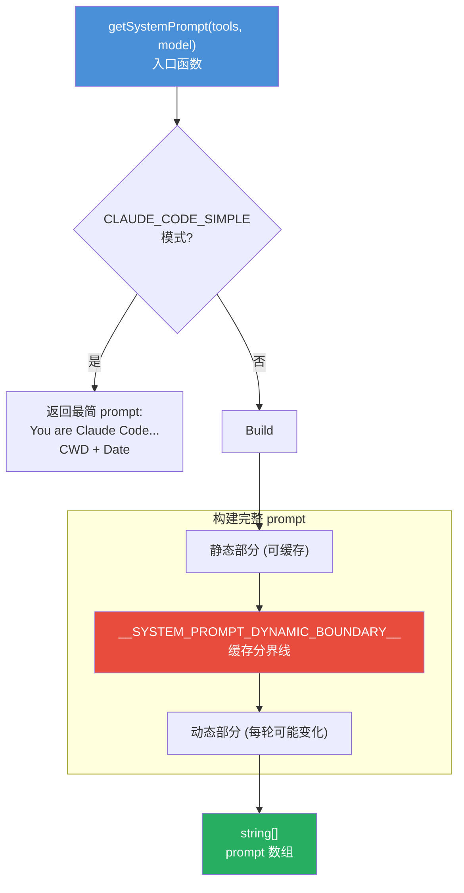

**关键设计**：prompt 被分成**静态部分**和**动态部分**，中间用一个分界线隔开。静态部分可以被 Anthropic API 缓存（省 token 费用），动态部分每轮可能变化。

---

## 二、getSystemPrompt() 函数详解

入口在 `src/constants/prompts.ts:444`：

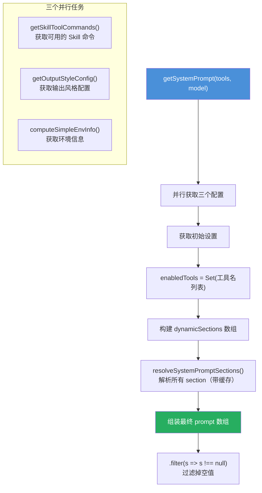

---

## 三、静态部分（可缓存，不变）

这些内容在同一个会话内**不会变化**，所以 Anthropic API 可以缓存它们：

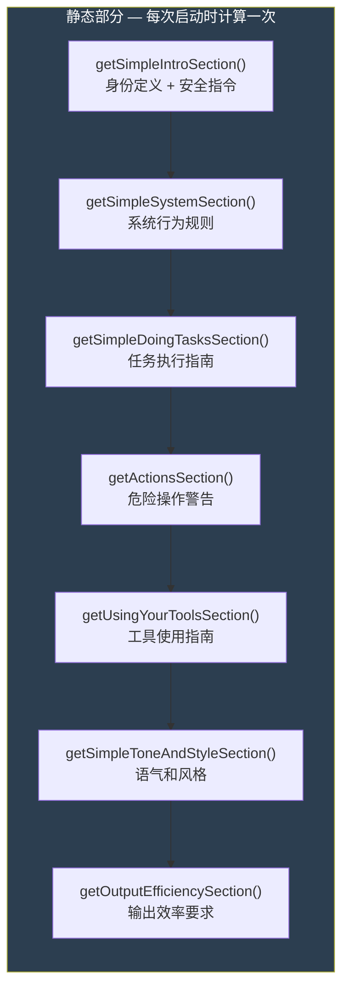

### 3.1 身份定义（getSimpleIntroSection）

```text
You are an interactive agent that helps users with software engineering tasks.
Use the instructions below and the tools available to you to assist the user.

IMPORTANT: Assist with authorized security testing...
IMPORTANT: You must NEVER generate or guess URLs...
```

**作用**：告诉 Claude "你是谁"——一个帮助用户做软件工程任务的 agent。

### 3.2 系统行为规则（getSimpleSystemSection）

包含 6 条核心规则：

| 规则 | 说明 |
|------|------|
| 输出方式 | 用 GitHub-flavored markdown，渲染为等宽字体 |
| 权限模式 | 工具执行受权限控制，用户可批准/拒绝 |
| system-reminder | 消息中的 `<system-reminder>` 标签来自系统 |
| 外部数据警告 | 工具结果可能包含外部数据，注意 prompt injection |
| Hooks | 用户可配置 hooks，在工具调用时执行 shell 命令 |
| 自动压缩 | 对话会自动压缩，不受上下文窗口限制 |

### 3.3 任务执行指南（getSimpleDoingTasksSection）

这是**最长的一段**，包含大量行为约束：

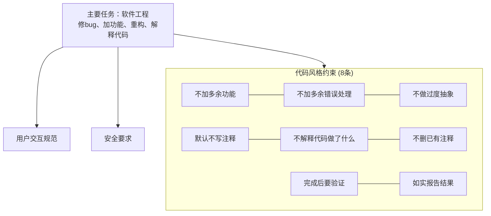

### 3.4 工具使用指南（getUsingYourToolsSection）

告诉 Claude **优先用专用工具，不要用 Bash**：

```text
Do NOT use the Bash to run commands when a relevant dedicated tool is provided.

- To read files use Read instead of cat, head, tail, or sed
- To edit files use Edit instead of sed or awk
- To create files use Write instead of cat with heredoc
- To search for files use Glob instead of find or ls
- To search content use Grep instead of grep or rg
- Reserve Bash exclusively for system commands...
```

还包含并行执行指南：
```text
You can call multiple tools in a single response.
If tools are independent, make all independent tool calls in parallel.
```

### 3.5 危险操作警告（getActionsSection）

列出需要用户确认的操作类型：

| 类型 | 示例 |
|------|------|
| 破坏性操作 | 删除文件/分支、drop table、rm -rf |
| 不可逆操作 | force-push、git reset --hard、修改 CI/CD |
| 影响他人 | push 代码、创建 PR、发消息 |
| 上传敏感内容 | 上传到第三方工具 |

---

## 四、缓存分界线

```text
__SYSTEM_PROMPT_DYNAMIC_BOUNDARY__
```

这是一个特殊的标记字符串。在它**之前**的内容使用 `scope: 'global'` 缓存（跨组织可共享），在它**之后**的内容包含用户/会话特定信息，不缓存。

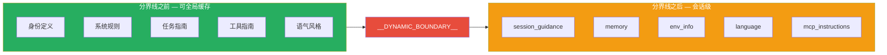

---

## 五、动态部分（每轮可能变化）

这些 section 通过 `systemPromptSection()` 或 `DANGEROUS_uncachedSystemPromptSection()` 创建：

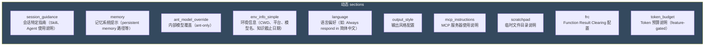

### 5.1 缓存策略

有两种 section 类型：

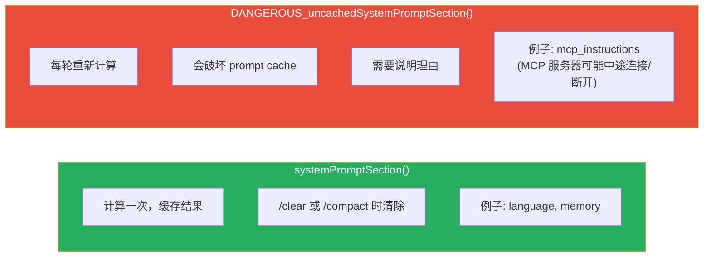

### 5.2 resolveSystemPromptSections() 解析过程

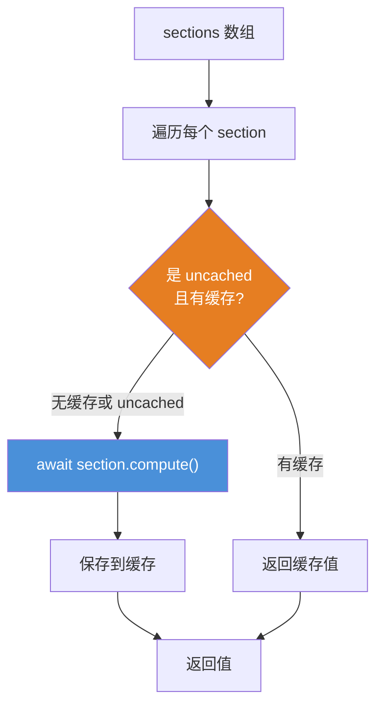

---

## 六、优先级链（buildEffectiveSystemPrompt）

在 `getSystemPrompt()` 生成默认 prompt 之后，还有一个**优先级覆盖**机制：

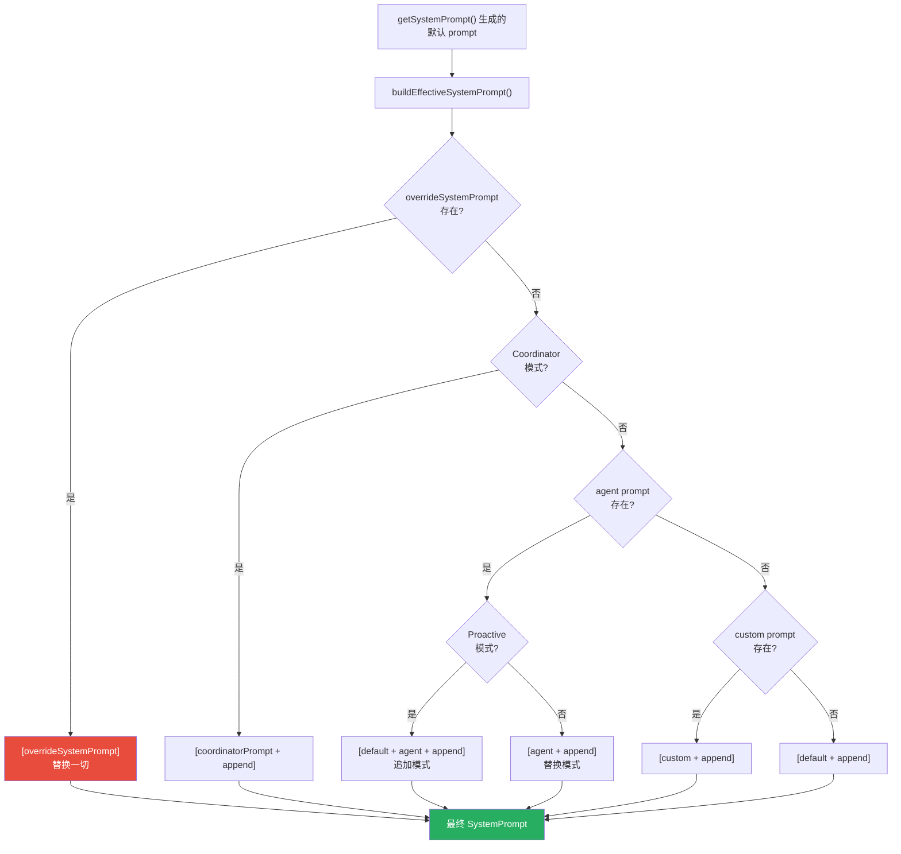

**appendSystemPrompt** 总是附加在最后（除非 override 模式）。

---

## 七、上下文注入（context.ts）

除了 system prompt 本身，还有两个上下文会被注入到 API 请求中：

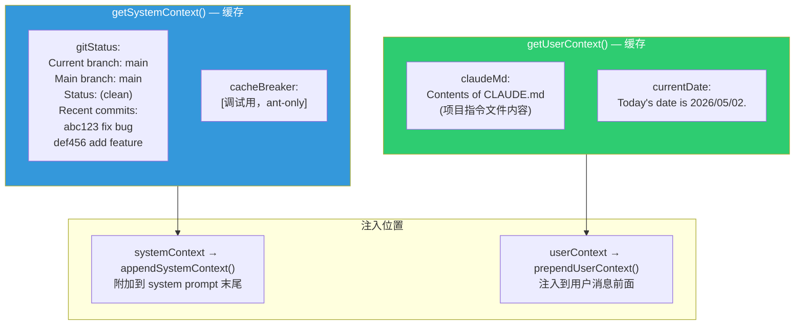

### 7.1 gitStatus 内容示例

```text
This is the git status at the start of the conversation.
Note that this status is a snapshot in time, and will not update
during the conversation.

Current branch: main
Main branch (you will usually use this for PRs): main
Git user: xinyi
Status:
(clean)

Recent commits:
3b0a5e4 docs: 更新说明文档
c57e6ee docs: 文档优化完成
```

### 7.2 claudeMd 内容

就是 CLAUDE.md 文件的内容。Claude Code 会从项目目录层级中自动发现并加载所有 CLAUDE.md 文件。

---

## 八、环境信息（computeSimpleEnvInfo）

```text
Here is useful information about the environment you are running in:
<env>
Primary working directory: /path/to/project
Is a git repository: true
Platform: darwin
Shell: /bin/zsh
OS Version: macOS 14.0
</env>
You are powered by the model named Claude Opus 4.6.
The exact model ID is claude-opus-4-6.
Assistant knowledge cutoff is early 2025.
```

---

## 九、MCP 服务器指令

当有 MCP 服务器连接时，会注入它们的使用说明：

```text
# MCP Server Instructions

The following MCP servers have provided instructions for how to use
their tools and resources:

## my-server
Use the search tool to query the database.
The query tool accepts SQL syntax...
```

---

## 十、完整 prompt 结构总览

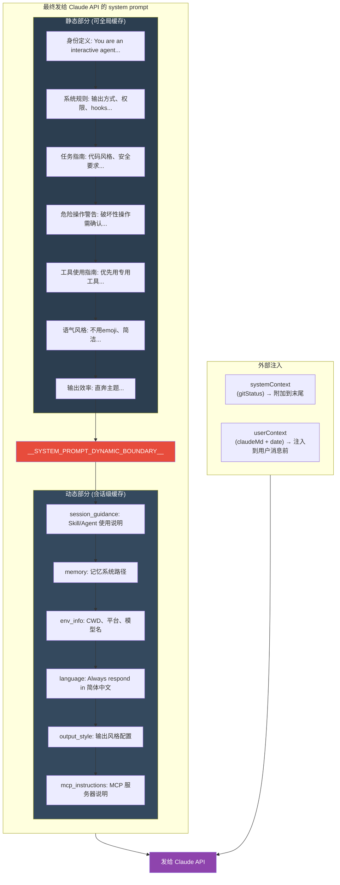

---

## 十一、设计精髓总结

| 设计点 | 做法 | 为什么 |
|--------|------|--------|
| 静态/动态分离 | 分界线隔开 | 静态部分可缓存，省 token 费用 |
| Section 缓存 | systemPromptSection() | 同一会话内只计算一次 |
| 不缓存标记 | DANGEROUS_uncachedSystemPromptSection() | MCP 等会变化的内容必须每轮重算 |
| 优先级链 | buildEffectiveSystemPrompt() | 支持 override > coordinator > agent > custom > default |
| 并行获取 | Promise.all() | 加速启动 |
| null 过滤 | .filter(s => s !== null) | 条件性 section 可能返回 null |
