# Claude Code 工程化细节：状态管理 / 工具编排 / 中断机制 / MCP / Skill / QueryEngine

> 本文档合并了状态管理、工具编排、中断机制、MCP 协议、Skill 系统和 QueryEngine 六大工程化主题，从源码层面拆解 Claude Code 的关键设计决策。

---

## 一、状态管理（store.ts）— 35 行的极简设计

### 1.1 完整实现

整个状态管理只有 35 行代码，核心就是三个方法：

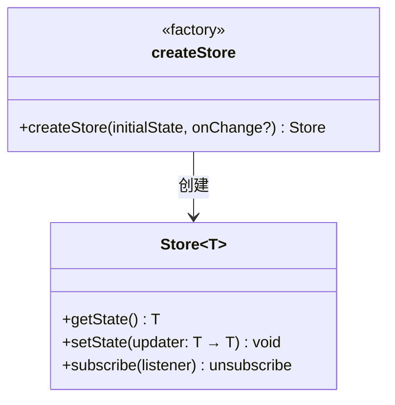
```mermaid
classDiagram
    class Store~T~ {
        +getState() T
        +setState(updater: T → T) void
        +subscribe(listener) unsubscribe
    }
    class createStore {
        <<factory>>
        +createStore(initialState, onChange?) Store
    }
    createStore --> Store : 创建
```

**类比 Java**：这就是一个极简版的 `EventBus` + `StateHolder`。

### 1.2 设计精髓

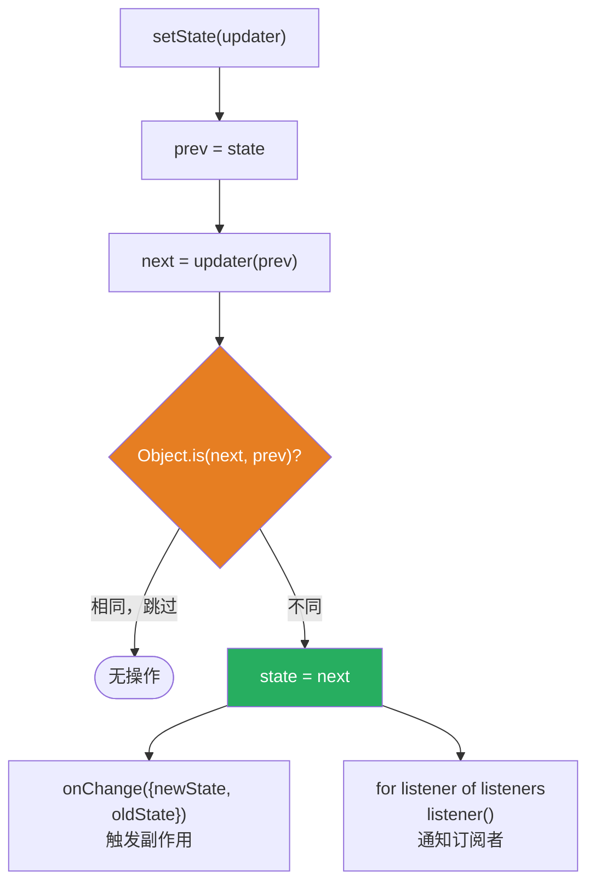
```mermaid
flowchart TB
    Input["setState(updater)"] --> Prev["prev = state"]
    Prev --> Next["next = updater(prev)"]
    Next --> Check{"Object.is(next, prev)?"}
    Check -- "相同，跳过" --> Skip(["无操作"])
    Check -- "不同" --> Update["state = next"]
    Update --> OnChange["onChange({newState, oldState})\n触发副作用"]
    Update --> Notify["for listener of listeners\nlistener()\n通知订阅者"]

    style Check fill:#E67E22,color:#fff
    style Update fill:#27AE60,color:#fff
```

三个设计要点：

| 要点 | 做法 | 为什么 |
|------|------|--------|
| 不可变更新 | `updater(prev) => next` | 避免意外修改旧状态 |
| 引用相等检查 | `Object.is(next, prev)` | 避免无意义的重渲染 |
| 副作用分离 | `onChange` 回调 | 状态变更后的副作用（日志、持久化）独立处理 |

### 1.3 AppState — 全局状态结构

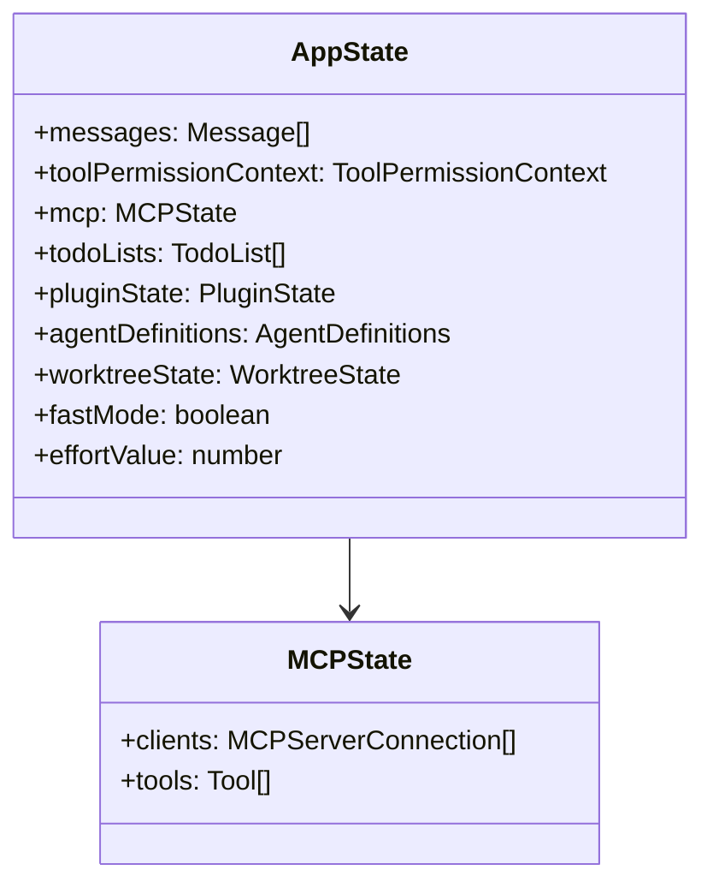
```mermaid
classDiagram
    class AppState {
        +messages: Message[]
        +toolPermissionContext: ToolPermissionContext
        +mcp: MCPState
        +todoLists: TodoList[]
        +pluginState: PluginState
        +agentDefinitions: AgentDefinitions
        +worktreeState: WorktreeState
        +fastMode: boolean
        +effortValue: number
    }
    class MCPState {
        +clients: MCPServerConnection[]
        +tools: Tool[]
    }
    AppState --> MCPState
```

**类比 Java**：这就是 Spring 的 `ApplicationContext`——一个全局可访问的状态容器。

### 1.4 React 集成（AppState.tsx）

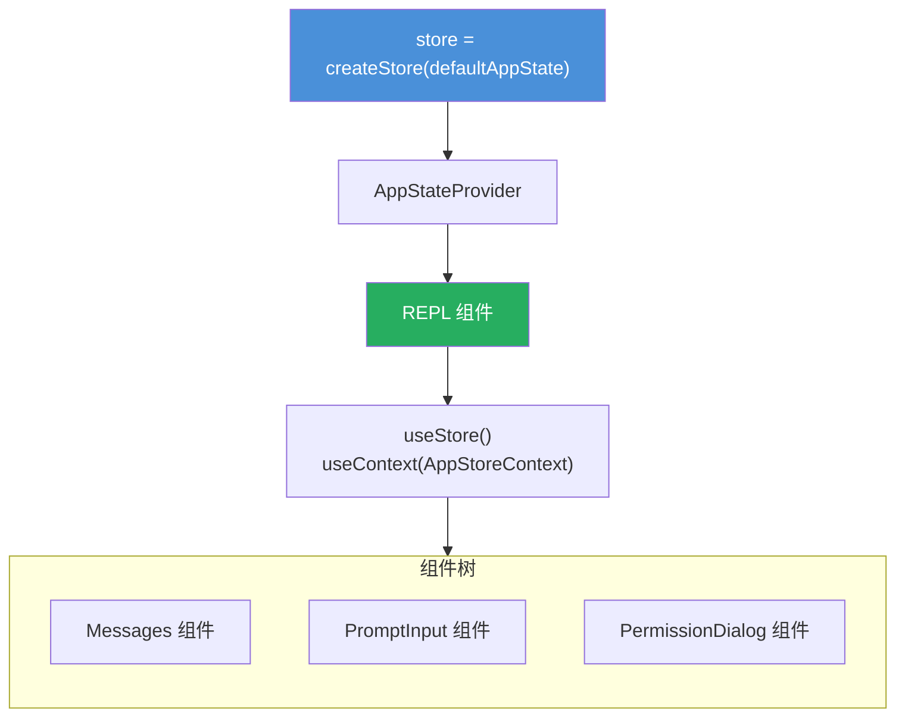
```mermaid
flowchart TB
    Store["store = createStore(defaultAppState)"] --> Provider["AppStateProvider"]
    Provider --> REPL["REPL 组件"]
    REPL --> UseStore["useStore()\nuseContext(AppStoreContext)"]

    subgraph components["组件树"]
        direction TB
        C1["Messages 组件"]
        C2["PromptInput 组件"]
        C3["PermissionDialog 组件"]
    end

    UseStore --> components

    style Store fill:#4A90D9,color:#fff
    style REPL fill:#27AE60,color:#fff
```

---

## 二、工具编排（toolOrchestration.ts）— 并行与串行

### 2.1 核心问题

Claude 一次回复可能包含多个 tool_use 块。怎么执行它们？

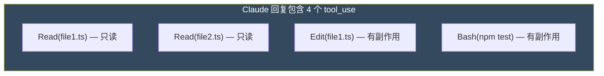
```mermaid
flowchart LR
    subgraph reply["Claude 回复包含 4 个 tool_use"]
        direction TB
        T1["Read(file1.ts) — 只读"]
        T2["Read(file2.ts) — 只读"]
        T3["Edit(file1.ts) — 有副作用"]
        T4["Bash(npm test) — 有副作用"]
    end

    style reply fill:#34495E,color:#fff
```

### 2.2 执行策略

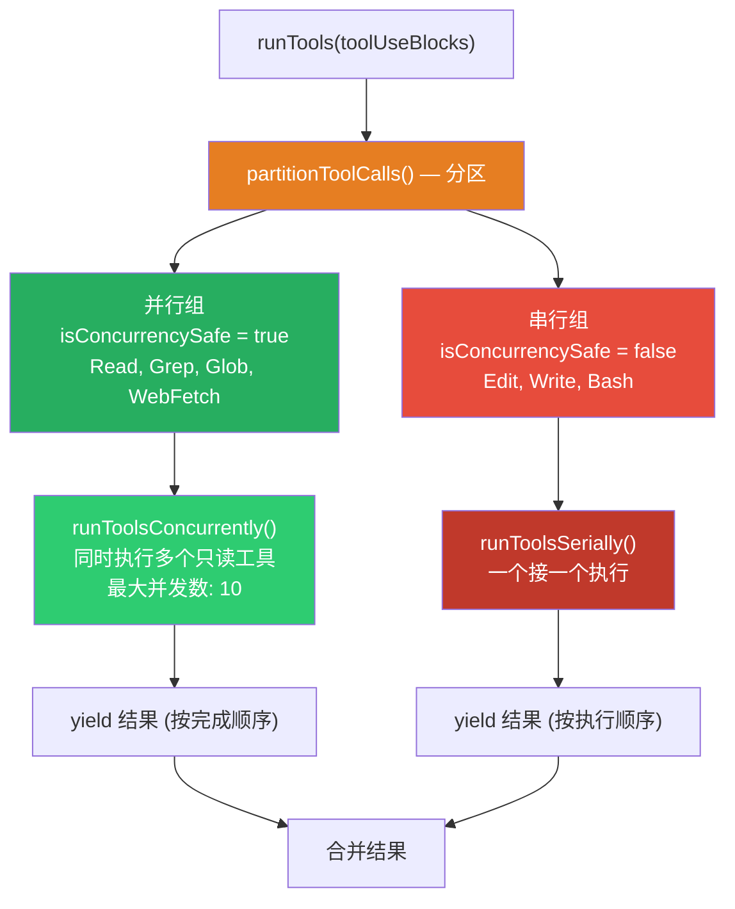
```mermaid
flowchart TB
    Input["runTools(toolUseBlocks)"] --> Partition["partitionToolCalls() — 分区"]

    Partition --> Safe["并行组\nisConcurrencySafe = true\nRead, Grep, Glob, WebFetch"]
    Partition --> Unsafe["串行组\nisConcurrencySafe = false\nEdit, Write, Bash"]

    Safe --> Concurrent["runToolsConcurrently()\n同时执行多个只读工具\n最大并发数: 10"]
    Unsafe --> Serial["runToolsSerially()\n一个接一个执行"]

    Concurrent --> Yield1["yield 结果 (按完成顺序)"]
    Serial --> Yield2["yield 结果 (按执行顺序)"]

    Yield1 --> Final["合并结果"]
    Yield2 --> Final

    style Partition fill:#E67E22,color:#fff
    style Safe fill:#27AE60,color:#fff
    style Unsafe fill:#E74C3C,color:#fff
    style Concurrent fill:#2ECC71,color:#fff
    style Serial fill:#C0392B,color:#fff
```

### 2.3 分区算法

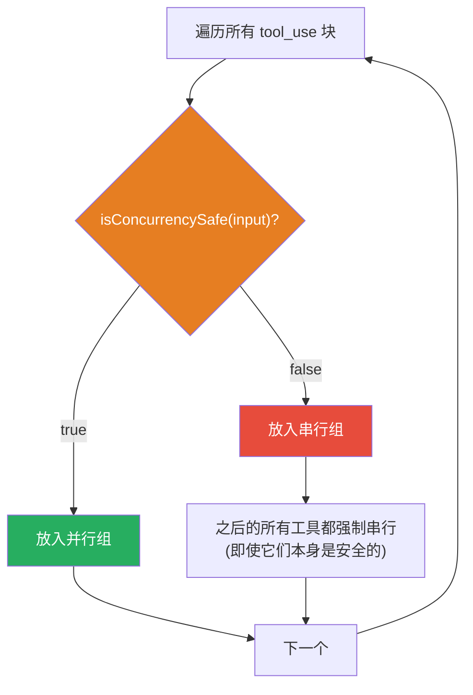
```mermaid
flowchart TB
    Start["遍历所有 tool_use 块"] --> Check{"isConcurrencySafe(input)?"}

    Check -- "true" --> Parallel["放入并行组"]
    Check -- "false" --> Serial["放入串行组"]
    Serial --> Force["之后的所有工具都强制串行\n(即使它们本身是安全的)"]

    Parallel --> Next["下一个"]
    Force --> Next
    Next --> Start

    style Check fill:#E67E22,color:#fff
    style Parallel fill:#27AE60,color:#fff
    style Serial fill:#E74C3C,color:#fff
```

**为什么遇到不安全工具后要全部串行？**

因为不安全工具（如 Edit）会改变文件状态，后续的"安全"工具（如 Read）可能需要读取修改后的内容。如果并行执行，Read 可能读到旧内容。

**类比 Java**：就像数据库事务中的读写锁——一旦有写操作介入，后续所有操作都必须排队等待，避免脏读。

---

## 三、中断机制 — Ctrl+C / ESC 是怎么工作的

### 3.1 整体架构

中断的核心是 JavaScript 的 `AbortController`，类似 Java 的 `Thread.interrupt()`，但更灵活。

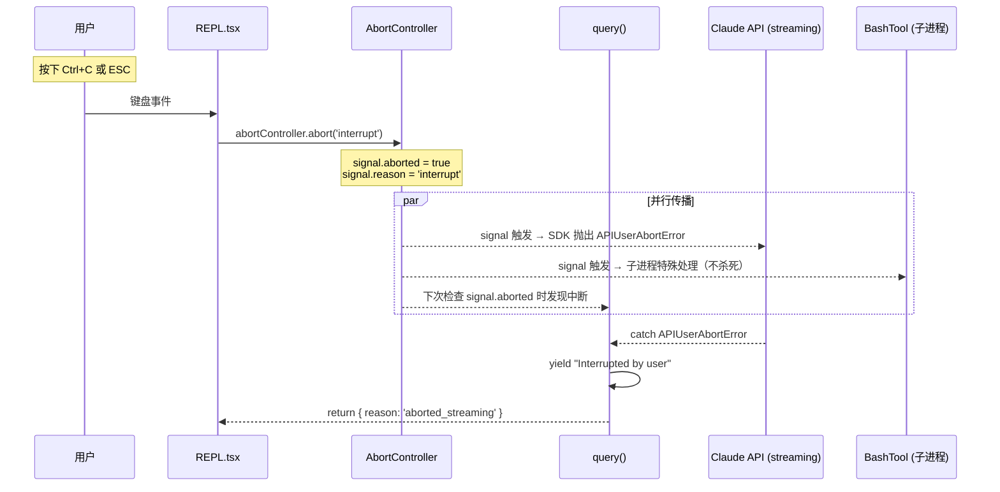
```mermaid
sequenceDiagram
    participant U as 用户
    participant REPL as REPL.tsx
    participant AC as AbortController
    participant Q as query()
    participant API as Claude API (streaming)
    participant BT as BashTool (子进程)

    Note over U: 按下 Ctrl+C 或 ESC

    U->>REPL: 键盘事件
    REPL->>AC: abortController.abort('interrupt')

    Note over AC: signal.aborted = true<br/>signal.reason = 'interrupt'

    par 并行传播
        AC-->>API: signal 触发 → SDK 抛出 APIUserAbortError
        AC-->>BT: signal 触发 → 子进程特殊处理（不杀死）
        AC-->>Q: 下次检查 signal.aborted 时发现中断
    end

    API-->>Q: catch APIUserAbortError
    Q->>Q: yield "Interrupted by user"
    Q-->>REPL: return { reason: 'aborted_streaming' }
```

### 3.2 AbortController 基础

```typescript
// 创建
const abortController = new AbortController()

// 触发中断（传入原因字符串）
abortController.abort('interrupt')

// 检查状态
abortController.signal.aborted          // true
abortController.signal.reason           // 'interrupt'
```

**传递给 API 调用**：signal 被传给 Anthropic SDK，SDK 内部监听这个信号。一旦中断，正在接收的 HTTP 流会被立刻关闭。

**创建位置**（`src/utils/abortController.ts`）：

```typescript
export function createAbortController(
  maxListeners: number = 50,
): AbortController {
  const controller = new AbortController()
  setMaxListeners(maxListeners, controller.signal)
  return controller
}
```

还提供了 `createChildAbortController(parent)` 用于创建子 Agent 的中断控制器（见 3.7 节）。

### 3.3 中断触发点

| 触发场景 | 代码位置 | 触发方式 |
|---------|---------|---------|
| 用户按 ESC | `src/screens/REPL.tsx:4099` | `abortControllerRef.current?.abort('interrupt')` |
| 用户在工具执行中提交新消息 | `src/utils/handlePromptSubmit.ts:331` | `params.abortController?.abort('interrupt')` |
| 远程客户端发送中断指令 | `src/screens/REPL.tsx:4098` | `queuedCommands.some(cmd => cmd.priority === 'now')` |
| 流式空闲超时（自动） | `src/services/api/claude.ts:1869` | 90 秒无数据到达，自动 abort |

### 3.4 两种中断场景

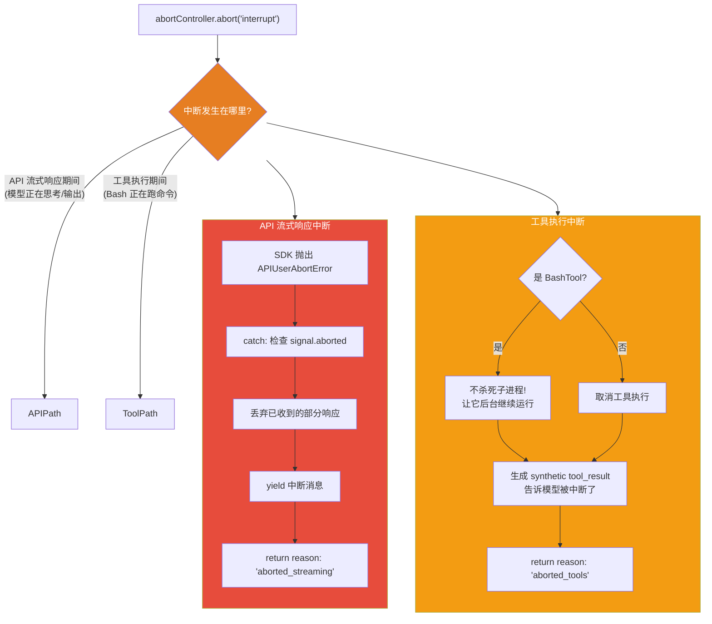
```mermaid
flowchart TB
    Abort["abortController.abort('interrupt')"] --> Check{"中断发生在哪里?"}

    Check -- "API 流式响应期间\n(模型正在思考/输出)" --> APIPath
    Check -- "工具执行期间\n(Bash 正在跑命令)" --> ToolPath

    subgraph api_path["API 流式响应中断"]
        direction TB
        A1["SDK 抛出 APIUserAbortError"]
        A2["catch: 检查 signal.aborted"]
        A3["丢弃已收到的部分响应"]
        A4["yield 中断消息"]
        A5["return reason: 'aborted_streaming'"]
        A1 --> A2 --> A3 --> A4 --> A5
    end

    subgraph tool_path["工具执行中断"]
        direction TB
        T1{"是 BashTool?"}
        T1 -- "是" --> T2["不杀死子进程!\n让它后台继续运行"]
        T1 -- "否" --> T3["取消工具执行"]
        T2 --> T4["生成 synthetic tool_result\n告诉模型被中断了"]
        T3 --> T4
        T4 --> T5["return reason: 'aborted_tools'"]
    end

    Check --> api_path
    Check --> tool_path

    style Check fill:#E67E22,color:#fff
    style api_path fill:#E74C3C,color:#fff
    style tool_path fill:#F39C12,color:#fff
```

### 3.5 场景一：API 流式响应中断（模型正在思考）

**答案：是的，正在思考的模型也会被立刻中断。**

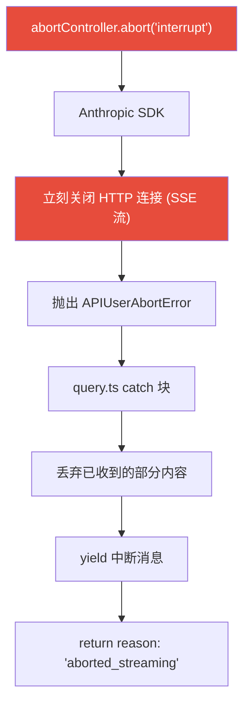
```mermaid
flowchart TB
    Call["abortController.abort('interrupt')"] --> SDK["Anthropic SDK"]
    SDK --> Close["立刻关闭 HTTP 连接 (SSE 流)"]
    Close --> Throw["抛出 APIUserAbortError"]
    Throw --> Catch["query.ts catch 块"]
    Catch --> Discard["丢弃已收到的部分内容"]
    Discard --> Yield["yield 中断消息"]
    Yield --> Return["return reason: 'aborted_streaming'"]

    style Call fill:#E74C3C,color:#fff
    style Close fill:#E74C3C,color:#fff
```

**关键代码**（`src/services/api/claude.ts:2435`）：

```typescript
if (streamingError instanceof APIUserAbortError) {
    if (signal.aborted) {
        // 真正的用户中断（ESC 键）
        throw streamingError  // 向上传播到 query.ts
    } else {
        // SDK 内部超时（不是用户操作）
        throw new APIConnectionTimeoutError({ message: 'Request timed out' })
    }
}
```

**中断后的清理**（`src/query.ts:1018`）：

```typescript
if (toolUseContext.abortController.signal.aborted) {
    if (streamingToolExecutor) {
        // 为已排队/正在执行的工具生成 synthetic tool_result
        for await (const update of streamingToolExecutor.getRemainingResults()) {
            if (update.message) yield update.message
        }
    } else {
        // 为每个 tool_use 块生成 "Interrupted by user" 的 tool_result
        yield* yieldMissingToolResultBlocks(assistantMessages, 'Interrupted by user')
    }
    return { reason: 'aborted_streaming' }
}
```

### 3.6 场景二：BashTool 执行中断（命令正在运行）

#### 核心设计：不杀死子进程

```typescript
// src/utils/ShellCommand.ts:186
#abortHandler(): void {
    // On 'interrupt' (user submitted a new message), don't kill — let the
    // caller background the process so the model can see partial output.
    if (this.#abortSignal.reason === 'interrupt') {
        return  // ← 什么都不做！不杀死进程！
    }
    this.kill()  // 只有非 interrupt 的 abort 才杀死
}
```

#### 为什么不杀死？

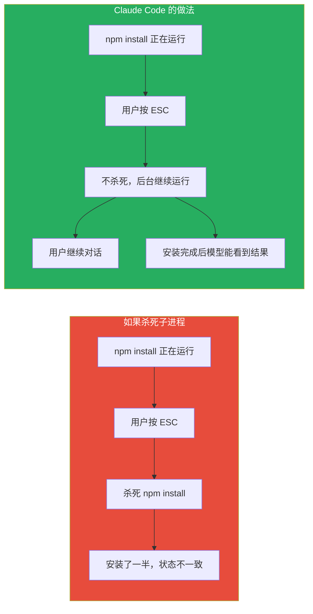
```mermaid
flowchart LR
    subgraph bad["如果杀死子进程"]
        direction TB
        B1["npm install 正在运行"]
        B2["用户按 ESC"]
        B3["杀死 npm install"]
        B4["安装了一半，状态不一致"]
        B1 --> B2 --> B3 --> B4
    end

    subgraph good["Claude Code 的做法"]
        direction TB
        G1["npm install 正在运行"]
        G2["用户按 ESC"]
        G3["不杀死，后台继续运行"]
        G4["用户继续对话"]
        G5["安装完成后模型能看到结果"]
        G1 --> G2 --> G3 --> G4
        G3 --> G5
    end

    style bad fill:#E74C3C,color:#fff
    style good fill:#27AE60,color:#fff
```

**类比 Java**：这类似于守护线程（Daemon Thread）的理念——主任务中断了，但子进程可以独立运行到完成。

#### BashTool 中断后的处理

```typescript
// src/tools/BashTool/BashTool.tsx:684
const isInterrupt = result.interrupted
    && abortController.signal.reason === 'interrupt'

// 中断时：不报错，只记录部分输出
if (interpretationResult.isError && !isInterrupt) {
    stdoutAccumulator.append(`Exit code ${result.code}`)
}
```

子进程被**后台化**（backgrounded），用户可以继续对话。下次对话时模型可以看到该命令的输出。

### 3.7 子 Agent 的中断传播

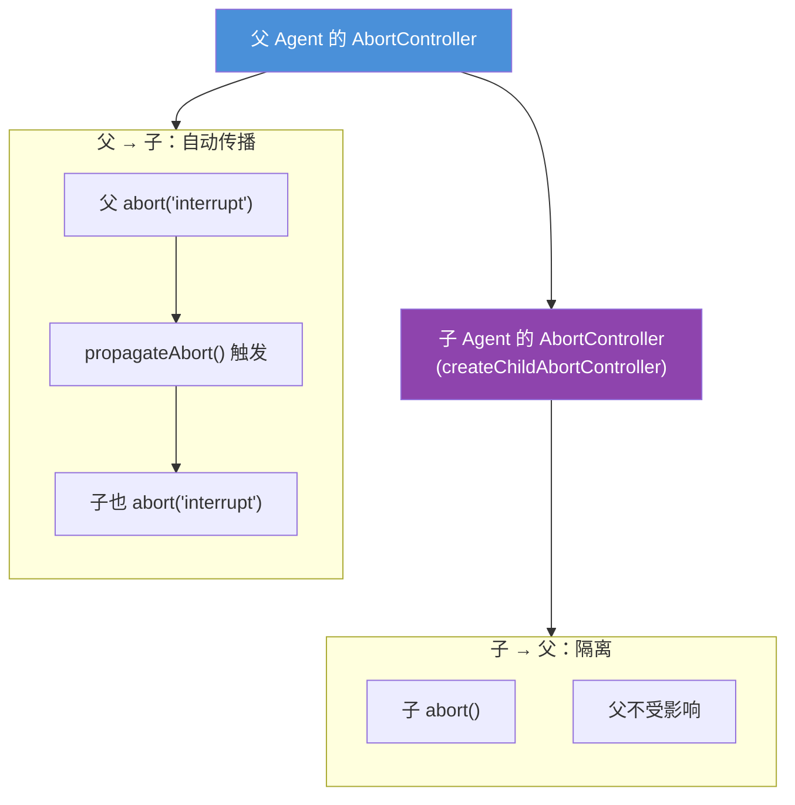
```mermaid
flowchart TB
    Parent["父 Agent 的 AbortController"] --> Child["子 Agent 的 AbortController\n(createChildAbortController)"]

    subgraph forward["父 → 子：自动传播"]
        direction TB
        F1["父 abort('interrupt')"]
        F2["propagateAbort() 触发"]
        F3["子也 abort('interrupt')"]
        F1 --> F2 --> F3
    end

    subgraph backward["子 → 父：隔离"]
        direction TB
        B1["子 abort()"]
        B2["父不受影响"]
    end

    Parent --> forward
    Child --> backward

    style Parent fill:#4A90D9,color:#fff
    style Child fill:#8E44AD,color:#fff
```

**实现**（`src/utils/abortController.ts`）：

```typescript
export function createChildAbortController(parent: AbortController): AbortController {
    const child = createAbortController()

    // 父已中断 → 子也立刻中断
    if (parent.signal.aborted) {
        child.abort(parent.signal.reason)
        return child
    }

    // WeakRef 防止内存泄漏
    const weakChild = new WeakRef(child)
    const weakParent = new WeakRef(parent)
    const handler = propagateAbort.bind(weakParent, weakChild)

    // 父中断时 → 子也中断
    parent.signal.addEventListener('abort', handler, { once: true })

    // 子中断时 → 清理父的监听器
    child.signal.addEventListener('abort',
        removeAbortHandler.bind(weakParent, new WeakRef(handler)),
        { once: true }
    )

    return child
}
```

**WeakRef 设计**：用弱引用避免父 Agent 持有已废弃的子 Agent 导致内存泄漏。如果子 Agent 被丢弃（没有 abort），它仍然可以被 GC 回收。

**类比 Java**：`WeakRef` 类似 Java 的 `WeakReference`——不阻止 GC 回收。传播机制类似 `CompletableFuture` 的 `cancel(true)` 向子任务传播。

### 3.8 submit-interrupt vs escape-interrupt

Claude Code 区分两种中断触发方式：

| 类型 | 触发方式 | signal.reason | 是否插入中断消息 |
|------|---------|---------------|-----------------|
| **escape-interrupt** | 按 ESC | `'interrupt'` | 否（用户没有新消息） |
| **submit-interrupt** | 输入新消息并回车 | `'interrupt'` | 否（新消息本身就够了） |
| **其他 abort** | 超时、错误等 | 其他值 | 是（插入 "Interrupted by user"） |

```typescript
// src/query.ts:1047
// 当 reason === 'interrupt' 时，不生成 "Request interrupted by user" 消息
// 因为用户的新消息会紧跟其后，或者用户只是按了 ESC 不需要额外消息
if (toolUseContext.abortController.signal.reason !== 'interrupt') {
    yield createUserInterruptionMessage({ toolUse: false })
}
```

### 3.9 流式空闲超时

除了用户主动中断，还有一个**自动超时机制**防止连接挂死：

```typescript
// src/services/api/claude.ts:1869
// 如果 API 流式响应 90 秒没有新数据到达，自动 abort
const STREAM_IDLE_TIMEOUT_MS =
    parseInt(process.env.CLAUDE_STREAM_IDLE_TIMEOUT_MS || '', 10) || 90_000

function resetStreamIdleTimer(): void {
    clearStreamIdleTimers()
    streamIdleTimer = setTimeout(() => {
        // 90 秒没收到数据 → 超时中断
        streamIdleAborted = true
        abortController.abort('stream_idle_timeout')
    }, STREAM_IDLE_TIMEOUT_MS)
}
```

每次收到新的 SSE chunk 时重置计时器。如果 90 秒内没有任何数据到达，自动 abort 防止会话永远挂起。

### 3.10 中断机制与 Java 的对比

| 机制 | Claude Code (JS) | Java |
|------|------------------|------|
| 中断信号 | `AbortController.abort(reason)` | `Thread.interrupt()` |
| 信号传播 | 手动通过 WeakRef 监听 | 自动传播（interrupt 状态） |
| HTTP 流中断 | SDK 内部关闭连接 | `InputStream.close()` |
| 子进程处理 | 不杀死，后台化 | 取决于实现 |
| 超时中断 | setTimeout + abort | `Future.cancel(true)` |
| 原因传递 | `signal.reason` 字符串 | 需要自定义字段 |

### 3.11 中断总结

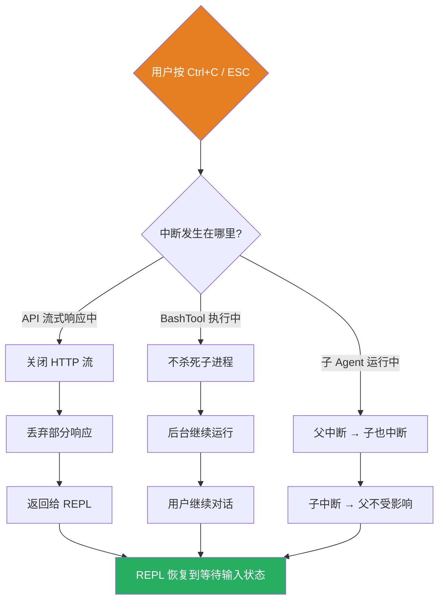
```mermaid
flowchart TB
    Q1{"用户按 Ctrl+C / ESC"}
    Q1 --> Q2{"中断发生在哪里?"}

    Q2 -- "API 流式响应中" --> A1["关闭 HTTP 流"]
    A1 --> A2["丢弃部分响应"]
    A2 --> A3["返回给 REPL"]

    Q2 -- "BashTool 执行中" --> B1["不杀死子进程"]
    B1 --> B2["后台继续运行"]
    B2 --> B3["用户继续对话"]

    Q2 -- "子 Agent 运行中" --> C1["父中断 → 子也中断"]
    C1 --> C2["子中断 → 父不受影响"]

    A3 --> Done["REPL 恢复到等待输入状态"]
    B3 --> Done
    C2 --> Done

    style Q1 fill:#E67E22,color:#fff
    style Done fill:#27AE60,color:#fff
```

| 问题 | 答案 |
|------|------|
| Ctrl+C 怎么实现的？ | `AbortController.abort('interrupt')`，signal 传给 SDK |
| 模型正在思考会中断吗？ | **会**。SDK 立刻关闭 HTTP 流，抛出 `APIUserAbortError` |
| 工具正在执行会中断吗？ | **会**，但 BashTool 特殊——不杀死子进程，让它后台继续 |
| 中断后已输出的内容怎么办？ | **丢弃**。部分响应不展示给用户 |
| 子 Agent 会一起中断吗？ | 父中断 → 子中断；子中断 → 父不受影响 |

---

## 四、MCP 协议 — 外部工具接入

### 4.1 MCP 是什么

MCP（Model Context Protocol）是一个标准协议，让外部程序能向 Claude 暴露工具、资源和提示词。

**类比 Java**：MCP 就像 SPI（Service Provider Interface）——定义一套标准接口，第三方实现者按接口规范提供服务，框架自动发现和加载。

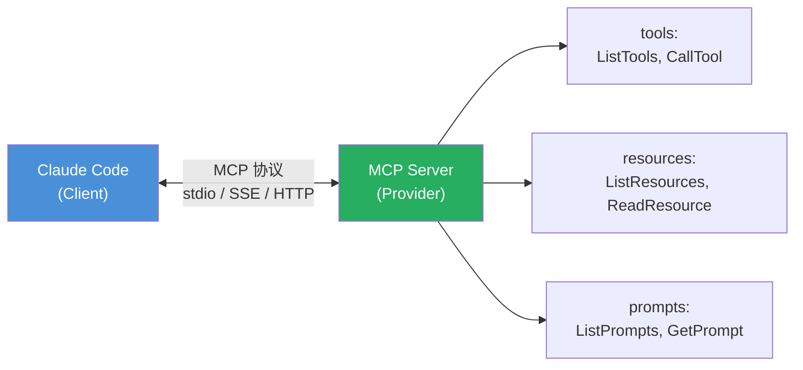
```mermaid
flowchart LR
    CC["Claude Code\n(Client)"] <-->|"MCP 协议\nstdio / SSE / HTTP"| Server["MCP Server\n(Provider)"]

    Server --> Cap1["tools:\nListTools, CallTool"]
    Server --> Cap2["resources:\nListResources, ReadResource"]
    Server --> Cap3["prompts:\nListPrompts, GetPrompt"]

    style CC fill:#4A90D9,color:#fff
    style Server fill:#27AE60,color:#fff
```

### 4.2 MCP 客户端连接流程（client.ts）

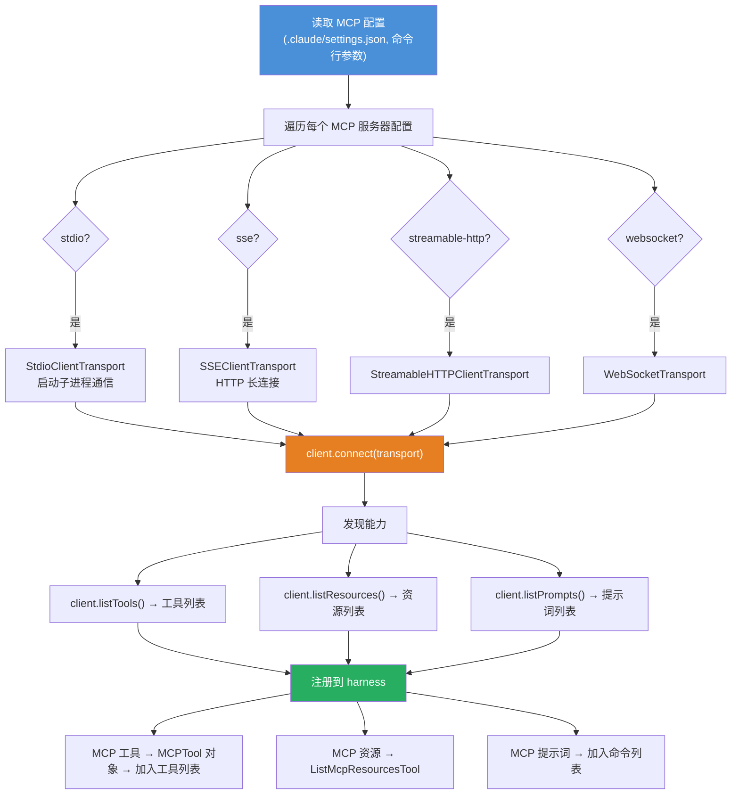
```mermaid
flowchart TB
    Config["读取 MCP 配置\n(.claude/settings.json, 命令行参数)"]

    Config --> Loop["遍历每个 MCP 服务器配置"]

    Loop --> T1{"stdio?"}
    Loop --> T2{"sse?"}
    Loop --> T3{"streamable-http?"}
    Loop --> T4{"websocket?"}

    T1 -- "是" --> Stdio["StdioClientTransport\n启动子进程通信"]
    T2 -- "是" --> SSE["SSEClientTransport\nHTTP 长连接"]
    T3 -- "是" --> HTTP["StreamableHTTPClientTransport"]
    T4 -- "是" --> WS["WebSocketTransport"]

    Stdio --> Connect["client.connect(transport)"]
    SSE --> Connect
    HTTP --> Connect
    WS --> Connect

    Connect --> Discover["发现能力"]
    Discover --> D1["client.listTools() → 工具列表"]
    Discover --> D2["client.listResources() → 资源列表"]
    Discover --> D3["client.listPrompts() → 提示词列表"]

    D1 --> Register["注册到 harness"]
    D2 --> Register
    D3 --> Register

    Register --> R1["MCP 工具 → MCPTool 对象 → 加入工具列表"]
    Register --> R2["MCP 资源 → ListMcpResourcesTool"]
    Register --> R3["MCP 提示词 → 加入命令列表"]

    style Config fill:#4A90D9,color:#fff
    style Connect fill:#E67E22,color:#fff
    style Register fill:#27AE60,color:#fff
```

### 4.3 MCPTool — MCP 工具的包装

MCP 暴露的每个工具都会被包装成一个 `MCPTool` 对象，对 Claude 来说和内置工具没有区别：

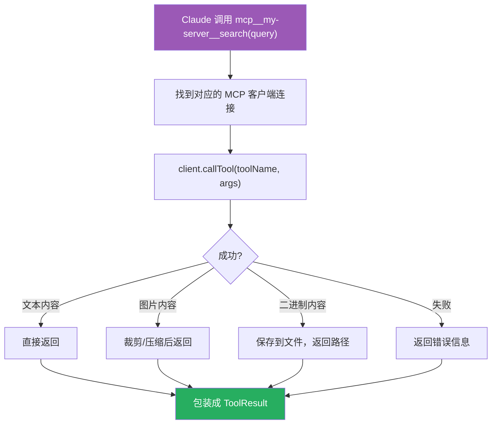
```mermaid
flowchart TB
    Input["Claude 调用 mcp__my-server__search(query)"]
    Input --> Find["找到对应的 MCP 客户端连接"]
    Find --> Call["client.callTool(toolName, args)"]

    Call --> Success{"成功?"}
    Success -- "文本内容" --> Text["直接返回"]
    Success -- "图片内容" --> Image["裁剪/压缩后返回"]
    Success -- "二进制内容" --> Binary["保存到文件，返回路径"]
    Success -- "失败" --> Error["返回错误信息"]

    Text --> Result["包装成 ToolResult"]
    Image --> Result
    Binary --> Result
    Error --> Result

    style Input fill:#9B59B6,color:#fff
    style Result fill:#27AE60,color:#fff
```

**类比 Java**：MCPTool 就是适配器模式（Adapter）——把 MCP 协议的 `callTool` 接口适配成 Claude Code 内部的 `Tool` 接口。

---

## 五、Skill 系统 — 预编排的指令集

### 5.1 Skill 是什么

**关键区分**：Skill 不等于 Tool。

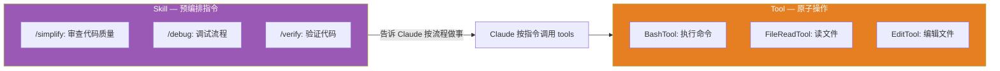
```mermaid
flowchart LR
    subgraph tool["Tool — 原子操作"]
        direction TB
        T1["BashTool: 执行命令"]
        T2["FileReadTool: 读文件"]
        T3["EditTool: 编辑文件"]
    end

    subgraph skill["Skill — 预编排指令"]
        direction TB
        S1["/simplify: 审查代码质量"]
        S2["/debug: 调试流程"]
        S3["/verify: 验证代码"]
    end

    skill -- "告诉 Claude 按流程做事" --> Claude["Claude 按指令调用 tools"]
    Claude --> tool

    style tool fill:#E67E22,color:#fff
    style skill fill:#9B59B6,color:#fff
```

**类比 Java**：
- Tool 类似 Service 层的原子方法——做一件具体的事
- Skill 类似 Spring Batch Job 定义——它不是代码，而是一组编排好的指令，告诉 Claude "按这个流程做事"

### 5.2 BundledSkillDefinition 结构

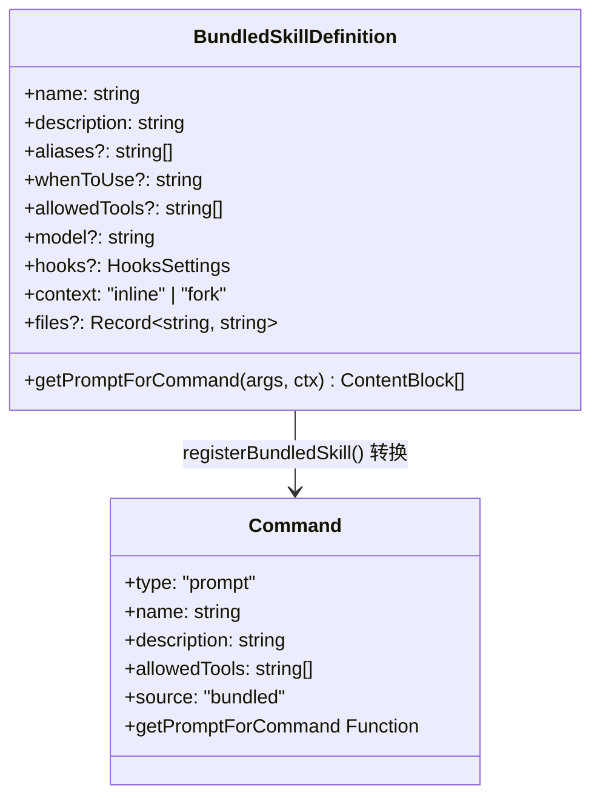
```mermaid
classDiagram
    class BundledSkillDefinition {
        +name: string
        +description: string
        +aliases?: string[]
        +whenToUse?: string
        +allowedTools?: string[]
        +model?: string
        +hooks?: HooksSettings
        +context: "inline" | "fork"
        +files?: Record~string, string~
        +getPromptForCommand(args, ctx) ContentBlock[]
    }
    class Command {
        +type: "prompt"
        +name: string
        +description: string
        +allowedTools: string[]
        +source: "bundled"
        +getPromptForCommand Function
    }
    BundledSkillDefinition --> Command : registerBundledSkill() 转换
```

核心字段说明：
- `allowedTools`：限制 Skill 执行时可用的工具范围（安全边界）
- `context: "inline" | "fork"`：inline 在当前对话中注入，fork 创建独立上下文
- `getPromptForCommand()`：根据用户参数动态生成提示词

### 5.3 Skill 的加载流程

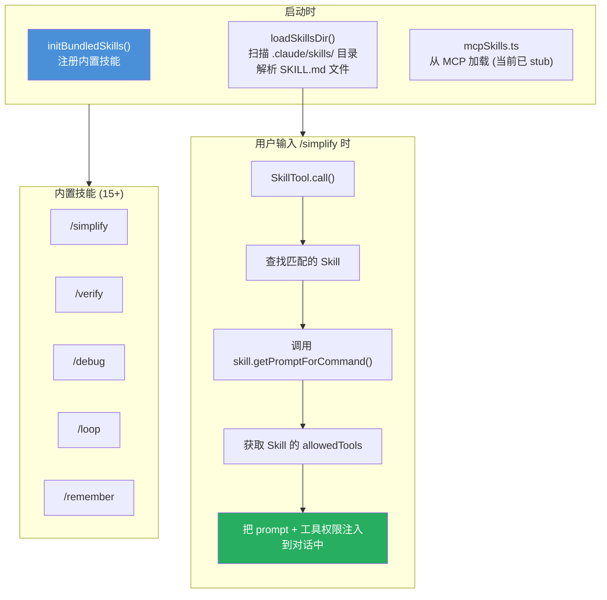
```mermaid
flowchart TB
    subgraph startup["启动时"]
        direction TB
        I1["initBundledSkills()\n注册内置技能"]
        I2["loadSkillsDir()\n扫描 .claude/skills/ 目录\n解析 SKILL.md 文件"]
        I3["mcpSkills.ts\n从 MCP 加载 (当前已 stub)"]
    end

    subgraph builtin["内置技能 (15+)"]
        direction LR
        B1["/simplify"]
        B2["/verify"]
        B3["/debug"]
        B4["/loop"]
        B5["/remember"]
    end

    subgraph invoke["用户输入 /simplify 时"]
        direction TB
        V1["SkillTool.call()"]
        V2["查找匹配的 Skill"]
        V3["调用 skill.getPromptForCommand()"]
        V4["获取 Skill 的 allowedTools"]
        V5["把 prompt + 工具权限注入到对话中"]
        V1 --> V2 --> V3 --> V4 --> V5
    end

    startup --> builtin
    I2 --> invoke

    style I1 fill:#4A90D9,color:#fff
    style V5 fill:#27AE60,color:#fff
```

### 5.4 SKILL.md 文件格式（磁盘技能）

用户可以在 `.claude/skills/` 目录下自定义 Skill，使用 Markdown 文件格式：

```markdown
---
name: my-skill
description: 做某件事的技能
allowedTools:
  - Bash
  - Read
  - Edit
hooks:
  pre: echo "starting"
  post: echo "done"
---

你是一个专业的代码审查员。请按以下步骤工作：

1. 使用 GrepTool 搜索所有 TODO 注释
2. 使用 FileReadTool 读取相关文件
3. 使用 EditTool 修复发现的问题

完成后给出总结报告。
```

**类比 Java**：这就像 Spring 的 `@Configuration` + `@Bean`——用声明式的方式定义行为，框架自动解析和注册。

---

## 六、QueryEngine — 非交互式模式

### 6.1 什么是 QueryEngine

QueryEngine 是 `query()` 的高级封装，用于**非交互式**场景（SDK 调用、自动化脚本）。

**类比 Java**：
- REPL 模式 类似 Spring MVC 的 `@Controller`（交互式，有 UI）
- QueryEngine 模式 类似 Spring 的 `CommandLineRunner`（非交互式，无 UI）

### 6.2 QueryEngine vs REPL

| 维度 | REPL | QueryEngine |
|------|------|-------------|
| 交互方式 | 终端 UI（Ink/React） | SDK 调用 |
| 用户输入 | 键盘输入 | 编程传入 |
| 输出方式 | 终端渲染 | 回调/流 |
| 状态管理 | React state | 简单变量 |
| 权限确认 | 弹窗询问 | 预设/自动 |

### 6.3 QueryEngine 核心流程

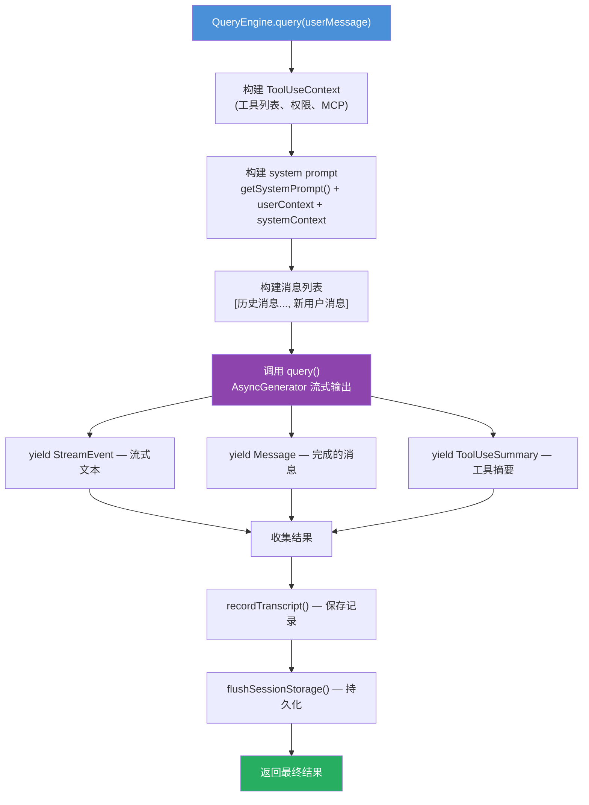
```mermaid
flowchart TB
    Input["QueryEngine.query(userMessage)"] --> CTX["构建 ToolUseContext\n(工具列表、权限、MCP)"]
    CTX --> SP["构建 system prompt\ngetSystemPrompt() + userContext + systemContext"]
    SP --> MSG["构建消息列表\n[历史消息..., 新用户消息]"]
    MSG --> Query["调用 query()\nAsyncGenerator 流式输出"]

    Query --> Y1["yield StreamEvent — 流式文本"]
    Query --> Y2["yield Message — 完成的消息"]
    Query --> Y3["yield ToolUseSummary — 工具摘要"]

    Y1 --> Collect["收集结果"]
    Y2 --> Collect
    Y3 --> Collect

    Collect --> Save["recordTranscript() — 保存记录"]
    Save --> Flush["flushSessionStorage() — 持久化"]
    Flush --> Return["返回最终结果"]

    style Input fill:#4A90D9,color:#fff
    style Query fill:#8E44AD,color:#fff
    style Return fill:#27AE60,color:#fff
```

### 6.4 QueryEngine 与 query() 的关系

```mermaid
flowchart LR
    subgraph callers["调用方"]
        direction TB
        REPL["REPL.tsx\n交互模式"]
        QE["QueryEngine\nSDK 模式"]
        Pipe["Pipe Mode\n管道模式"]
    end

    subgraph core["核心引擎"]
        direction TB
        Query["query.ts\nwhile 循环：发消息 → 执行工具 → 再发消息"]
        API["claude.ts\n构建请求 → 调 Anthropic SDK → 流式处理"]
    end

    subgraph components["引擎组件"]
        direction LR
        E1["压缩管道"]
        E2["权限检查"]
        E3["工具编排"]
        E4["中断机制"]
    end

    callers --> Query
    Query --> components
    Query --> API

    style callers fill:#3498DB,color:#fff
    style core fill:#2C3E50,color:#fff
    style components fill:#8E44AD,color:#fff
```

**关键点**：无论 REPL、QueryEngine 还是 Pipe Mode，最终都调用同一个 `query()` 函数。区别只在于谁来调、怎么传参、怎么收集结果。

---

## 七、六大模块协作关系

```mermaid
sequenceDiagram
    participant U as 用户
    participant SS as SkillSystem
    participant PS as PromptSystem
    participant QL as Query Loop
    participant TS as ToolSystem
    participant MCP as MCP Server
    participant API as Claude API
    participant Store as Store (状态)

    U->>SS: /simplify
    SS->>SS: 查找 simplify skill
    SS->>PS: prompt + allowedTools

    PS->>PS: 注入到 system prompt
    PS->>PS: 注入 systemContext + userContext
    PS->>QL: 完整 prompt

    QL->>Store: 更新 AppState.messages
    QL->>API: 发送 prompt

    API-->>QL: tool_use: Read("src/main.ts")
    QL->>TS: 查找 Read tool
    TS->>TS: FileReadTool.call() — 并行安全
    TS-->>QL: 文件内容

    API-->>QL: tool_use: mcp__search__(query)
    QL->>TS: 查找 MCP tool
    TS->>MCP: client.callTool()
    MCP-->>TS: 搜索结果
    TS-->>QL: ToolResult

    QL->>API: [消息 + tool_result]
    API-->>QL: 纯文本: "以下是代码审查结果..."

    QL->>Store: 更新 AppState.messages
    QL-->>U: 最终结果
```

---

## 八、设计模式总结

| 模式 | 在哪里用 | Java 等价 |
|------|---------|-----------|
| Command | Tool 接口 | `Command.execute()` |
| Strategy | 工具编排的并行/串行策略 | `Strategy` 接口 |
| Observer | store.ts 状态订阅 | `EventListener` |
| Adapter | MCPTool 包装 MCP 工具 | `Adapter` 模式 |
| Template Method | Skill.getPromptForCommand | `AbstractMethod` |
| Composite | system prompt 拼装 | `Builder` 模式 |
| Singleton | context.ts 的 memoize | `@Scope("singleton")` |
| Chain of Responsibility | 中断信号的父子传播 | `Filter Chain` |
| Background Task | BashTool 子进程后台化 | `Daemon Thread` |

---

## 九、一句话总结

- **store.ts**：35 行极简状态管理，不可变更新 + 引用相等检查 + 副作用分离
- **工具编排**：只读工具并行（最大 10），有副作用工具串行，遇到第一个不安全工具后全部强制串行
- **中断机制**：AbortController 一把梭——API 流立刻关闭，BashTool 子进程不杀死而是后台化，父子 Agent 通过 WeakRef 单向传播
- **MCP**：标准协议接入外部工具，适配器模式包装成内部 Tool，对 Claude 透明
- **Skill**：预编排的指令集，不是代码而是 Prompt + 工具权限的组合，声明式定义工作流
- **QueryEngine**：query() 的非交互式封装，REPL / SDK / Pipe 三种模式共用同一个核心引擎
