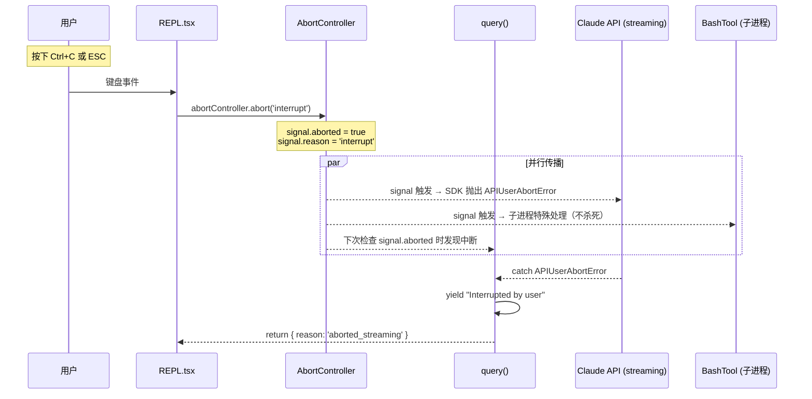
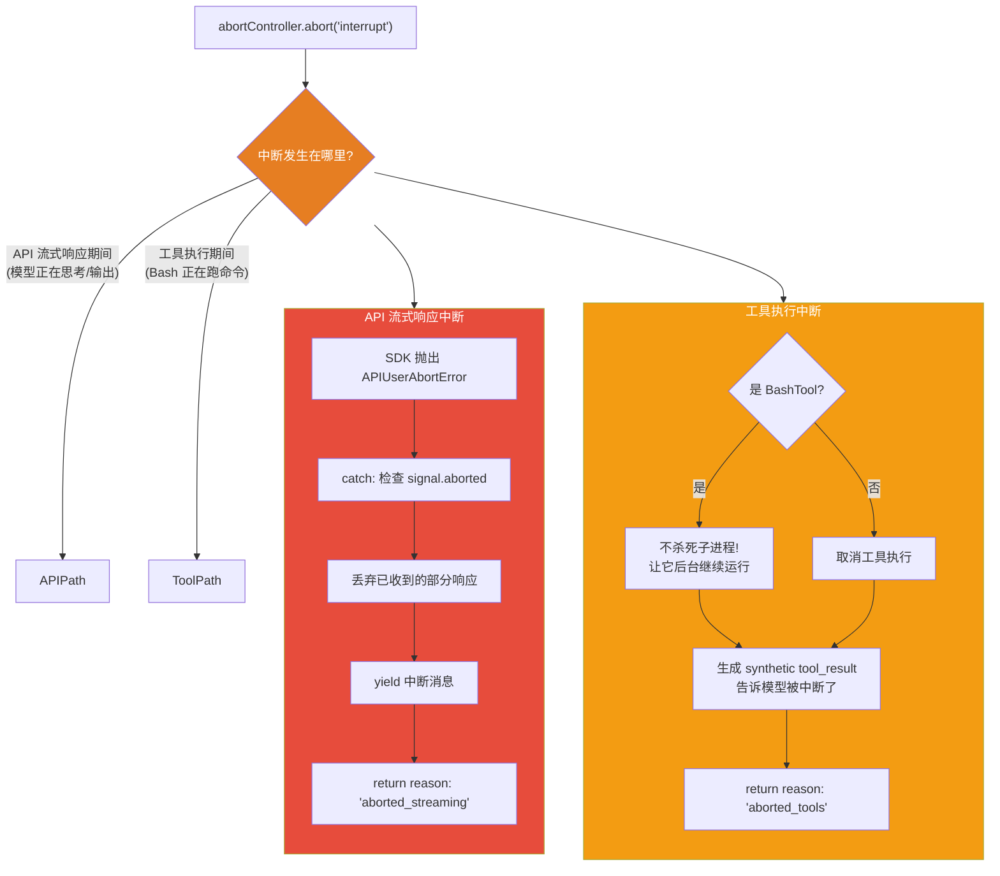
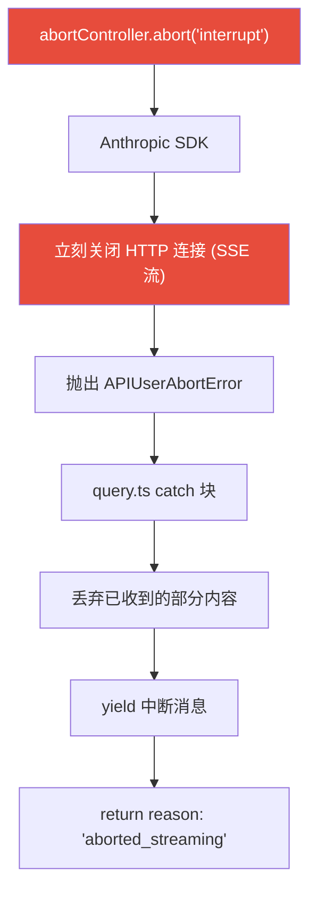
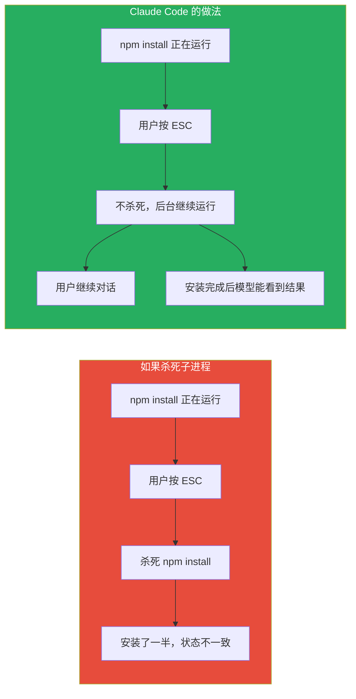
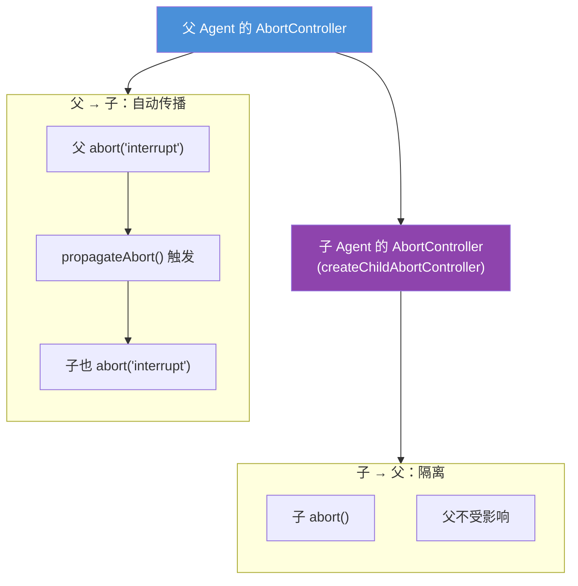
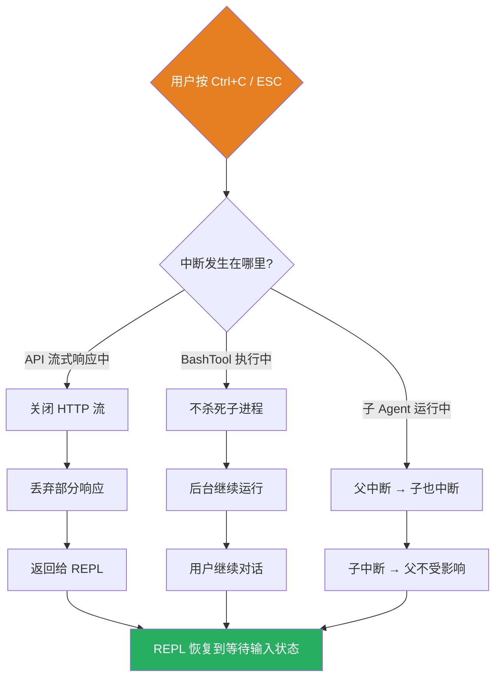

# 中断机制详解：Ctrl+C / ESC 是怎么工作的

> 阅读本文档后，你将理解：用户按 Ctrl+C 后发生了什么、正在思考的模型会不会被中断、正在执行的命令会不会被杀死。

---

## 一、整体架构

中断的核心是 JavaScript 的 `AbortController`，类似 Java 的 `Thread.interrupt()`，但更灵活。



---

## 二、AbortController 基础

```typescript
// 创建
const abortController = new AbortController()

// 触发中断（传入原因字符串）
abortController.abort('interrupt')

// 检查状态
abortController.signal.aborted          // true
abortController.signal.reason           // 'interrupt'
```

**传递给 API 调用**：signal 被传给 Anthropic SDK，SDK 内部监听这个信号。一旦中断，正在接收的 HTTP 流会被立刻关闭。

**创建位置**（`src/utils/abortController.ts`）：

```typescript
export function createAbortController(
  maxListeners: number = 50,
): AbortController {
  const controller = new AbortController()
  setMaxListeners(maxListeners, controller.signal)
  return controller
}
```

还提供了 `createChildAbortController(parent)` 用于创建子 Agent 的中断控制器（见第七节）。

---

## 三、中断触发点

### 3.1 用户按 ESC

```typescript
// src/screens/REPL.tsx:4099
abortControllerRef.current?.abort('interrupt')
```

### 3.2 用户在工具执行中提交新消息

```typescript
// src/utils/handlePromptSubmit.ts:331
if (params.hasInterruptibleToolInProgress) {
    params.abortController?.abort('interrupt')
}
```

### 3.3 远程客户端发送中断指令

```typescript
// src/screens/REPL.tsx:4098
if (queuedCommands.some(cmd => cmd.priority === 'now')) {
    abortControllerRef.current?.abort('interrupt');
}
```

### 3.4 流式空闲超时（自动）

```typescript
// src/services/api/claude.ts:1869
// 如果 API 流式响应 90 秒没有新数据到达，自动 abort
// 防止连接静默断开导致会话永远挂起
const STREAM_IDLE_TIMEOUT_MS = 90_000
```

---

## 四、两种中断场景



---

## 五、场景一：API 流式响应中断（模型正在思考）

**答案：是的，正在思考的模型也会被立刻中断。**



**关键代码**（`src/services/api/claude.ts:2435`）：

```typescript
if (streamingError instanceof APIUserAbortError) {
    if (signal.aborted) {
        // 真正的用户中断（ESC 键）
        throw streamingError  // 向上传播到 query.ts
    } else {
        // SDK 内部超时（不是用户操作）
        throw new APIConnectionTimeoutError({ message: 'Request timed out' })
    }
}
```

**中断后的清理**（`src/query.ts:1018`）：

```typescript
if (toolUseContext.abortController.signal.aborted) {
    if (streamingToolExecutor) {
        // 为已排队/正在执行的工具生成 synthetic tool_result
        for await (const update of streamingToolExecutor.getRemainingResults()) {
            if (update.message) yield update.message
        }
    } else {
        // 为每个 tool_use 块生成 "Interrupted by user" 的 tool_result
        yield* yieldMissingToolResultBlocks(assistantMessages, 'Interrupted by user')
    }
    return { reason: 'aborted_streaming' }
}
```

---

## 六、场景二：BashTool 执行中断（命令正在运行）

### 6.1 核心设计：不杀死子进程

```typescript
// src/utils/ShellCommand.ts:186
#abortHandler(): void {
    // On 'interrupt' (user submitted a new message), don't kill — let the
    // caller background the process so the model can see partial output.
    if (this.#abortSignal.reason === 'interrupt') {
        return  // ← 什么都不做！不杀死进程！
    }
    this.kill()  // 只有非 interrupt 的 abort 才杀死
}
```

### 6.2 为什么不杀死？



### 6.3 BashTool 中断后的处理

```typescript
// src/tools/BashTool/BashTool.tsx:684
const isInterrupt = result.interrupted
    && abortController.signal.reason === 'interrupt'

// 中断时：不报错，只记录部分输出
if (interpretationResult.isError && !isInterrupt) {
    stdoutAccumulator.append(`Exit code ${result.code}`)
}
```

子进程被**后台化**（backgrounded），用户可以继续对话。下次对话时模型可以看到该命令的输出。

---

## 七、子 Agent 的中断传播



**实现**（`src/utils/abortController.ts`）：

```typescript
export function createChildAbortController(parent: AbortController): AbortController {
    const child = createAbortController()

    // 父已中断 → 子也立刻中断
    if (parent.signal.aborted) {
        child.abort(parent.signal.reason)
        return child
    }

    // WeakRef 防止内存泄漏
    const weakChild = new WeakRef(child)
    const weakParent = new WeakRef(parent)
    const handler = propagateAbort.bind(weakParent, weakChild)

    // 父中断时 → 子也中断
    parent.signal.addEventListener('abort', handler, { once: true })

    // 子中断时 → 清理父的监听器
    child.signal.addEventListener('abort',
        removeAbortHandler.bind(weakParent, new WeakRef(handler)),
        { once: true }
    )

    return child
}
```

**WeakRef 设计**：用弱引用避免父 Agent 持有已废弃的子 Agent 导致内存泄漏。如果子 Agent 被丢弃（没有 abort），它仍然可以被 GC 回收。

---

## 八、submit-interrupt vs escape-interrupt

Claude Code 区分两种中断触发方式：

| 类型 | 触发方式 | signal.reason | 是否插入中断消息 |
|------|---------|---------------|-----------------|
| **escape-interrupt** | 按 ESC | `'interrupt'` | 否（用户没有新消息） |
| **submit-interrupt** | 输入新消息并回车 | `'interrupt'` | 否（新消息本身就够了） |
| **其他 abort** | 超时、错误等 | 其他值 | 是（插入 "Interrupted by user"） |

```typescript
// src/query.ts:1047
// 当 reason === 'interrupt' 时，不生成 "Request interrupted by user" 消息
// 因为用户的新消息会紧跟其后，或者用户只是按了 ESC 不需要额外消息
if (toolUseContext.abortController.signal.reason !== 'interrupt') {
    yield createUserInterruptionMessage({ toolUse: false })
}
```

---

## 九、流式空闲超时

除了用户主动中断，还有一个**自动超时机制**防止连接挂死：

```typescript
// src/services/api/claude.ts:1869
// 如果 API 流式响应 90 秒没有新数据到达，自动 abort
const STREAM_IDLE_TIMEOUT_MS =
    parseInt(process.env.CLAUDE_STREAM_IDLE_TIMEOUT_MS || '', 10) || 90_000

function resetStreamIdleTimer(): void {
    clearStreamIdleTimers()
    streamIdleTimer = setTimeout(() => {
        // 90 秒没收到数据 → 超时中断
        streamIdleAborted = true
        abortController.abort('stream_idle_timeout')
    }, STREAM_IDLE_TIMEOUT_MS)
}
```

每次收到新的 SSE chunk 时重置计时器。如果 90 秒内没有任何数据到达，自动 abort 防止会话永远挂起。

---

## 十、与 Java 的对比

| 机制 | Claude Code (JS) | Java |
|------|------------------|------|
| 中断信号 | `AbortController.abort(reason)` | `Thread.interrupt()` |
| 信号传播 | 手动通过 WeakRef 监听 | 自动传播（interrupt 状态） |
| HTTP 流中断 | SDK 内部关闭连接 | `InputStream.close()` |
| 子进程处理 | 不杀死，后台化 | 取决于实现 |
| 超时中断 | setTimeout + abort | `Future.cancel(true)` |
| 原因传递 | `signal.reason` 字符串 | 需要自定义字段 |

---

## 十一、总结



| 问题 | 答案 |
|------|------|
| Ctrl+C 怎么实现的？ | `AbortController.abort('interrupt')`，signal 传给 SDK |
| 模型正在思考会中断吗？ | **会**。SDK 立刻关闭 HTTP 流，抛出 `APIUserAbortError` |
| 工具正在执行会中断吗？ | **会**，但 BashTool 特殊——不杀死子进程，让它后台继续 |
| 中断后已输出的内容怎么办？ | **丢弃**。部分响应不展示给用户 |
| 子 Agent 会一起中断吗？ | 父中断 → 子中断；子中断 → 父不受影响 |
