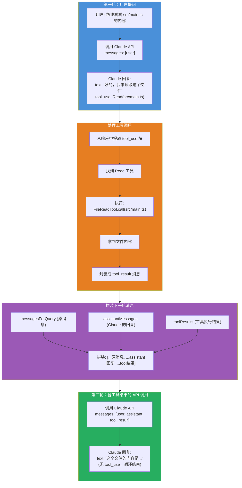
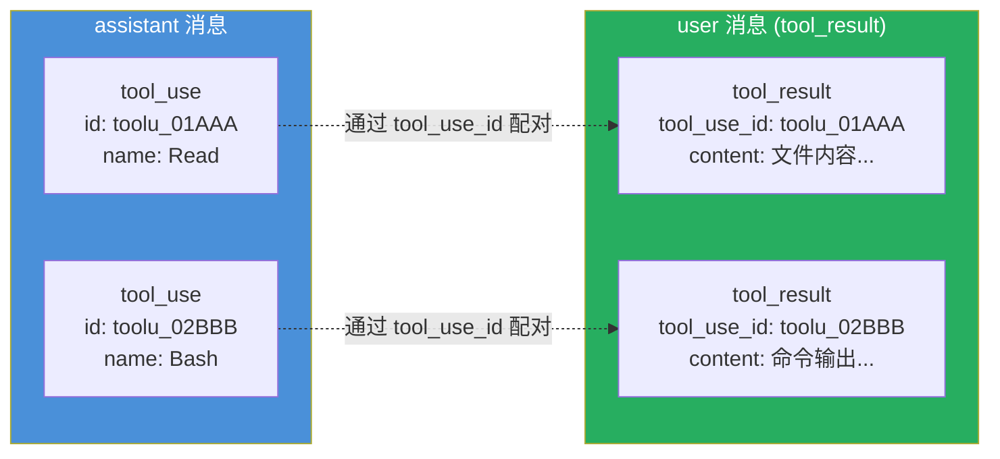
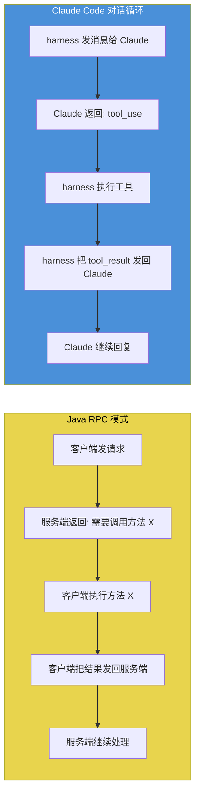

# 工具结果注入与下一轮 API 调用详解

> 阅读本文档后，你将理解：Claude 返回 tool_use 后，harness 怎么执行工具、怎么把结果拼回消息、怎么发起下一轮 API 调用，以及最终发给 API 的完整消息结构是什么样的。

---

## 一、完整数据流



---

## 二、代码追踪：三步走

### 第一步：从 API 响应中提取 tool_use 块

```typescript
// src/query.ts:828-838
if (message.type === 'assistant') {
    assistantMessages.push(assistantMessage)

    // 从 assistant 消息的 content 数组中过滤出 tool_use 块
    const msgToolUseBlocks = assistantMessage.message.content
        .filter(content => content.type === 'tool_use') as ToolUseBlock[]

    if (msgToolUseBlocks.length > 0) {
        toolUseBlocks.push(...msgToolUseBlocks)
        needsFollowUp = true  // ← 标记需要继续循环
    }
}
```

### 第二步：执行工具，生成 tool_result 消息

```typescript
// src/query.ts:1383-1411
const toolUpdates = streamingToolExecutor
    ? streamingToolExecutor.getRemainingResults()
    : runTools(toolUseBlocks, assistantMessages, canUseTool, toolUseContext)

for await (const update of toolUpdates) {
    if (update.message) {
        yield update.message
        // 把工具结果转成 UserMessage，加入 toolResults 数组
        toolResults.push(
            ...normalizeMessagesForAPI([update.message], tools)
                .filter(_ => _.type === 'user'),
        )
    }
}
```

工具结果消息的结构（`src/services/tools/toolExecution.ts:1456`）：

```typescript
createUserMessage({
    content: [
        {
            type: 'tool_result',
            tool_use_id: 'toolu_abc123',   // 对应 tool_use 的 id
            content: '文件内容...',          // 工具执行结果
        }
    ],
    sourceToolAssistantUUID: assistantMessage.uuid,  // 关联到哪个 assistant 消息
})
```

### 第三步：拼装消息，发起下一轮 API 调用

```typescript
// src/query.ts:1718-1730
const next: State = {
    // 关键：拼装三部分消息
    messages: [...messagesForQuery, ...assistantMessages, ...toolResults],
    toolUseContext: updatedToolUseContext,
    turnCount: nextTurnCount,
    // ...
}
state = next
// → 回到 while(true) 循环顶部，用新 messages 再次调用 API
```

---

## 三、实际例子：完整消息结构

用户说"帮我看看 src/utils/config.ts 的前 20 行"。

### 第一轮发给 API 的 messages

```json
[
  {
    "role": "user",
    "content": "帮我看看 src/utils/config.ts 的前 20 行"
  }
]
```

### 第一轮 API 返回（assistant 消息）

```json
{
  "role": "assistant",
  "content": [
    {
      "type": "text",
      "text": "好的，我来读取这个文件的前 20 行。"
    },
    {
      "type": "tool_use",
      "id": "toolu_01ABC123",
      "name": "Read",
      "input": {
        "file_path": "D:/develop/OpenSource/claude-code/src/utils/config.ts",
        "limit": 20
      }
    }
  ]
}
```

### harness 执行工具

```typescript
// 找到 Read 工具
const tool = findToolByName(tools, "Read")  // → FileReadTool

// 执行
const result = await tool.call(
    { file_path: "D:/develop/OpenSource/claude-code/src/utils/config.ts", limit: 20 },
    toolUseContext,
    canUseTool,
    assistantMessage
)
// result.data = "import { ... } from 'fs'\n\nexport function getGlobalConfig() {\n..."
```

### 生成 tool_result 消息

```json
{
  "role": "user",
  "content": [
    {
      "type": "tool_result",
      "tool_use_id": "toolu_01ABC123",
      "content": "import { readFileSync, writeFileSync } from 'fs'\nimport { join } from 'path'\nimport { getGlobalConfigDir } from './paths.js'\n\nexport function getGlobalConfig(): GlobalConfig {\n  const configPath = join(getGlobalConfigDir(), 'config.json')\n  try {\n    const raw = readFileSync(configPath, 'utf-8')\n    return JSON.parse(raw)\n  } catch {\n    return getDefaultConfig()\n  }\n}\n\nexport function saveGlobalConfig(config: GlobalConfig): void {\n  const configPath = join(getGlobalConfigDir(), 'config.json')\n  writeFileSync(configPath, JSON.stringify(config, null, 2))\n}"
    }
  ]
}
```

### 第二轮发给 API 的完整 messages

```json
[
  {
    "role": "user",
    "content": "帮我看看 src/utils/config.ts 的前 20 行"
  },
  {
    "role": "assistant",
    "content": [
      {
        "type": "text",
        "text": "好的，我来读取这个文件的前 20 行。"
      },
      {
        "type": "tool_use",
        "id": "toolu_01ABC123",
        "name": "Read",
        "input": {
          "file_path": "D:/develop/OpenSource/claude-code/src/utils/config.ts",
          "limit": 20
        }
      }
    ]
  },
  {
    "role": "user",
    "content": [
      {
        "type": "tool_result",
        "tool_use_id": "toolu_01ABC123",
        "content": "import { readFileSync, writeFileSync } from 'fs'\n..."
      }
    ]
  }
]
```

### 第二轮 API 返回（无 tool_use，循环结束）

```json
{
  "role": "assistant",
  "content": [
    {
      "type": "text",
      "text": "以下是 src/utils/config.ts 前 20 行的内容：\n\n```typescript\nimport { readFileSync, writeFileSync } from 'fs'\nimport { join } from 'path'\nimport { getGlobalConfigDir } from './paths.js'\n\nexport function getGlobalConfig(): GlobalConfig {\n  const configPath = join(getGlobalConfigDir(), 'config.json')\n  try {\n    const raw = readFileSync(configPath, 'utf-8')\n    return JSON.parse(raw)\n  } catch {\n    return getDefaultConfig()\n  }\n}\n```\n\n这个函数读取全局配置文件，如果文件不存在则返回默认配置。"
    }
  ]
}
```

**没有 tool_use 块 → `needsFollowUp = false` → 循环结束。**

---

## 四、多工具并行的例子

当 Claude 一次回复中包含多个 tool_use 时：

### 第一轮 API 返回（两个 tool_use）

```json
{
  "role": "assistant",
  "content": [
    {
      "type": "text",
      "text": "我来同时读取这两个文件。"
    },
    {
      "type": "tool_use",
      "id": "toolu_01AAA",
      "name": "Read",
      "input": { "file_path": "src/a.ts" }
    },
    {
      "type": "tool_use",
      "id": "toolu_02BBB",
      "name": "Read",
      "input": { "file_path": "src/b.ts" }
    }
  ]
}
```

### 并行执行（都是只读工具）

```typescript
// toolOrchestration.ts
// 两个 Read 都是 isConcurrencySafe = true
// → runToolsConcurrently() 并行执行
```

### 生成两个 tool_result

```json
[
  {
    "role": "user",
    "content": [
      {
        "type": "tool_result",
        "tool_use_id": "toolu_01AAA",
        "content": "文件 a.ts 的内容..."
      }
    ]
  },
  {
    "role": "user",
    "content": [
      {
        "type": "tool_result",
        "tool_use_id": "toolu_02BBB",
        "content": "文件 b.ts 的内容..."
      }
    ]
  }
]
```

### 第二轮发给 API 的 messages

```json
[
  { "role": "user", "content": "比较 a.ts 和 b.ts" },
  { "role": "assistant", "content": [
      { "type": "text", "text": "我来同时读取这两个文件。" },
      { "type": "tool_use", "id": "toolu_01AAA", "name": "Read", "input": {...} },
      { "type": "tool_use", "id": "toolu_02BBB", "name": "Read", "input": {...} }
  ]},
  { "role": "user", "content": [
      { "type": "tool_result", "tool_use_id": "toolu_01AAA", "content": "文件 a.ts 的内容..." }
  ]},
  { "role": "user", "content": [
      { "type": "tool_result", "tool_use_id": "toolu_02BBB", "content": "文件 b.ts 的内容..." }
  ]}
]
```

---

## 五、tool_use 和 tool_result 的配对规则



**配对规则**：
- 每个 `tool_use` 有唯一 `id`
- 每个 `tool_result` 通过 `tool_use_id` 关联到对应的 `tool_use`
- API 要求每个 `tool_use` 都必须有对应的 `tool_result`（否则报错）
- `tool_result` 必须紧跟在包含对应 `tool_use` 的 `assistant` 消息之后

---

## 六、API 请求完整结构

第二轮调用时，发给 Anthropic API 的完整请求：

```json
{
  "model": "claude-opus-4-6",
  "max_tokens": 16384,
  "system": [
    "You are an interactive agent that helps users with software engineering tasks...",
    "You have been invoked in the following environment: ...",
    "Always respond in 简体中文..."
  ],
  "tools": [
    {
      "name": "Read",
      "description": "Reads a file from the local filesystem...",
      "input_schema": {
        "type": "object",
        "properties": {
          "file_path": { "type": "string", "description": "..." },
          "offset": { "type": "integer" },
          "limit": { "type": "integer" }
        },
        "required": ["file_path"]
      }
    },
    {
      "name": "Bash",
      "description": "Executes a given bash command...",
      "input_schema": { ... }
    }
  ],
  "messages": [
    { "role": "user", "content": "帮我看看 src/utils/config.ts 的前 20 行" },
    { "role": "assistant", "content": [
        { "type": "text", "text": "好的，我来读取这个文件的前 20 行。" },
        { "type": "tool_use", "id": "toolu_01ABC123", "name": "Read",
          "input": { "file_path": "...", "limit": 20 } }
    ]},
    { "role": "user", "content": [
        { "type": "tool_result", "tool_use_id": "toolu_01ABC123",
          "content": "import { readFileSync, writeFileSync } from 'fs'\n..." }
    ]}
  ]
}
```

---

## 七、错误情况的 tool_result

当工具执行失败时，tool_result 会标记 `is_error`：

```json
{
  "role": "user",
  "content": [
    {
      "type": "tool_result",
      "tool_use_id": "toolu_01ABC123",
      "content": "<tool_use_error>Error: ENOENT: no such file or directory 'src/missing.ts'</tool_use_error>",
      "is_error": true
    }
  ]
}
```

Claude 看到 `is_error: true` 后会知道工具执行失败，可以尝试其他方案。

---

## 八、与 Java 的类比



本质上就是 **RPC over Messages**——Claude 是服务端，harness 是客户端，`tool_use` 是请求，`tool_result` 是响应。只不过整个协议是通过消息数组传递的，而不是 HTTP 请求/响应。
