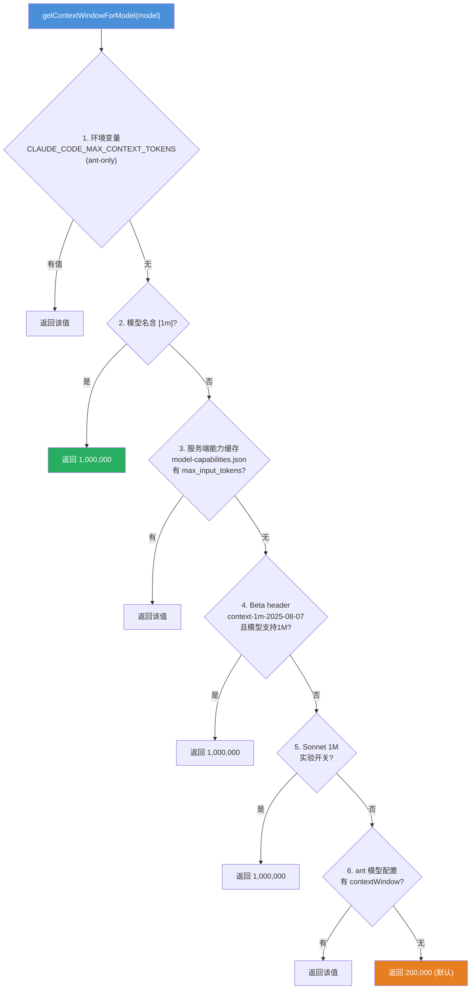
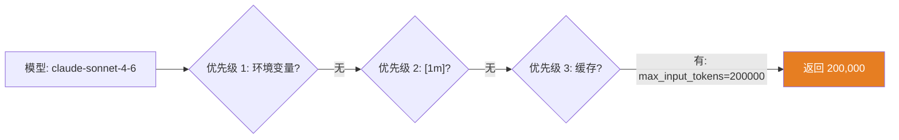
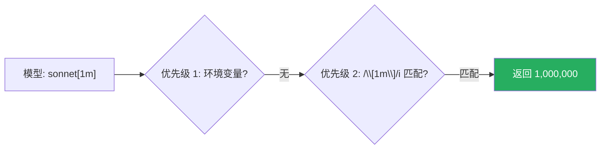
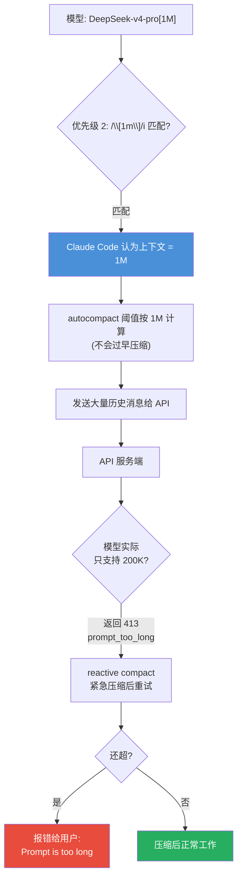

# 上下文窗口解析机制：[1M] 后缀、200K 默认值、动态探测

> 阅读本文档后，你将理解：上下文窗口大小是怎么确定的、`[1M]` 后缀的原理、配置了不支持的大小会怎样。

---

## 一、核心函数

所有上下文窗口大小的确定都经过 `getContextWindowForModel()`（`src/utils/context.ts:51`）。

```typescript
export function getContextWindowForModel(model: string, betas?: string[]): number {
    // 6 级优先级，逐级探测
    // ...
    return MODEL_CONTEXT_WINDOW_DEFAULT  // 200_000（兜底）
}
```

---

## 二、6 级优先级解析链



| 优先级 | 来源 | 条件 | 返回值 |
|--------|------|------|--------|
| 1 | 环境变量 | `CLAUDE_CODE_MAX_CONTEXT_TOKENS`（ant-only） | 自定义值 |
| 2 | 模型名后缀 | `/\[1m\]/i` 正则匹配 | 1,000,000 |
| 3 | 服务端缓存 | `~/.claude/cache/model-capabilities.json` 中有 `max_input_tokens` | 该值 |
| 4 | Beta header | `context-1m-2025-08-07` + 模型支持 1M | 1,000,000 |
| 5 | 实验开关 | Sonnet 1M experiment（`coral_reef_sonnet` flag） | 1,000,000 |
| 6 | ant 模型配置 | `AntModel.contextWindow` | 该值 |
| 7 | 默认值 | 以上都没命中 | **200,000** |

---

## 三、[1M] 后缀的实现原理

### 3.1 检测逻辑

```typescript
// src/utils/context.ts:35
export function has1mContext(model: string): boolean {
    if (is1mContextDisabled()) return false
    return /\[1m\]/i.test(model)  // 不区分大小写
}
```

正则 `/\[1m\]/i` 匹配模型名中的 `[1m]`、`[1M]`、`[1M]` 等形式。

### 3.2 后缀从哪来

模型选择菜单中的 1M 选项会自动添加后缀：

```typescript
// src/utils/model/modelOptions.ts:143
export function getSonnet46_1MOption(): ModelOption {
    const is3P = getAPIProvider() !== 'firstParty'
    return {
        value: is3P
            ? getModelStrings().sonnet46 + '[1m]'   // 第三方: "us.anthropic.claude-sonnet-4-6-v1[1m]"
            : 'sonnet[1m]',                          // 官方: "sonnet[1m]"
        label: 'Sonnet (1M context)',
    }
}
```

### 3.3 哪些模型原生支持 1M

```typescript
// src/utils/context.ts:43
export function modelSupports1M(model: string): boolean {
    if (is1mContextDisabled()) return false
    const canonical = getCanonicalName(model)
    return canonical.includes('claude-sonnet-4') || canonical.includes('opus-4-6')
}
```

| 模型 | 支持 1M |
|------|---------|
| Claude Sonnet 4.x | 是 |
| Claude Opus 4.6 | 是 |
| Claude Opus 4.5 及以下 | 否 |
| Claude Haiku | 否 |
| 第三方模型 (DeepSeek 等) | 不检查，`[1M]` 后缀直接生效 |

### 3.4 禁用 1M

```typescript
// src/utils/context.ts:31
export function is1mContextDisabled(): boolean {
    return isEnvTruthy(process.env.CLAUDE_CODE_DISABLE_1M_CONTEXT)
}
```

设置环境变量 `CLAUDE_CODE_DISABLE_1M_CONTEXT=1` 后，所有 1M 相关逻辑都被禁用，`has1mContext()` 永远返回 `false`。

---

## 四、服务端能力缓存（优先级 3）

### 4.1 缓存文件位置

```
~/.claude/cache/model-capabilities.json
```

### 4.2 缓存内容格式

```json
[
  {
    "id": "claude-sonnet-4-6",
    "max_input_tokens": 200000,
    "max_tokens": 16384
  },
  {
    "id": "claude-opus-4-6",
    "max_input_tokens": 200000,
    "max_tokens": 32768
  }
]
```

### 4.3 查找逻辑

```typescript
// src/utils/model/modelCapabilities.ts:75
export function getModelCapability(model: string): ModelCapability | undefined {
    if (!isModelCapabilitiesEligible()) return undefined
    const cached = loadCache(getCachePath())
    if (!cached || cached.length === 0) return undefined

    const m = model.toLowerCase()
    // 先精确匹配
    const exact = cached.find(c => c.id.toLowerCase() === m)
    if (exact) return exact
    // 再子串匹配
    return cached.find(c => m.includes(c.id.toLowerCase()))
}
```

**注意**：这个缓存只对 Anthropic 官方 API 用户（`ant` 类型）有效。第三方 API（Bedrock、Vertex 等）不走这个缓存。

### 4.4 缓存刷新

模型能力缓存会在 Claude Code 启动时从 API 拉取更新，刷新 `~/.claude/cache/model-capabilities.json` 文件。

---

## 五、场景分析

### 场景 1：什么都不配置



结果：`/context` 显示 200K。这是大多数用户的默认体验。

### 场景 2：配置 `sonnet[1m]`



结果：`/context` 显示 1M。Claude Code 按 1M 空间管理上下文（更晚触发压缩）。

### 场景 3：配置 `DeepSeek-v4-pro[1M]`（模型实际只支持 200K）



**详细过程**：

1. Claude Code 客户端看到 `[1M]`，认为有 1M 上下文
2. autocompact 按 1M 阈值计算 → 不会提前压缩
3. 大量历史消息被发给 API
4. API 服务端发现模型只支持 200K → 返回 `prompt_too_long` 错误
5. Claude Code 的恢复机制启动：
   - 先尝试 `context collapse drain`（折叠上下文）
   - 再尝试 `reactive compact`（紧急用小模型总结）
6. 如果压缩后仍超限 → 报错给用户

**结论**：`[1M]` 只影响客户端的上下文管理策略，不会让 API 服务端变出 1M 能力。配错了不会崩溃，但会浪费一轮 API 调用后才触发压缩。

### 场景 4：配置 `sonnet[1m]`（模型确实支持 1M）


结果：正常享受 1M 上下文，对话可以更长才触发压缩。

---

## 六、上下文窗口大小的影响

上下文窗口大小决定了以下行为：

| 受影响的行为 | 200K 时 | 1M 时 |
|-------------|---------|-------|
| autocompact 触发时机 | ~160K tokens 时压缩 | ~800K tokens 时压缩 |
| 对话历史保留量 | 保留较短历史 | 保留更长历史 |
| prompt too long 错误 | 更容易触发 | 更难触发 |
| API 费用 | 较低（消息更少） | 较高（消息更多） |
| 响应质量 | 长对话可能丢失早期上下文 | 长对话保留更多上下文 |

autocompact 的阈值计算：

```typescript
// src/services/compact/autoCompact.ts:33
export function getEffectiveContextWindowSize(model: string): number {
    const reservedTokensForSummary = Math.min(
        getMaxOutputTokensForModel(model),
        MAX_OUTPUT_TOKENS_FOR_SUMMARY,  // 20,000
    )
    let contextWindow = getContextWindowForModel(model, getSdkBetas())
    return contextWindow - reservedTokensForSummary
    // 200K 模型: 200,000 - 20,000 = 180,000 触发压缩
    // 1M 模型: 1,000,000 - 20,000 = 980,000 触发压缩
}
```

---

## 七、与 Java 的类比

| 机制 | Claude Code | Java 类比 |
|------|------------|-----------|
| 上下文窗口 | `getContextWindowForModel()` | 类似 JVM `-Xmx` 最大堆大小 |
| `[1M]` 后缀 | 用户手动声明能力 | 类似 `-Xmx1g` 命令行参数 |
| 服务端缓存 | `model-capabilities.json` | 类似 `Runtime.getRuntime().maxMemory()` |
| autocompact | 超阈值时压缩 | 类似 GC 触发 |
| prompt too long | OOM | 类似 `OutOfMemoryError` |
| reactive compact | 紧急 GC | 类似 Full GC |

---

## 八、总结

| 问题 | 答案 |
|------|------|
| 什么都不配置时上下文怎么来？ | 优先查服务端缓存的 `max_input_tokens`，没有则默认 200K |
| `[1M]` 后缀怎么生效？ | 正则 `/\[1m\]/i` 匹配模型名，直接返回 1M，不检查模型能力 |
| 配了 `[1M]` 但模型不支持？ | 客户端按 1M 管理，API 返回 `prompt_too_long`，触发紧急压缩 |
| 哚些模型原生支持 1M？ | Claude Sonnet 4.x 和 Opus 4.6 |
| 怎么禁用 1M？ | 环境变量 `CLAUDE_CODE_DISABLE_1M_CONTEXT=1` |
